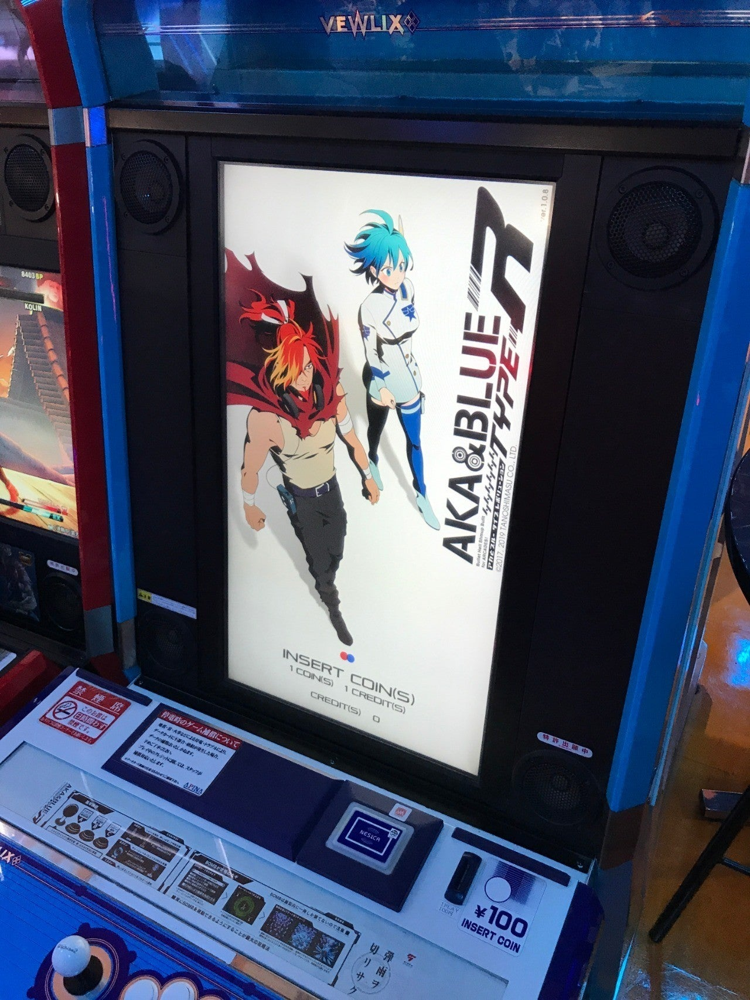
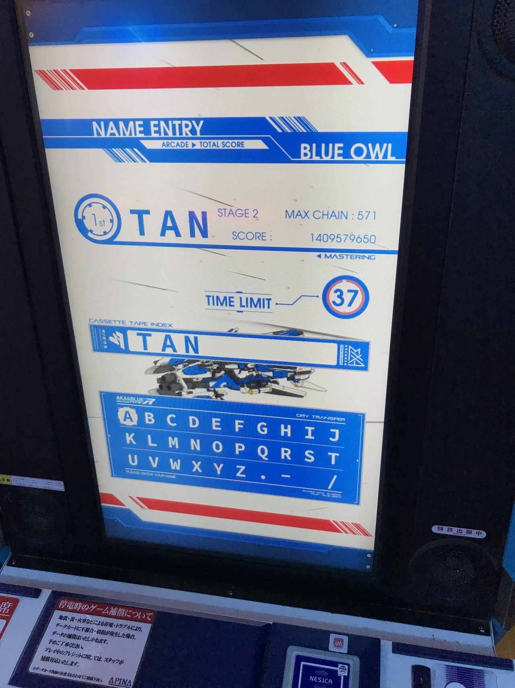

<figure>

</figure>

## **アーケードゲーム界に彗星のごとく現れた新作シューティング**

　久々にアーケードゲームの新作シューティングとして登場したアカとブルー。地元にも入荷があったので早速プレイしてみた。

　ゲームは一見して従来の弾幕シューティングを踏襲したスタイルであるが、実際に遊んでみると、往年のケイブシューティングのように、幾何学的な軌道を描いて発射される弾をかいくぐって敵を殲滅する、いわゆる弾幕シューティングとは一線を画するゲームシステムとなっているのがわかる。敵を倒し敵弾をかすることで4段階にチャージされるボムを使い、弾幕を消すだけでなく、弾を敵に打ち返す。その圧倒的な攻撃力で硬い敵を破壊し、得点アイテムを稼ぎ、そしてさらに次のボムをリチャージしつつ、次なる展開に備える。それを繰り返して進んでいくことに攻略の重点が置かれたつくりになっているのだ。

　このゲームシステムは、正直言って画面いっぱいの弾幕をチマチマと避ける一斉を風靡した弾幕シューティングに食傷気味だった僕には新鮮なプレイ感覚で、長時間弾の間をせこせこと通り抜けるストレスから開放されたことは何よりの僥倖であった。次から次へと現れる敵は大量の弾を吐き出し、それによってボムはあっという間にチャージされ、次の弾幕ポイントでタイミングよくボムを発射することでさらにボムをチャージできる。このサイクルが実にテンポよく、そして小気味よい快感となってプレイヤーにシズル感を与えてくれるのだ。ややもすると大味ボムゲーになる危険性をはらんでいるシステムではあるが、そこはアーケード化に向けて入念な調整がなされている。プレイヤーは繰り返しプレイを重ねることで、このボムポイントを探していくことがこのゲームの攻略の鍵となっていくようだ。

　実際、1プレイの時間も短めで、これはロケーションにおけるインカムの問題と、80年代に多数存在した”上達すると30分も40分も遊べてしまう冗長なゲーム”という危険性を孕んだシューティングゲームを、格闘ゲーム並みに稼げるゲームとしたのではないだろうか。遊ぶ方としても、短時間で気軽に楽しめ、しかもその短いプレイ時間に凝縮された緊張感を楽しむことができるゲームバランスに、ついついコインを入れたくなってしまう。シューティングゲームファンとしては、様々な工夫の凝らされたこの新作の登場をスタンディングオベーションで迎えたいところだ。

　さて、SNSなどでは、『アカとブルー TYPE-R』の全国での稼働状況が報告され、果たして本作がどこの店舗に設置されているのか、そんな情報交換が盛んに行われている。僕の地元は、たまたま『アカとブルー TYPE-R』のプラットフォームであるEXA基板の取扱会社があったため、幸いなことにその直営店には何台か設置されたようだが、場所によってはまったく入荷がないところも見受けられるようだ。ゲーセン世代として育った僕などは、この令和の時代に登場した新しいシステム基板が多様な展開を見せ、ゲーセン復興の鍵となるぐらいのことを期待してしまうわけだが、そのためにも今作をはじめ、今後EXA基板でリリースされるゲーム群にはがんばってほしいと思う次第である。

　最後に。今の時代にゲームセンター専用としてデビューするという歴史的な偉業を成し遂げた『アカとブルー TYPE-R』、いちシューティングゲームファンとしてその存在を最大限応援したい。そのためにも、ぜひ上手にプロモーションをしていただきたいのだ。せっかくの素材も調理方法がまずければ料理としては台無しである。くれぐれも狭量な感情の吐露で、この雰囲気を壊すような空気を作り出してほしくないと思う。

