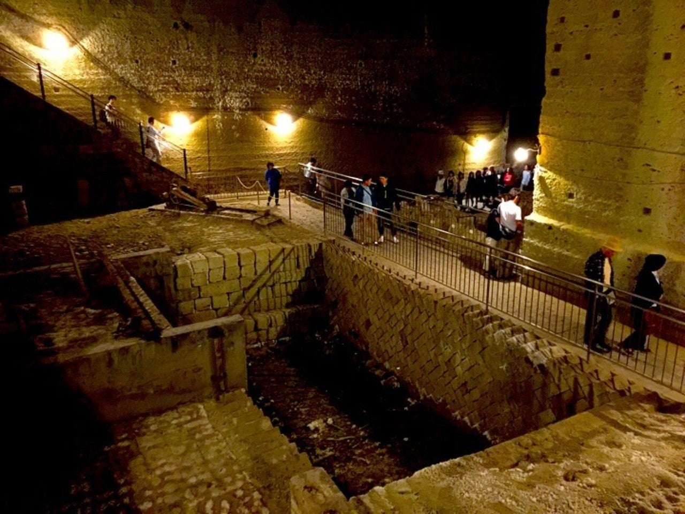
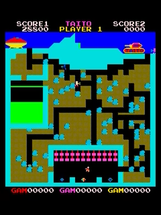
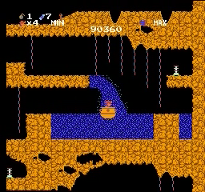
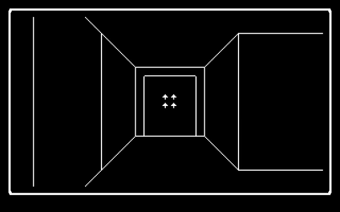
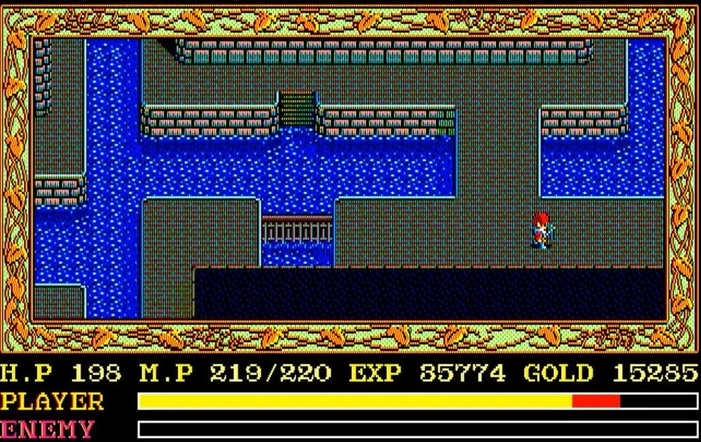
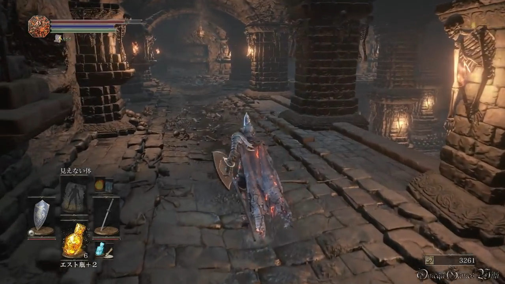

<figure>

</figure>

　先日”Legend of Grimrock”の記事を書いていて、そう言えば地下迷宮が好きで、ダンジョンが舞台となっているゲームを随分わくわくしながら遊んだなと、当時の感覚が蘇ってきた。そもそも、僕はいつ頃から地下迷宮が好きだったのだろう。

　ダンジョンと言えば、どうせ”ウィザードリィ”なんでしょ？と思われるかもしれないが、さにあらず。その昔ゲームセンターに”THE PIT”というゲームがあり、なぜかこのゲームの『地下から宝を持ち帰る』というフィーチャが強く記憶に残っているのだ。固定画面のシンプルなゲームだったが、その『地下の奥底に宝が並んでいる』というシチュエーションが好きだった。

　それからファミコン版でよく遊んだ”スペランカー”。主人公がひ弱なことばかりがクローズアップされてしまい、一時は完全にクソゲー扱いだった作品だが、よく見ると地下迷宮感満載の傑作なんじゃないかと思っている。スクロールして縦に連なるステージは、どこまでも地下深く潜っていく感覚に満ちあふれていたし、奥底へ行くにつれ、太古の文明が築いたと思われる地下の遺跡が姿を表す様は今見てもわくわくする。特に、道中に現れる地下水脈は、その意外性とともに、ひたすら土色に映える青色が美しくて、実に印象的であった。

　ここまで来てようやくウィザードリィの登場である。ウィザードリィはそれこそ本当に寝食忘れてのめり込んだゲームだ。来る日も来る日もダンジョンに潜り、未知のモンスターと戦い、ときには全滅の憂き目に遭いながら、まだ見ぬ強力なアイテムを求めて広大なダンジョン（今見るとそれほど広大じゃないんだけど）をさまよい歩いた。現在のように攻略情報に乏しい時代、自分でマップを書いて、一から自力でダンジョンを探索したという手応えがあった。そのおかげで、直線で描画されたシンプルな画面にも関わらず、本当に底に石造りのダンジョンが存在するような感触とともに冒険を楽しめたものだ。余談だが、ウィザードリィは当時創刊された”月刊誌遊撃手”に袋とじのマップが付いており、ドキドキしながらそれを開封したものである。本来ならば自力で探索しなければならないダンジョンをカンニングのように俯瞰してしまう罪悪感と、せっかく謎に包まれた地下迷宮が、いっぺんに白日のもとに晒されてしまう失望感とがないまぜになって、妙な緊張感を作り出していた。コンプティークの袋とじより数段上の禁断の果実だったのだ。

　日本ファルコムのアクションRPG”イースII”には、ゲーム終盤で広大な地下水路が登場する。主人公アドルは迷路のように入り組んだ地下水路を隅々まで探索して歩くことになるわけだが、ゲームのクライマックスに登場する巨大なサルモンの神殿の地下に、まだこんな広い地下水路が存在したのか！という演出に、血湧き肉躍ったものだ。どうにも地下迷宮と水路の組み合わせは相性がいいらしい。今でもそんなシチュエーションが大好物である。

　さて、最近のゲームはもうグラフィックの説得力が高すぎて、想像力をフル稼働させなくても、ディテールまで『恐ろしいダンジョンですよ！』というリアリティに満ちている。でもまあそれはそれで技術の進歩のありがたさを素直に享受するわけなのだが、僕のダンジョン好きの背景には、そういう映像的なリアルさよりも、かつて貧弱なグラフィック機能で地下世界の神秘と恐怖を雄弁に語ってくれた数々のゲームが存在するように思える。今後も新たなダンジョンゲームが登場して、僕を魅惑の地下世界へいざなってくれることを期待してやまないのである。

※ヘッダー写真は大谷石地下採掘場跡（宇都宮市）で撮影した写真。ダンジョン好きなら一度は訪れたい場所。
