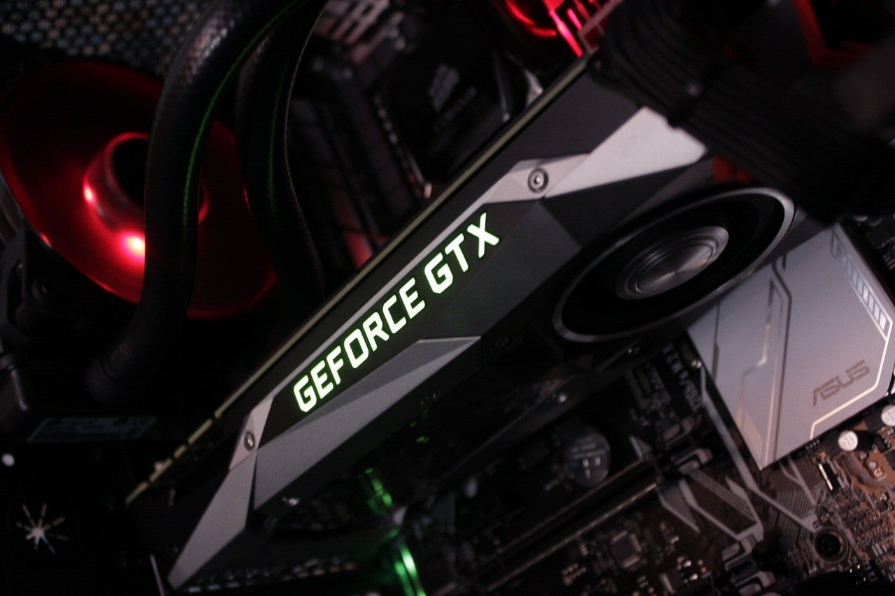
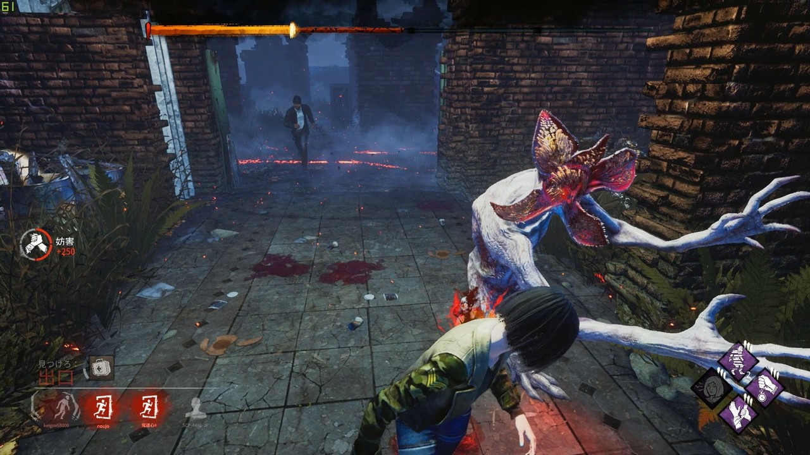
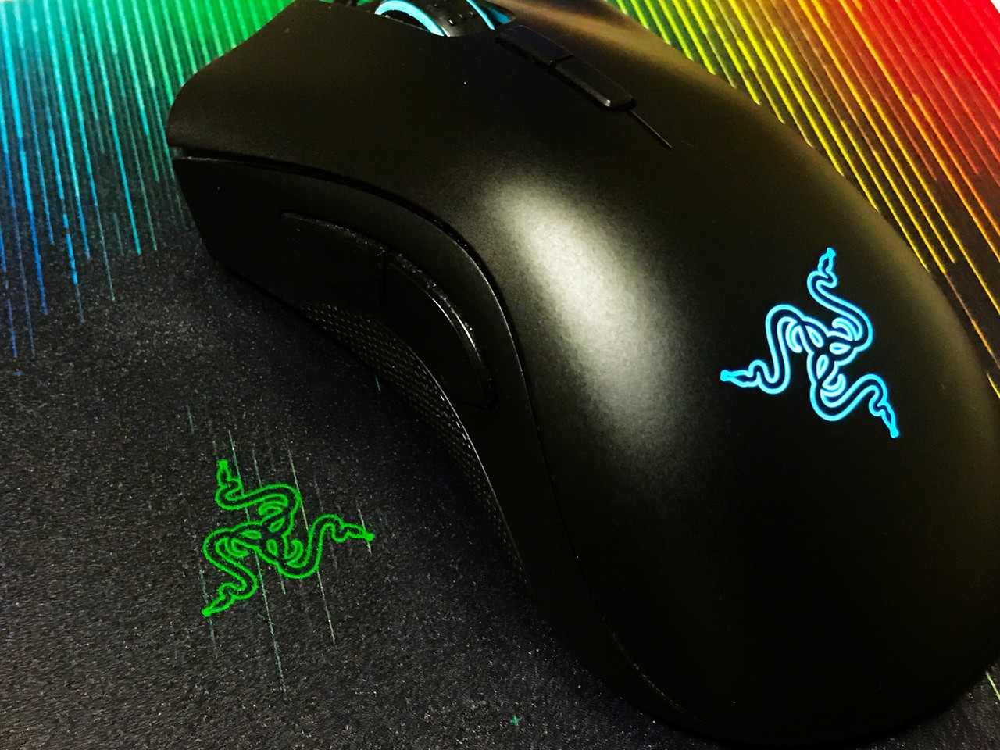

<figure>

</figure>

　もう1年前のことになるが、新しいパソコンを買った。コンパクトで便利なノートパソコンなどではなく、巨大なゲーミングパソコンである。

　最後にゲーム用のパソコンを買ったのは10年前。当時発売になった”ストリートファイターIV”を遊びたかったのがきっかけだ。しかし、なんとこのパソコンは後に水冷クーラー大爆発という大変な事件を起こすことになる。新しいパソコンがまさかそんなトラブルに見舞われるとは……。そう思ったものの、販売店が快く全交換に応じてくれて、しかも詫び石のごとくHDDを増設してくれたのがせめてもの救いであった。

　今回パソコンを新しくしたのは、しばらく前からPS4で遊んでいた”デッドバイデイライト”を快適にプレイしたかったからだ。デッドバイデイライトは、高性能を誇るPS4 Proをもってしてもフレームレートが低く、どうしても我慢できなくなってしまったのだ。

　久々にパソコンを買うにあたって、最近のパソコン事情をいろいろ調べてみた。どうも、自分の遊びたいゲームとスペックを天秤にかけると、15万円前後のパソコンが妥当な線のようだ。15万円！？高いよね。どう考えても高いのである。でも、聞くところによると、ユーチューバーやプロゲーマーが使っているゲーミングパソコン（ケースが6角形していたり、ファンが光ったりするようなやつだ）は50万円ぐらいするらしい。15万円って今のパソコンの世界では安いのか？まあ、紆余曲折あって結局セール12万円！ぐらいのパソコンで勘弁してもらうことにした。まあ、大丈夫だろう。オンラインショップでえいやっと購入確定ボタンを押す。高額商品を買うときの確定ボタンはどうしてこんなに重々しく感じるのだろう。

　さて、新しいパソコンが届いてからというもの、お目当てのデッドバイデイライトをはじめ、輝くような車体の表現が美しい”Forza Horizon4”や、コンシューマでは遠景が思いっきり省略されてしまう”PUBG”などで豊かなゲームライフを堪能していた。しかもマウスはRAZERのゲーミングマウス（ロゴが光るやつだ）である。パソコン買うだけで、こんなにゲーム環境が豊かになるのなら、もっと早く買っておけばよかった。などと、10年の技術の進歩を思い切り享受しつつ毎日ゲームに勤しんでいたのである。

　しかし、それはある日突然起こった。パソコンを操作していると、いきなりマウスカーソルが凍りつく怪現象が起き始めたのだ。しかも、日に日に凍りつく頻度が高くなってくる。新品のマウスなのにいきなり故障？いや、マウスパッドとの相性がよくないんじゃないか？いろいろな可能性を考えてみたが、そうじゃなかった。パソコンがフリーズしているのだ。よくよく調べてみると、特定のプログラムを起動するとフリーズが起きる。特に、ゲームを起動するためのSteamクライアントや、チャットに使うDiscordを起動すると必ず止まってしまう。ゲームがプレイしたくて新しいパソコンを買ったのに、Steamのクライアントが止まってしまうのでは話にならない。

　10年前の水冷クーラー事件を思い出しつつ、パソコンのトラブルというのはこんなにも頻繁に起こるものなのか。それとも自分だけヒット率が高い不幸な人間なのか。もしかして今宝くじを買ったら10億円当たるんじゃないかなどと、いろんな思いが頭の中をめぐりながらも、やむなく販売店に連絡をとった。結果的に、本体を送り返して交換となったわけだが、初期不良保証期間を1週間過ぎていたにもかかわらず、初期不良交換で対応してもらえたのは不幸中の幸いだった。まさかのトラブルで、購入時の箱は捨ててしまったため、スーパーから大きめのダンボールを頂いてきて梱包、送り返すことにした。玉ねぎの箱にパソコン入れてもいいのかね？さらに、運悪く年末年始をはさんでの交換処理となったため、3週間の長きに渡って快適なゲーム生活とは切り離される日々を送る羽目になった。3週間ぐらいどうってことないだろうと思われるかもしれないが、日頃『ゲームはライフワーク』を標榜している僕にとって3週間は長い。本当に長い。仕方ない、その間はPS4でゲームしよう。

　年が明けて、無事に新しいパソコンが届いた。一度でもトラブルに見舞われると、疑心暗鬼になってしまうもので、恐る恐るSteamクライアントを立ち上げ、Discordをインストールしてみる。おお！フリーズしない。当たり前なんだけど感動的だ。こうして、僕のゲームはライフワークは無事再開されたのである。

　早いものであれから約1年。その後は何一つトラブルなく、豊かなゲームライフを送っている毎日だ。何よりも、ダウンロード購入中心の生活は物理的なパッケージが積まれなくていい。安心してゲームが買える。自分のライフワークは今後パソコンゲームが中心になっていくのだろう。

　ところで、つい先日奥さんのためにもゲームパソコンを買ったのだが、万が一トラブルが起きたときのことを考え、今度は東京の有名店で買うことにした。まあ、まさか、そんなに当たらないよね。
