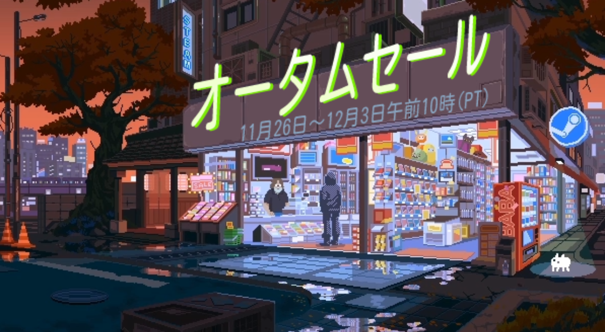
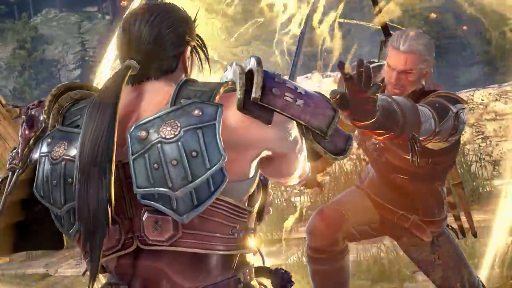
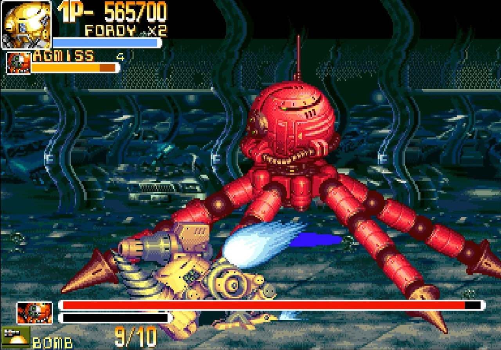

<figure>

</figure>

　つい先日まで、Steamのオータムセールが開催されていた。Steamは季節の節目に大きなセールを行い、結構な数のタイトルが、普段よりかなり安い値段で買えるとあって、SNSなどでも「このゲームがお買い得だ」「おもしろいタイトルはこれだ」などの話題が飛び交い、盛り上がりを見せる。

　僕も、平素から気になるゲームはウィッシュリストに入れておき、いざセールが来たら値下げされた『欲しいゲーム』を順次買っていこうと準備をしている。その購入候補タイトル数はすでに500を超え、もはや『積みゲー』ならぬ『積みウィッシュリスト』と化しているわけだが、これを崩すことがセールの楽しみのひとつでもあるのだ。

　今回のセールでは、都合でゲームを1本返品した（Steamには期間やプレイ時間などの条件付きで、購入したソフトを返品できる仕組みが用意されている）ため、ウォレットに2000円ちょっとのチャージが残っていた。どうせなら、これを今回のセール時に使い切ってしまおうと、オータムセール最後の1本を検討することにした。ちなみに、1本2000円ぐらいのゲームになると、個人的にはなかなか買わない程度の値段である。普段は1000円未満のゲームを中心に買っているので、2000円を超えてくると高級品。5000円を超えるフルプライスのタイトルは超高級品の部類だと思ってしまうのだ。

　最終的に候補に残ったのは2本。”鉄拳7”と”ソウルキャリバーVI”の、バンダイナムコ格闘ゲーム2大巨頭だ。今回のセールでは、オープンワールドの大作RPG”スカイリム”、時間をかけて街を作り上げる”シティーズ・スカイライン”、先日記事を書いたダンジョンRPG”レジェンド・オブ・グリムロック”、SF版ダークソウルといった趣のアクションゲーム”ザ・サージ”、神話をモデルにしたRTS”エイジ・オブ・ミソロジー”などなど、ちょっと重めのゲームを中心に買ってしまったため、気楽に遊べる格闘ゲームが欲しかったというのが、この2本を選んだ理由である。

　さて、セール終了まで残り2時間のところで悩む。鉄拳シリーズは長らく遊んでいなくて、もうどんなキャラクターが出演しているのかもわからないぐらいのご無沙汰。果たしてこれを買って素直に楽しめるのか。一方のソウルキャリバーは4までプレイ経験があり、すっかりおなじみのキャラクターが登場する上に、”ウィッチャー3”のゲラルトや、”ニーア・オートマタ”の２Bがゲスト出演しているということで、（それらのゲームを遊んだということもあり）キャラクター的には親しみやすい。これはソウルキャリバーを買っておこうか。と、思いきや、よくよく値段を見ると、鉄拳7が1300円程度なのに対して、ソウルキャリバーは3000円！自分的には3000円は高級と超高級の間ぐらいの結構お高い値段設定。どうしよう。いやいや、そうは言っても、鉄拳はストリートファイターシリーズのように各キャラクター別売りみたいで結局値段変わらないんじゃないの？とは言え、そもそも2000円のチャージ金額で3000円のゲーム買うのは本末転倒。果たしてこれはどちらを買うべきか。

　などとセール終了直前まで悩みに悩み抜いた挙げ句、僕の出した結論は……  
**「よし、”カプコン・ベルトアクション・コレクション”を買おう」**  
　であった。値段も1600円だし、なんと言っても7本の名作が収められていてお得だし、気楽に遊べるアーケードゲームの移植だから、これほど今回の選択に適切なタイトルはないだろう、という判断である。気持ちよく購入ボタンをポチッとして、早速大好きな”パワード・ギア”で遊んでご満悦な僕であった。

　でも、よく考えたらこのソフト、Switch版を持ってたんだよな。まあ、ジョイスティックで遊びたかったので買い直しで正解かな。満足満足。

　こうして、今回のセールも積みウィッシュリストはあまり飛躍的には消化されずに終わりを告げるのであった。まさに**「積みゲーは罪ゲー」**なのである。
