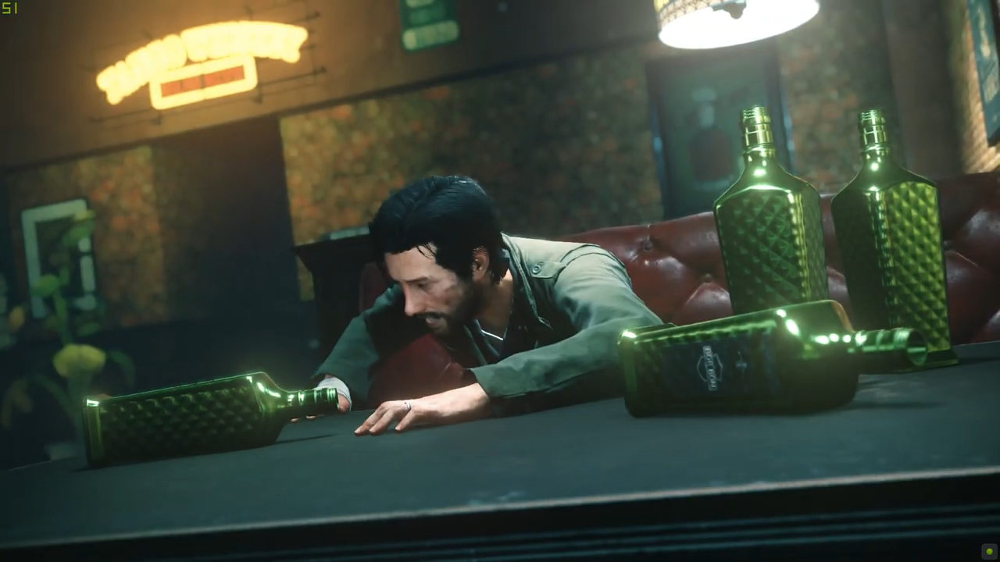

<figure>

</figure>

**過去を精算する男の復活ストーリー**  
※ちょっとだけネタバレあり

　少し前にPC版のサイコブレイク2（英題: The Evil Within2）を買った。発売当時にPS4で買ってプレイ済みなのに、また改めて遊んでしまうぐらい好きなゲームだ。

　主人公のセバスチャン・カステヤノス刑事は30代の敏腕刑事で、オカルトチックなちょっとぶっとんだ事件にもまったく臆せず突っ込んでいってしまうタフガイである。  
　でもそれは正義感からではない。火事で娘を失い、それが原因で妻と別れ、半ば自暴自棄になった男の、ある意味幼稚とも言える捨て鉢の行動でしかないのだ。

　しかし、サイコブレイク2のセバスチャンは少し様子が違う。前作の事件の精神的ショックから立ち直れず、ゲームの冒頭から場末の酒場で酔いつぶれている。その無様な姿は、初代セバスチャンに比べて実に弱々しい。一方で、ある意味人間らしくもあり、より我々プレイヤーに近い存在になったとも言える。

　そして、そんな悲惨な生活を送っていたセバスチャンが、どん底から這い上がり、以前のバイタリティを取り戻して、再び不可解な事件に挑戦していく復活劇がサイコブレイク2なのである。  
　考えてみると、映画アルマゲドンも、インディペンデンス・デイも、ツイスターも、みんな主人公は離婚して厭世的な生活を送っていた。何も背負うものがない状況で、危険を顧みず自ら過酷な戦いに身を投じる者たちが、ハードな経験を通して人生の大切なものを取り戻していく。そういう物語がハリウッド映画の王道とも言えるわけだが、サイコブレイク2では、初代で確立された極上のサバイバルホラーに、実にドラマティックな孤独な男の復活ストーリーが盛り込まれた作品なのである。

　ゲーム中盤では、かつて初代サイコブレイクの冒頭で出会い、命からがら逃げ出した悪夢のような強敵『サディスト』が再登場する。再び逃げ惑うセバスチャン。しかし、いよいよ追い詰められようとしたそのとき、元刑事は最後の反撃を試みるのだ。サディストに一撃を浴びせて脱出しようとするセバスチャンだったが、ふと足を止めて「今度は逃げん…」と呟くと、サディストに強烈な止めを指すのだ。  
　この瞬間、セバスチャンの過去が精算されるとともに、プレイヤーにもそのやる気のほどが全力で伝わってくるのだ。その後、この高揚感をもって一気に戦えとばかりに、過去の強力なボスたちとの連戦になる。ゲーム制作者の意図とメッセージが力強く発信される名シーンだ。

　もうこのシーンだけで、サイコブレイク2は大のお気に入りになってしまったわけだが、ゲームの方も初代からはるかにあそびやすくなっていて、非常におすすめできる。弾薬も手に入りやすく、スニークキルもやりやすいので、多様なプレイスタイルで楽しめるのがポイント高い。機会があればぜひプレイしてほしい1作である。

　とは言え、ホラー部分はしっかり怖いので、そういうの苦手な方は大変かも。

[https://www.youtube.com/watch?v=-cHW-fwRE3g](https://www.youtube.com/watch?v=-cHW-fwRE3g)
