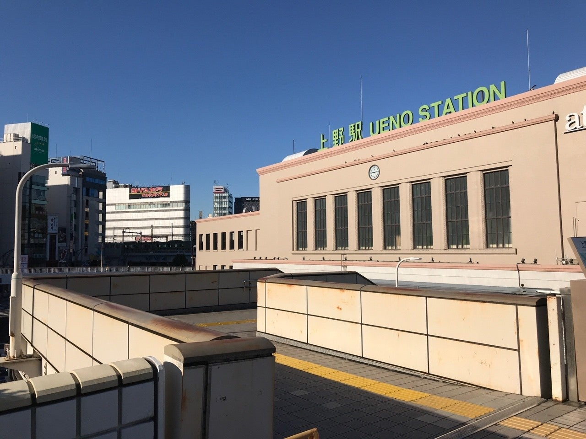
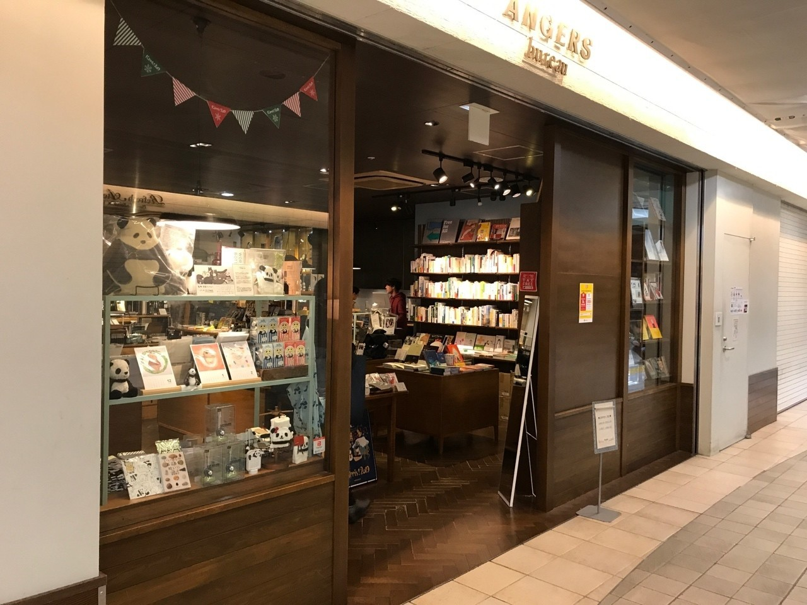

<figure>

</figure>

　上野駅で時間があると、いつも立ち寄るアンジェビュロー（以下『アンジェ』）という雑貨店がある。京都の河原町に本店を構える、おしゃれ文具やグッズの店である。

　一風変わった商品を陳列する店内は、ただ眺めているだけでも楽しく、いつも電車待ちの客で賑わっている。特に、この店独自にセレクトされた書籍を取り扱っているコーナーには、流行に流されない本が新旧入り混じって置かれていて、本好きにはとても嬉しい店でもあるのだ。  
　上野駅は、他にも同じフロアにそれなりの規模の書店があるし、改札を通る前ならば、さらにもう1軒書店があるので、割と困らずにお目当ての本を探すことができる駅である。しかし、僕がアンジェを気に入っているのは、比較的狭いスペースに独特の視点で選ばれた本たちが、コンパクトに並べられているというところなのだ。  
　確かに、広い書店で多くの本を物色し、あれもこれもと買い漁るのも至福の時間ではある。しかし、電車待ちという限られた時間の中で、自分が今まで出会ったこともない、日常の中では興味を持つこともなかった1冊と巡り会えることができるのが、この店の魅力である。駅の中の本屋という立地条件と、電車旅の出発前の時間という、極めて限定的な条件に見事にマッチするサイズ感の書店なのだ。そんな素敵な立ち位置が気に入っていて、今日もまたついつい立ち寄ってしまうことになる。  
　そういう店なので、実は密かに自分なりのこの店での流儀を持っている。それは『できるだけ短い時間で1冊を選び、素早く会計を済ませて電車に乗り込むこと』である。  
　旅に出る前のちょっとした時間。長々と買い物をして、走ってホームへ行くのはいかにも無計画だ。かと言って、欲しいものをすべて買い込んで、電車旅の前に大荷物を作るのも、どうもかっこがつかない。そう考えると、素早く1冊だけ買うというのは、この場合の最適解だと思うのだ。  
　ところが、いざ書籍コーナーの前に立つと、迷ってしまう。どの本を買うのか決められない自分がいるのである。どの本も面白そうに見えてきて、何を買えばいいのか一向に決めることができない。挙げ句、熟考し悩んだ末に、何冊も本を抱えて無様にレジに持って行く自分がいるのである。（しかも電車の出発まで残り数分。ダッシュでホームへ向かえ！）  
　現実の自分は全然スマートでもないし、長旅を前に荷物を増やす行為はいかにも滑稽だ。重々わかっていながら、今日もまた数冊の本を買い込んでしまうのである。  
　僕のスマート旅が実現される日は遠い。いつでも、軽い後悔と、でも欲しい本が買えた喜びがないまぜになった複雑な気持ちの上野駅なのである。  
　ところで、今日またアンジェに立ち寄ってみたら、ハヤカワの銀背をはじめ魅力的な古書の取り扱いを始めていた。どうやらまた悩みの種が増えたようである。
