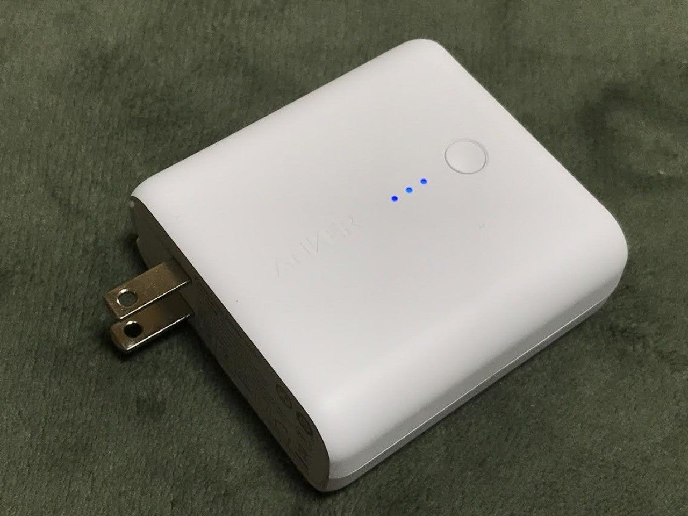
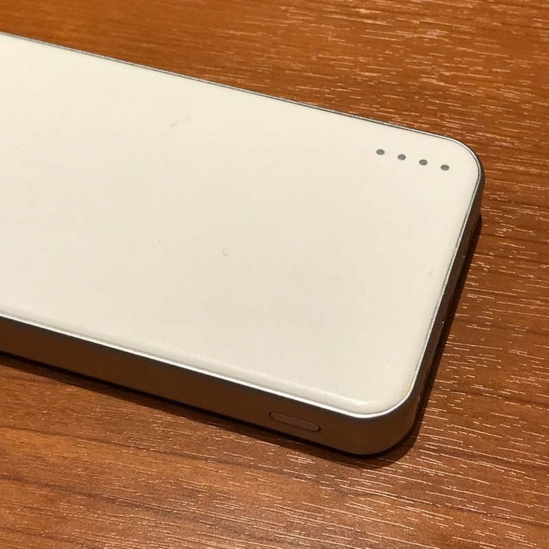

<figure>

</figure>

　もうずっとiPhone7を使っている。正確に言うとデカいサイズの方のplusであるが、それはここでは重要ではない。実はそろそろバッテリーがヤバそうなのだ。ちょっと使っていると、あっという間にバッテリーの表示が20%ぐらい減ってしまい、慌てて充電すると、ものの数分で満充電になる。これはもうバッテリーが消耗している証拠なんじゃないかなと考えている。専門的なことはわからないけど。

　本当は新型のスマホに買い換えればいいんだけど、自分としては、Suicaが使えれば、他はそれほど不自由していないので、まだ全然買い換える気が起きない。そもそも、買い換えようにも最近のスマホは値段が高すぎる。この前ちょっとiPhoneの価格を調べたら、あっという間に15万円近くになってしまった。そんなの、パソコン買える値段じゃないか。そんなわけで、未だにiPhone7のままなのだ。

　で、出かけるときなんかは、必然的にモバイルバッテリーが手放せなくなる。特に、Suicaで電車に乗るわけだが、電車に乗っている間にバッテリーなくなったらどうしようと思うと、いつでもどこでも、常に充電の準備はしておかなければ心配である。あれ、本当にバッテリーがなくなったらどうするんだろう？改札の脇に行って、「バッテリーなくなったんですけど」って言えば、なにか対応してくれるのだろうか。とにかく、最近は、電車に乗っている間にもモバイルバッテリーで充電することは日常茶飯事になっている。

　ところが先日、そのモバイルバッテリーが死亡した。こちらもバッテリーが寿命のようで、スマホに接続すると、一瞬で充電が終わるのだ。モバイルバッテリーを充電しようと思ってアダプタにつなぐと、こちらも一瞬で順電が終わる。で、またスマホに繋ぐと、1秒もたたずにためてあった電気が無くなってしまうのだ。

　さすがにこれでは困るので、早速モバイルバッテリーを新調することにした。ここ数年、モバイルバッテリーやUSB充電器で定評のあるANKER製を選ぶことにした。しかも、モバイルバッテリーでありながら、直接コンセントに差し込むとUSB充電器にもなる、ハイブリッド（？）な感じのやつにした。

　本体はちょっと大きめなのだが、家では常にコンセントに差し込み、スマホの充電に使い、出かけるときはコンセントから抜くと、常に満充電のモバイルバッテリーに早変わりするスグレモノだ。以前のモバイルバッテリーはよく充電しておくのを忘れて、出かける前にせめて10分でも充電して……などと間抜けなことをやっていたのだが、今度の製品は本体がUSB充電器を兼ねているのだから、充電を忘れることもない。お出かけ前の準備品であたふたする僕にとっては、福音のようなモバイルバッテリーなのである。

　このANKERという会社、もともとはGoogleに勤めていた人が独立して作った会社というから、なにか先鋭的な取り組みをしていい製品をつくってくれているんじゃないかという気がする。専門的なことはわからないけど。  
　でも、こういう会社って、何年か経つと偉い人が交代していて、社名は残っているけど技術はどこかへ置いてけぼりになってたりするから、まさに話題になっている今が旬なのかな、とも思っていたいたりする。いずれにしても新しいモバイルバッテリーで、僕のモバイルライフがより充実したので、しばらくはこれで行けるんじゃないかな。

　みんなもモバイルバッテリーとUSB充電器を兼ねるといいと思うよ！
