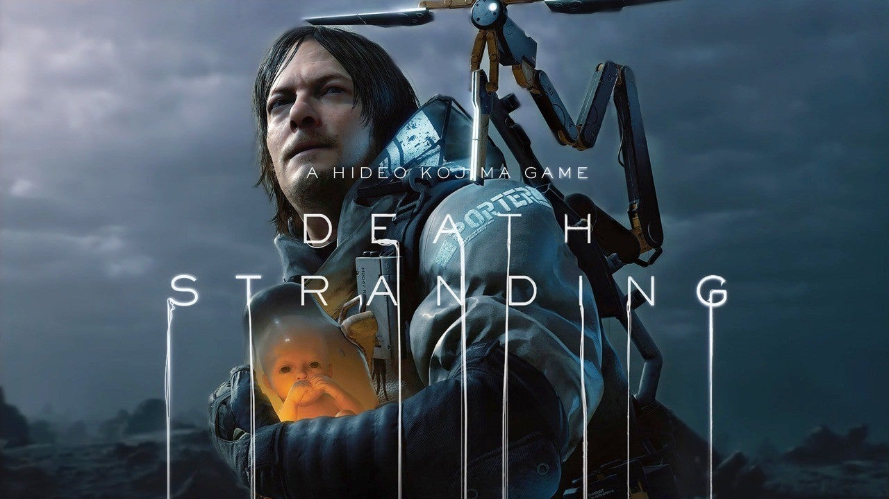
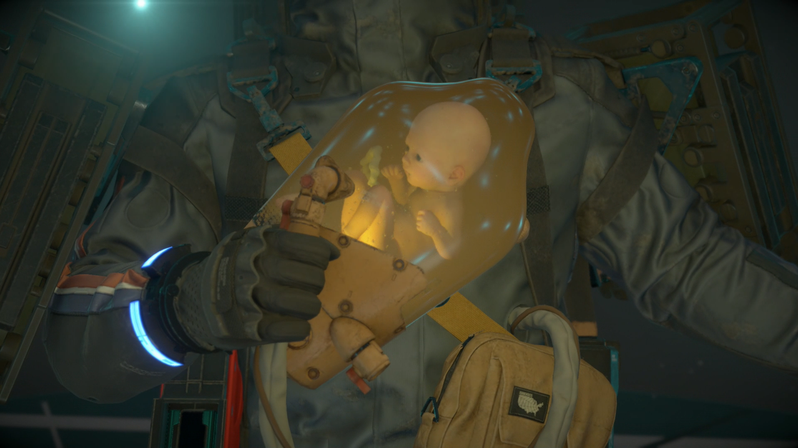
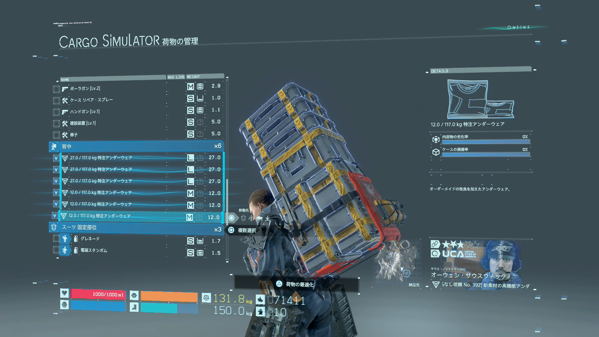

<figure>

</figure>

　小島秀夫監督のゲーム”デス・ストランディング”が楽しい。

　ノーマン・リーダス扮する主人公サムは、朝早く成田線に乗り込む行商のおばちゃんのように巨大な背負子を背負い、胸には瓶入りの赤ん坊を吊り提げた、ちょっと風変わりな出で立ちで荒廃したアメリカ全土に荷物を配達する。

　ゲーム内の登場人物に頼まれて、広いマップをあちらこちらへと歩かされるゲームを、『お使いゲーム』と揶揄することがあるが、デス・ストランディングはいわば究極のお使いゲームだ。荷物を運ぶだけのゲーム。そんなものが果たして楽しいのか！？

　これがなぜか楽しいのである。荷物の積み方を工夫し、左右にバランスを取りながら歩く。今までのゲームにないことをするだけでも楽しいのだが、やがてサムはロープを設置して岩肌を登り、行く手を阻む川に橋をかけ、気の遠くなるような荒野に舗装道路を敷設し始める。プレイするほど、荷物の配送が快適になるようなギミックが仕込まれたゲームなのだ。しかも、ゲームが進行するにつれフィールド上には、オンラインで同期された他のプレイヤーが設置した便利な施設が現れるようになる。毎日ゲームを起動するたびに、昨日と違うアメリカ大陸ができあがっているのである。

　こうして、ついつい毎日少しずつ遊んでしまうのがデス・ストランディングなのだ。正直、遊んでみるまでは、その面白さを予測することはまったくできなかった。しかし、メタルギアシリーズで『隠れる』という行為を、見事にゲームの楽しさとして昇華させてしまった小島監督。作業感満載のデス・ストランディングも実に楽しい作品に仕上げてくれている。

　今思うと、このゲームの主役にノーマン・リーダスを据えて、早くからそれをプロモーションとして推してきたのもさすがだった。デス・ストランディングのディストピアな世界観は、ドラマ”ウォーキング・デッド”との共通性を意識せずにはいられない。注目度抜群の前振りだった。

　かくして、まんまと小島秀夫の戦略に引っかかった僕は、今日も荷物を運ぶ。そして、それがサムの日常であり、今や僕の日常にもなりつつあるのだ。

　さあ、今日も届けよう。
