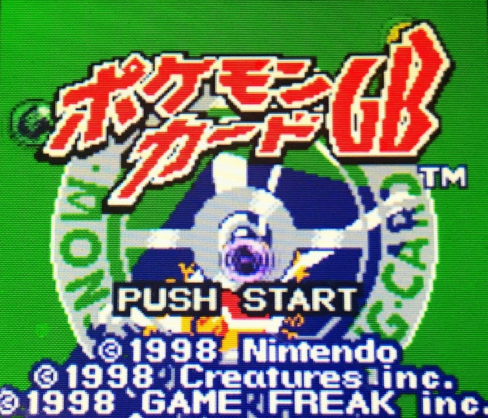
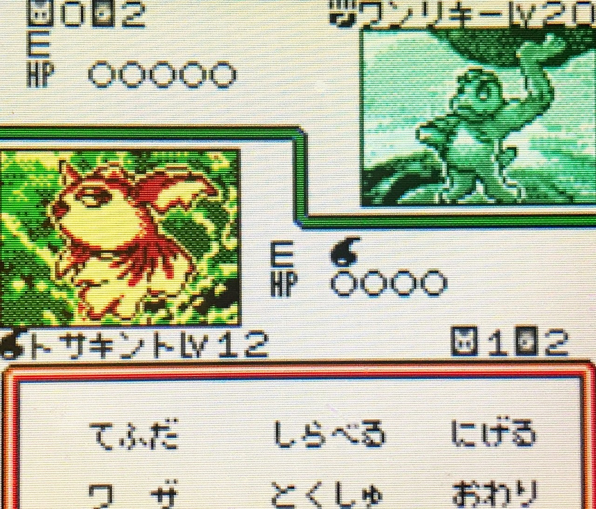
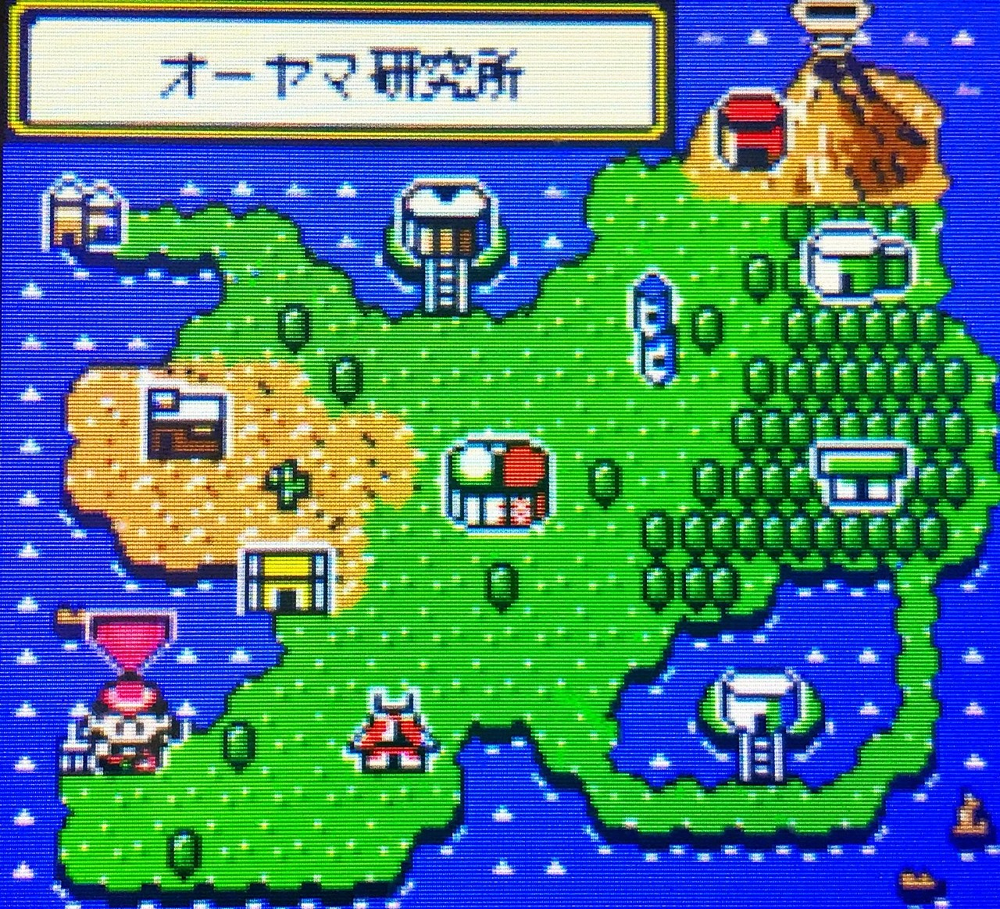
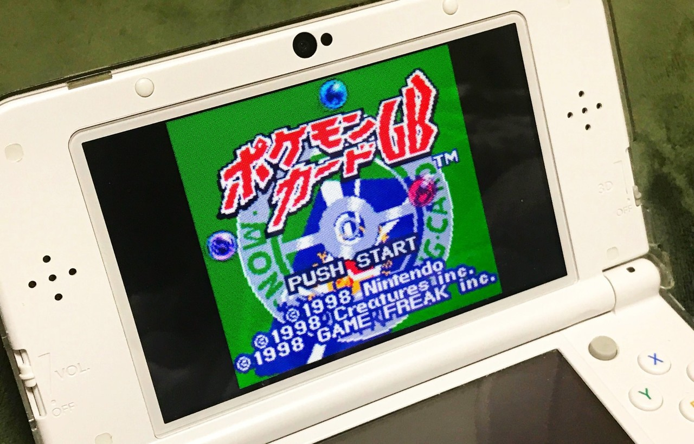

<figure>

</figure>

　最初のポケモンが世に出たとき、すでにその対象の世代から大きく外れていた僕は、ポケモンをやったことがない。

　そんな僕が、なぜかゲームボーイの”ポケモンカードGB”（1998）というゲームだけはよく遊んだ。どうしてポケモンのカードゲームに興味を持ったのか、記憶も定かではない。当時携帯ゲーム機を持っていなかったため、黄色いボディのゲームボーイカラー本体と、ポケモンカードGBのカセットを安い値段で手に入れて遊び始めたのだけは覚えている。唐突にそんな思い出が蘇ってきたので、少し文章にまとめてみた。

　ポケモンカードGBは、当時トレーディングカードゲーム（TCG）として売り出されていたポケモンカード（1996～）をゲームボーイのソフトとして逆輸入する形でゲーム化されていたタイトルだ。

　ルールは、やはり当時人気が出ていたカードゲーム”マジック・ザ・ギャザリング”（1993～）をよりシンプルに、よりスピーディにした感じである。  
　デッキの中から引いたポケモンカードに、それぞれの属性のエネルギーをくっつけて、ポケモンごとの固有の『ワザ』で攻撃し合うという内容。子供にも理解しやすい簡単なルールで作られているが、デッキ構築から個々のポケモンの特性を熟知する必要性まで、本格的なデッキ型カードゲームが楽しめる内容になっている。

　僕としては、本家のポケモンのように広大なフィールドを歩くゲームではなく、マップから行く場所を選択するお手軽な移動方法が気に入っていた。ポケモンを草むらから探し出さなくても、カードバトルでカードとして手に入れればいいので、無駄に歩き回らなくていい。とにかくバトルをして、手に入れたカードでデッキを組んでいけばいいだけ。デッキ作りに集中できるゲームデザインなのだ。

　おそらく、今の時代であれば、追加カードに課金が当たり前だったのかもしれない。しかし、ゲームボーイというハードでそれは難しく、すべてのカード収集はゲームソフトの中で完結していて、当たり前だが、今のような世知辛い課金要素は皆無なのである。この辺りも、僕が気兼ねなくプレイを続けることができた理由の一つかもしれない。（もっともリアルのカードゲームは当時から子供相手に容赦なく課金を迫っていたわけだが）

　もう当時持っていたゲームボーイ本体も、ポケモンカードGBのカセットも手放してしまったが、実は今でも3DSのバーチャルコンソールでこのゲームを遊ぶことができる。  
　僕のゲーム史に特異点のように残っている、唯一プレイしたポケモンシリーズ。久しぶりに遊んでみようかと思っている。　

