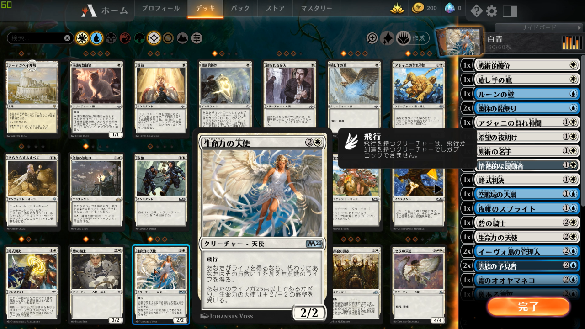
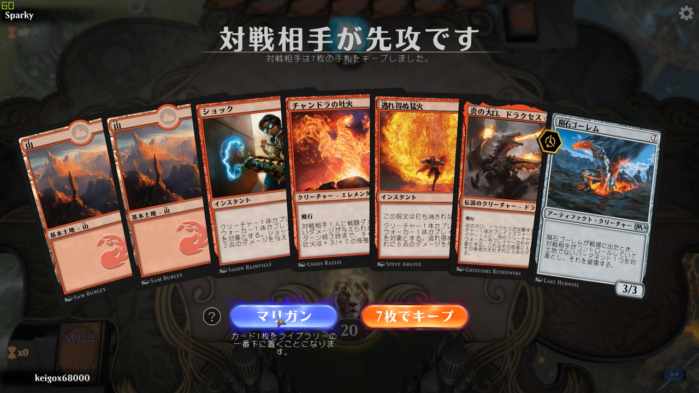
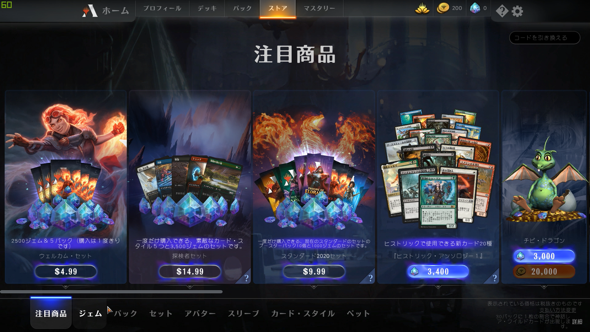
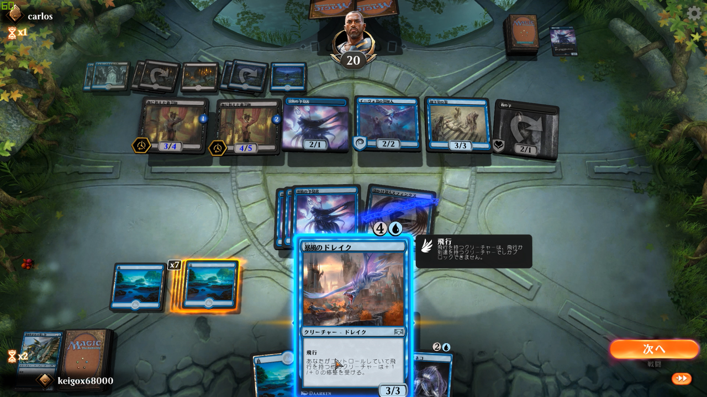
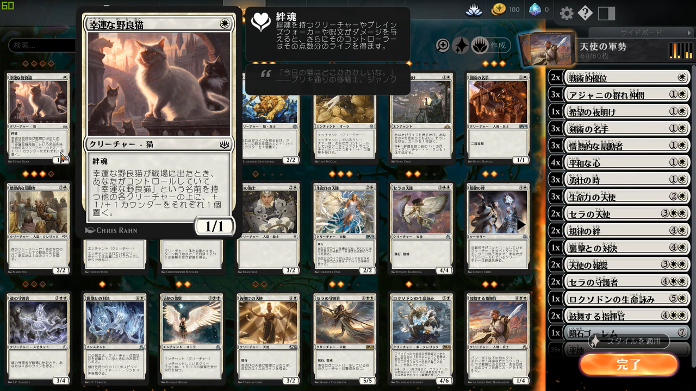
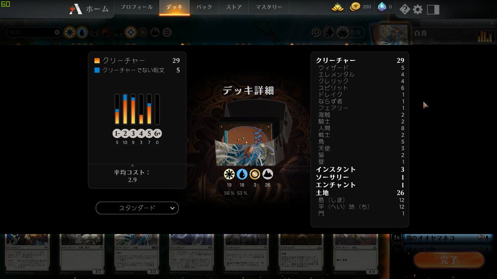
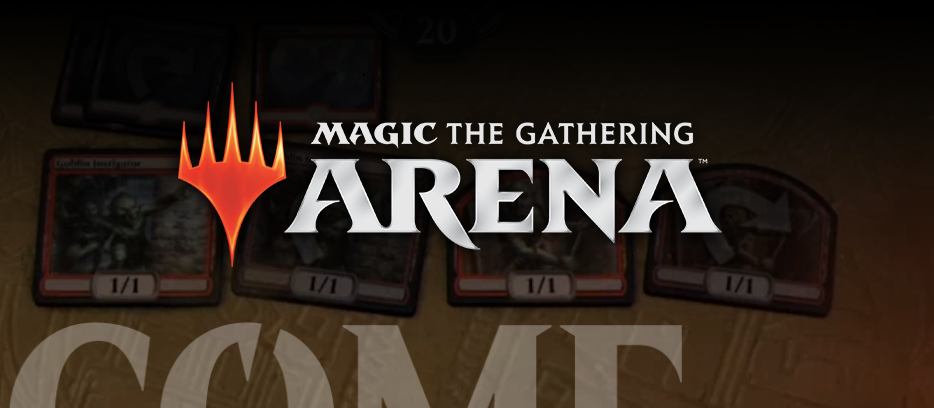

<figure>

</figure>

　思い立ったが吉日。善は急げ。拙速は巧遅に勝る。早いことはいいことだ、とばかりに、昨日の記事でもちょこっと話題にしていたマジック・ザ・ギャザリングを始めてみることにした。

　さすがに、今からリアルカードを買い始めるのはあり得ないので、PC用一択で行くことにする。  
　ところが調べてみると、PC用のマジック・ザ・ギャザリングは2種類あるらしい。実物のカードゲームに近い”オンライン”と、よりゲームらしく初心者でも遊びやすい、さらには競技を意識した作りになっている”アリーナ”の2種類だ。  
　これはもう迷うまでもなく、初心者向けの”アリーナ”しかないでしょうということで、早速インストールしてみた。

　やっぱりカードゲームらしく課金要素はあって、ストア画面には＄マークが並んでいる。しかし、無課金でもそれなりには遊べるらしい。ここは迷うことなく無課金で遊びましょう。人間が古いせいか、どうも課金文化には馴染めない。

　一応なんとなくルールは知っているのだが、実際にプレイするのは本当に初めて。親切なチュートリアルで一通りの遊び方と操作を覚えることにした。  
　と言っても、ルール覚えてもデッキを強くするためのカードが集まらないと対人戦の勝利はままならない。ちょっと味気ないが、しばらくはCPU戦でカード集めに勤しむことにした。

　小一時間も遊んでいるうちにCPU戦に物足りなくなってきて、無謀かなと思いつつも、ランクマッチに飛び込んでみる。  
　ランクマッチは、それなりに同ランク帯のプレイヤーとマッチングしてくれるので、なんとなく接戦には持ち込める感じだ。でも、ほとんどのカードの効果はわからないし、そもそも初期デッキで勝負に挑んでくるような人はいないしで、最初のうちはボコボコにされてしまう。

　やっぱりデッキが大事だよね……と、CPU戦で手に入れたいくつかのデッキや新カードを参考に、自分なりのデッキを組んでみる。色別に構成を考えたり、クリーチャーとか魔法とか土地の比率を考えるのは、かつて死ぬほど遊んだ”カルドセプト”に近い（てか、向こうがマジック・ザ・ギャザリングを参考にしているんだけど）感じで、理解しやすかった。

　しかも、デッキの分析画面も用意されていて、自分の作ったデッキがどういう傾向かというグラフや、平均コストなんかも表示してくれるから、初めてでもデッキが作りやすい！なんというスグレモノのUIなんだ。PCでカードゲーム遊ぶメリットってこういうところだよね、と妙に感心してしまった。

　自分でデッキを構築し、戦ってみて、相手の戦術を真似して、またデッキ構築に戻り、を繰り返し、徐々にルールやゲームの雰囲気がつかめてくる。これはもう、カードゲームのPDCAサイクルだな。  
　そんなことを繰り返しているうちに、ブロンズティアーから始まったランク戦が、シルバーティアーに昇格。結構勝てるようになってきた？なんてうぬぼれながら、気づけば5時間ぐらいプレイしていた。おそろしい。  
　1プレイが10分～20分ぐらいなのに、何この長時間プレイ。いや、こういう短時間で遊べるゲームほどハマって何時間も遊んでしまうものなのかもしれない。

　さて、そんなわけで、もう20年以上遊びたいと思っていながら、全然手を出していなかったマジック・ザ・ギャザリング。なぜかこのタイミングでついに始めてみてしまったというお話。  
　しかし、よくよく調べてみると実はPC版の”アリーナ”も、つい3ヶ月前に正式サービスが始まったばかりということで、実はちょっといいタイミングだったのかもしれない。末永く遊べるゲームのひとつになるといいなと思ったりしている。（ハマり過ぎに注意だ！）

[https://www.youtube.com/watch?v=RVr4Jt6oqcg](https://www.youtube.com/watch?v=RVr4Jt6oqcg)
