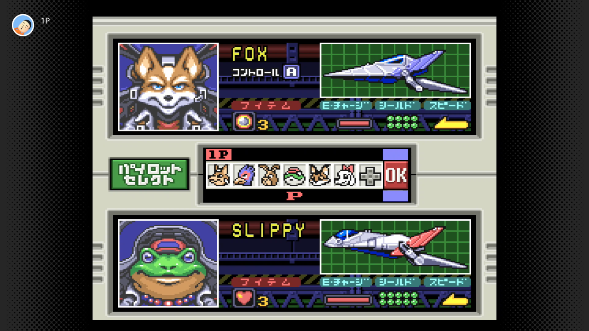

<figure>

</figure>

　どうして君には足が生えてしまったんだ。

　二本足でパタパタと歩き回るアーウィンを見て思わずそう言わずにはいられない。そう、”スターフォックス2”の話である。

　スーファミミニの目玉収録タイトルとして発表されたスターフォックス2は、スーパーファミコン用ソフトとして開発されながらも、発売されることなくお蔵入りになっていたソフトだった。それが、2017年に発売されたスーファミミニに収録されたということで話題になった。それが今回、ニンテンドースイッチでも遊べるようになったということで、当時スターフォックス２に感じた印象を思い出してみた。

　前作を凌ぐ3D性能で描かれるタイトル画面と、スペースオペラ映画のような重厚なBGM。画面を一閃して宇宙船団を真っ二つにするレーザー。ポリゴンで描画された龍が画面狭しと飛び回る。四半世紀が過ぎた今見ても当時の力の入れようがわかるオープニングだ。

　スタートボタンを押すと、すっかりおなじみのキャラクターとともに愛機アーウィンが飛び立つ。前作からスマートに進化したHUDが、未来感抜群の宇宙船を演出する。かっこいいなあ、スターフォックス２。そうこうしているうちにステージは惑星上に移り、敵基地内部への侵攻作戦に移行する。

　が、ここでアーウィンに驚きの変化が現れる。なんと、地表に近づいたアーウィンの機体から、足が生え、地面に降り立つのである。針金細工のような頼りない足をパタパタ動かしながら地面を走り回るアーウィン。何このコミカルな動き。  
　しかも、パタパタと二本足で走り回りながら（ご丁寧に土埃まであげて）地表に設置されたマルバツスイッチを踏みつけて建造物の入り口を開閉するアーウィン。スタイリッシュな宇宙戦ゲームのスターフォックスはどこへ行ってしまったのか。さらには、必死でアーウィンが駆け回る最中にも空中からは敵機が襲ってくる。プレイヤーは咄嗟にアーウィンを戦闘機形態に変形させて応戦しなければならない。スマートな飛行形態と、パタパタな歩行形態の切り替えを要求されるプレイヤー……うーん、微妙。あまりにテンポが悪い！

　こうして、広大な宇宙を、青い大空を、3D空間を気持ちよく飛び回っていたアーウィンはどこかへ消えてしまった。  
　彼（？）に足が生えた瞬間、スターフォックスは、水飲み鳥のようなおもしろいポリゴンを動かす滑稽なゲームに成り果ててしまったのである。  
　これこそ本当の『蛇足』というものではないだろうか。
