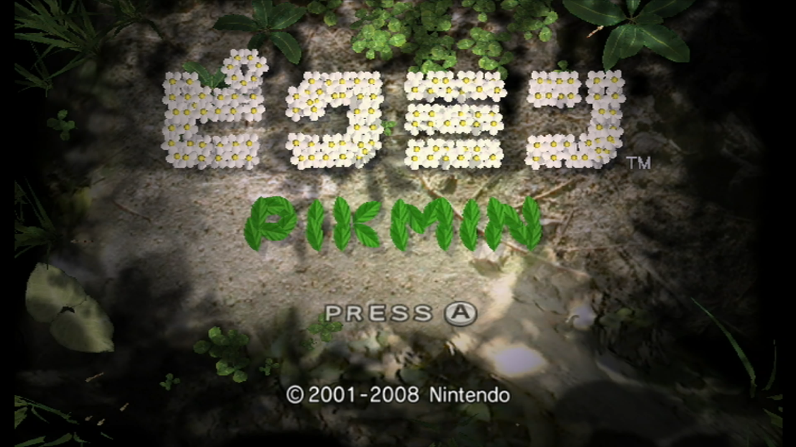
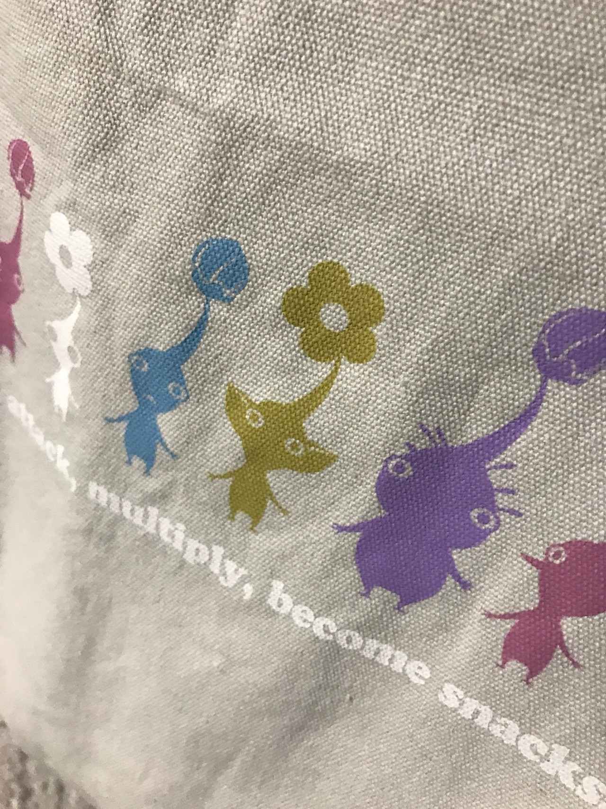
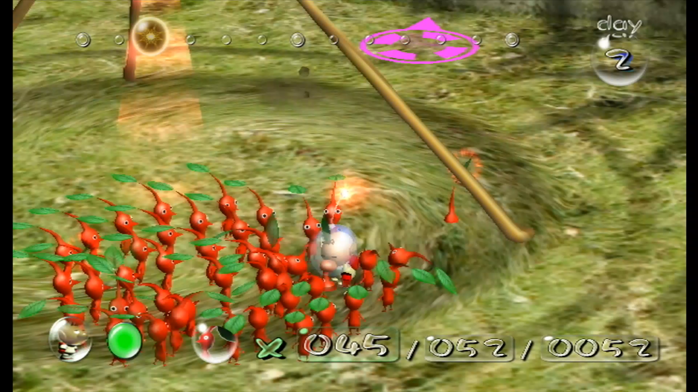
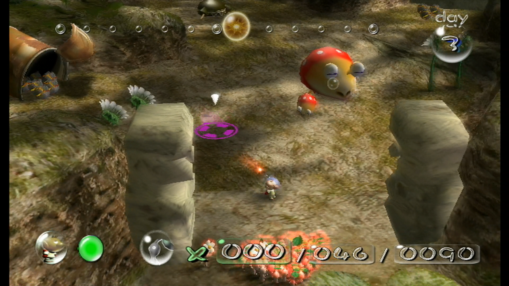
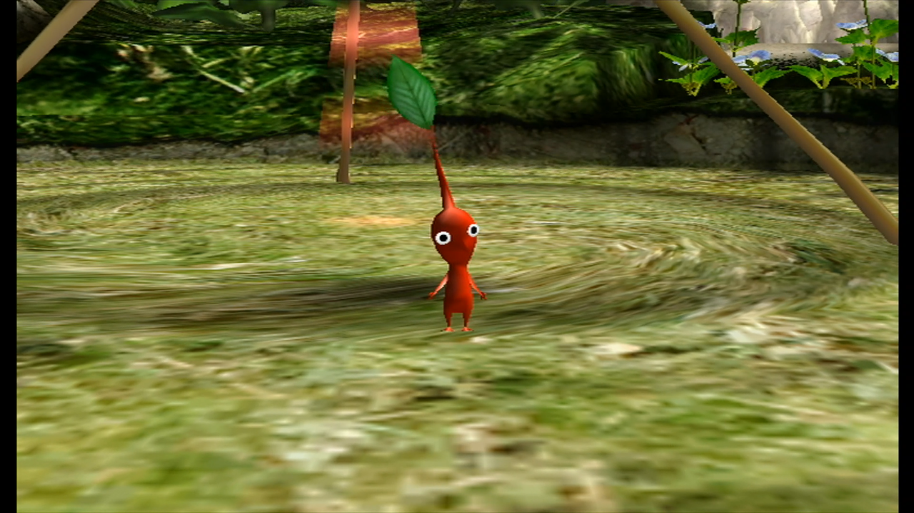

<figure>

</figure>

　奥さんがピクミンのトートバッグを持っているのを見て、なんだか唐突にピクミンがやりたくなってきたのだ。よしやろう！

　ピクミンの発売当時（2001）、ゲームキューブでこのゲームをプレイした。宇宙船が墜落して困っている主人公（プレイヤーキャラ）オリマーを手伝ってくれるピクミンたち。僕は、彼（？）らを見て、一言では言い表せないような愛と感動を感じたものだ。

　集合をかければさっと集まり、遠くのアイテムに向かってぽーいぽーいと投げても文句も言わずに荷物運びをしてくれる。それがこの星に住む謎の生物（植物？）ピクミン。それはそれは本当に可愛らしいやつらなのだ。  
　毎日毎日少しずつピクミンの花を探し出し、ちょっとずつ集めた仲間が大群になる頃には、このピクミンたちが、僕の家族じゃないかと錯覚するぐらいの愛着が湧いていた。お前らと一緒なら、この星のどこまでも行けるよ。もういっそのこと、このロケットで、ともに広い宇宙を旅しようじゃないか。そんな気持ちにさせてくれる、銀河系規模の一体感を感じられるゲーム、それがピクミンだった。

　ところが、そんなピクミンとの甘い蜜月も長くは続かなかった。ある日、いつものように大勢のピクミンを連れて歩いていた僕（オリマー）は、ちょっとした不注意で、岩陰に隠れている大型生物に気づかずに、その目の前を堂々と通過してしまったのだ。

　常日頃から腹を空かせている大型生物。わらわらと列をなして歩いていくピクミンの姿に食欲を掻き立てられたのだろう。オリマーがピクミンたちに感じている愛とはまた別の欲望に突き動かされ、ピクミンたちに向かって突進する大型生物。次の瞬間その大型生物は、巨大な口をがばっと開いて赤くて小さな二十日大根のようなピクミンたちに飛びかかったのである。  
**バクバクバクバクーッ！**  
　貪り食うようにピクミンたちを蹂躙する大型生物。「きゅー！」と悲鳴を上げながら逃げ惑うピクミンたち。  
「逃げろ！逃げるんだピクミン！いや、違う！戦え！力を合わせれば勝てる！」  
　そう叫びながらピクミンを大型生物に投げる僕だったが、その一瞬の判断の迷いが悲劇を生んだ。何十匹も連れて歩いてピクミンは、あらかた食い尽くされ、もう帰らぬ人（？）となっていたのだ。  
　泣きながら敗走するオリマー。あまりのショッキング映像は、プレイヤーの心にも大きな傷を残し、僕のピクミンはそこでフェードアウトすることになった。

　可愛らしいキャラクターが売りのピクミンだが、実はピクミンを食らう敵のデザインが非常に怖い。そして気持ち悪い。なんの意志もなく、ただただ本能に突き動かされるようにピクミンたちを食い尽くす敵の姿は、本当に恐ろしい存在に感じられる。

　今日唐突に思い出したピクミン。今はWii用のソフト”Wiiであそぶ ピクミン”が、Wii Uのダウンロードソフトとしてプレイできる。あの日食い尽くされたピクミンたちを思い出し、同じ轍を踏むまいと、超慎重なプレイを始める僕であった。ピクミンたちよ、今度こそ一緒にこの星を脱出しよう。
