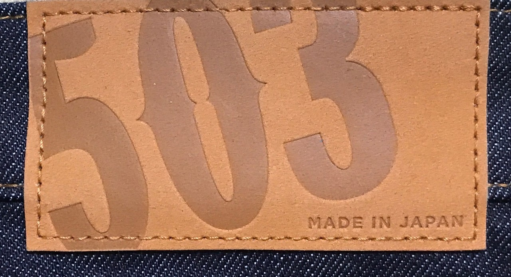

<figure>

</figure>

　10年履いたジーンズが破れた。膝の部分が破れているのは、80年代に青春真っ盛りだった僕からすると、ヘヴィメタルファッションの一環みたいなものだ。まだまだかっこいいし、全然履ける。と、思っていたのだが、奥さんに  
「みっともないから買いなさい」  
　と、一蹴されて、新しいジーンズを買うことにした。ところで、雑誌とか見るとジーンズって書いてなくて、デニムなんだけど、僕の世代はデニムなんてこっ恥ずかしくて言えない。ジーンズでいいんだ。

　さて、10年に1回しかジーンズ買い換えない人は、次にどんなジーンズを買えばいいかわからない。今まで履いていたのはリーバイスの505。普通のストレートだけど、当時Made in Japanってのを買った。中国製よりちょっと高い。  
　今度履くなら、デヴィッド・カヴァデールがカリフォルニア・ジャムで履いていたような、裾が広がっているやつがいいなあ。そんなことを言っていたら、またも奥さんに「ダサい」と一蹴されてしまった。

　え、裾の広いジーンズってダサいの？かっこいいじゃん！と思って、ネットで検索すると、なるほど、裾の広いジーンズはあまり売ってない。どちらかと言えばかなりマニア向けの特殊なファッションのようだ。いや、知ってたよ。本当。  
　そんなわけで、ネットで見ていても埒が明かないので店に行ってみることにした。

　うわー、やっぱり細いの全盛なんですね。スキニーって言うって？知ってたよ、それぐらい。  
　こういうときに、ファッションに興味ゼロ人間のダメっぷりが発揮されてしまう。もう、今履いているのと同じでいいよって感じで、なかば思考停止しつつリーバイスの505を手に取ってみた。ほら、定番だから10年経っても置いてあるじゃん。と、思っていたらストレートもあるけど、細いのもある。スキニーじゃなくて、膝下が絞ってあるテーパードって言うのか。いや、聞いたことあったよ。うん。  
　さすがに細いの無理でしょう。と思って、テーパード履いてみると、これが意外にフィットして悪くない。この10年間、医者に運動しろとか言われて日々トレーニングしてきた成果かもしれないなー。鼻をフフンと鳴らして悦に入りながら、すぐに決めた。裾の広いジーンズはあっけなくどこかへ行ってしまった。まあ、そんなものだ。

　で、一応もう一本買っておくかと、店内を見回す。今度はエドウィンの503が目に入ってくる。これは、僕くらいの世代だと、ブラッド・ピットがギター弾きながらヘタクソな日本語で「♪ごーまりーさーん」と歌っていたCMで印象に残っているジーンズだ。  
　説明したい店員さんがすぐに駆け寄ってきてまくし立てる。  
「あ、エドウィンの503はモデルチェンジして昔よりスッキリしたデザインになったんですよ。おすすめですよ」  
　あなたにかかれば、なんでもオススメじゃないか、と苦笑しながら見てみる。こっちもストレート、テーパード、スキニーと揃っている。いいよ、じゃあ、それにしましょう。俺はファッションに敏感なんだ。時代はテーパードだよ。やっぱり細くないと。

　で、買ってから気づいた。今回買ったリーバイスは中国製、エドウィンは日本製であった。ああ、Made in Japanは遠くになりにけりってことなのかなあ。いいよ、全然こだわらないよ。　

　そんなわけで、お手頃なリーバイスとエドウィンの（たぶん）今風のシルエットのジーンズを2本買ったお話。次回は2030年頃にお会いしましょう、店員さん。
