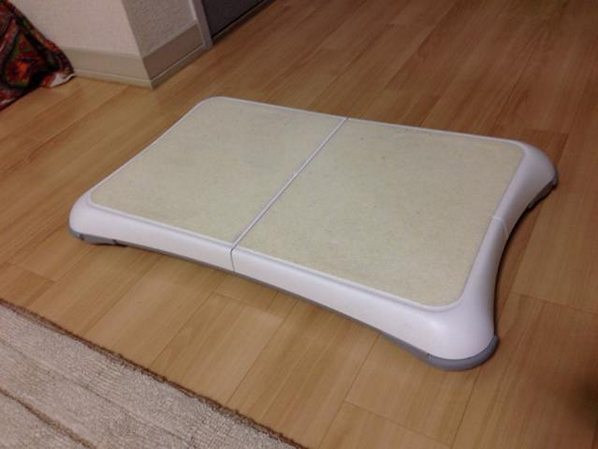
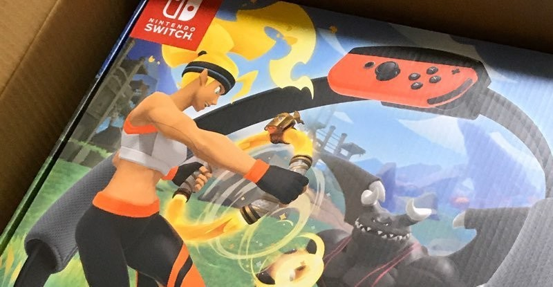

<figure>

</figure>

　もう10年以上前から運動を日課にするようにしている。「するようにしている」と、限りなくぼかして書くのは、意志が弱くて必ずしも日課になっていない部分も否めないからだ。

　そもそも自分から、「運動しよう！」と意識高く決めたわけでなく、病院へ行くといろいろ検査結果が芳しくなく、医者に「運動しなさい」と言われるようになったのがきっかけである。

　運動と言えばジョギングということで、僕もご多分に漏れず走ってみた。しかし、これが続かない。まず、天候がダメ。毎日の天候が自分に都合よく味方してくれるとは限らず、雨の日は走れない。こうなってくると、次は季節がダメだ。寒くなってくると走りに行くのはものすごく億劫になる。冬なんかオフシーズンでまったく走らない。結局やめてしまった。

　次にジムに通ってみた。月に1万円程度の月謝を収めて運動しようというわけだから、さすがに運動するだろう。しかも屋内で運動できるのだから、天候に左右されない。  
　しかし、僕の意志の弱さは、ジムの便利さにも勝る。もう弱いんだか、強いんだかわからない。毎日のように通っていたジムが、週3日になり、週末だけになり、やがて行かなくなってしまう。しまいにはジムに行っても、トレッドミル15分。あとはお風呂に入って帰ってくるだけ。ずいぶん高い銭湯だ。

　結局、そんな僕を日常的な運動に取り組ませてくれたのが、2007年に発売された”Wii Fit”だった。ゲームの中で運動した量や自分の体重が日々記録される。不思議なもので、これだけで全然モチベーションが違う。数ヶ月運動を続けてから病院へ行くと、いろいろな数値が劇的に改善されていた。これには主治医もびっくりしたようだ。  
「どうやって運動してるの？」  
「Wii Fitってゲームがあって……」  
　カルテに『ウィーフィット』と記入する主治医。なんの記録なんだそれは。

　こうして健康促進に大活躍したWii Fitだったが、残念なことにゲームハードとしての全盛期がすぎるとともに、活躍の機会も減ってしまった。しかし、Wii Fitによって、『ゲームと運動が同時にできれば継続できる』という素晴らしい結論が導き出されたこともまた事実である。

　このような過去の経験から、今ではエアロバイクを買って、室内で日々有酸素運動に勤しんでいる。エアロバイクなら**ゲームをプレイしながら運動ができるからだ。**しかも天候にまったく左右されない。僕にとって理想的な運動環境である。おかげで10年前より体も締まってきた。細いジーンズも買えた。人間やる気と工夫があれば、続けることができる。「継続は力なり」である。

　さて、つい先日、そんな僕の前に新たな相棒が届いた。その名もリングフィットアドベンチャー。新たな相棒が健康の助けになるのか否か。そのお話はまたいつか書こう。

