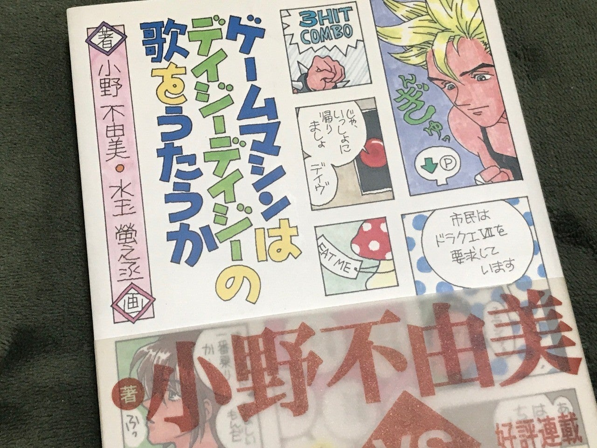
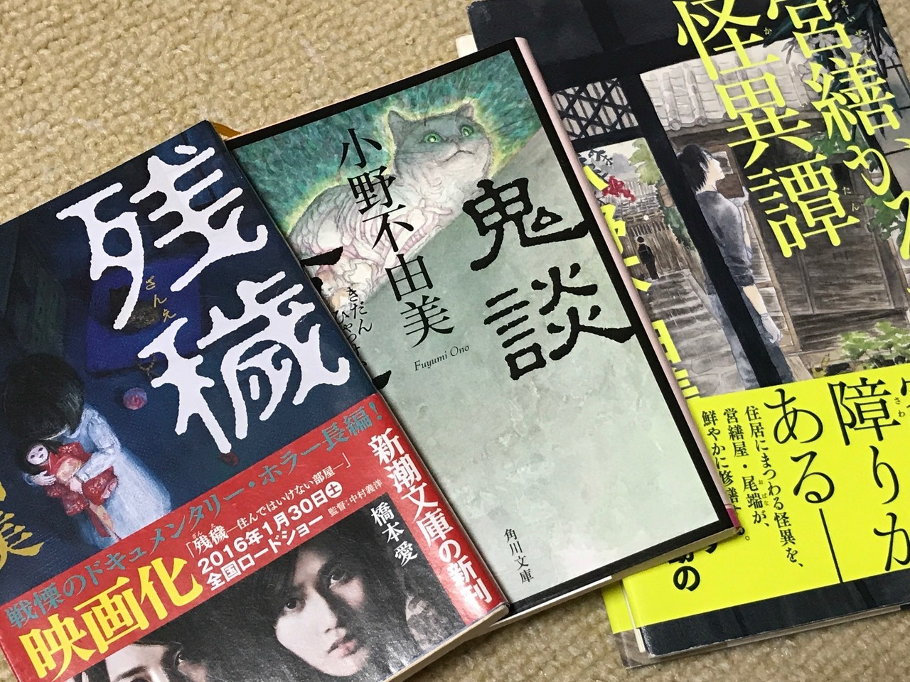

<figure>

</figure>

　小野不由美の小説が好きで、いろいろ読んでいる。しかし、そもそも彼女の本を最初に読んだのは**『ゲームマシンはデイジーデイジーの歌をうたうか』**（1996年）というゲームエッセイである。  
　**『The スーパーファミコン』**という雑誌に掲載されていた連載が書籍化されたもので、当時僕は小野不由美という人をよく知らずに読んでいた。あまり小難しいことを言わず、誰でも知っている有名ゲームを取り上げ、親しみやすい文章で書かれた内容だ。

　でもよく読んでみると、実はゲームのことに終始せず、ゲームを通して見えてくる世の中のこと、いろいろな人の人生、考えさせられること、そんなことが散りばめられている。そういう、多層的な内容がエッセイとして好きだった。

　その後、小野不由美作品は、**『十二国記』**をはじめ、特に何冊かのホラー小説が気に入って、よく読むようになるのだが、ずっと後になってから「あのエッセイの人か！」と気づいたのだ。こういう、たまたま好きになった別の作品が、同じに作者によるものだったりするのはなぜか嬉しい。いっちょ前に、その作者のことを理解したような気になって一人悦に入ってしまうものだ。

　この本のさらに嬉しいところは、同じ頃ゲームやコンピュータ雑誌、SF雑誌などで活躍していた水玉螢之丞が挿絵を描いているということだ。あの頃、ゲームやパソコンが趣味だった人にはおなじみの、可愛らしい絵である。なんというか、小野不由美の日常感とマニアックな感性が入り混じった雰囲気の文章に、ベストマッチなイラストなのである。このコンビネーションで書籍化した編集者は本当にお手柄だと思うよ。

　ところで、タイトルの「デイジーデイジー」は、映画**『2001年宇宙の旅』**でHAL 9000が機能停止する際に歌っていた歌だ。そもそもIBM 7094が歌った世界で初めてのコンピュータによる歌に由来している。よーく見ると、表紙にHAL 9000も描かれているし、いろんなところがマニアックに嬉しい1冊なのであった。

[https://www.amazon.co.jp/%E3%82%B2%E3%83%BC%E3%83%A0%E3%83%9E%E3%82%B7%E3%83%B3%E3%81%AF%E3%83%87%E3%82%A4%E3%82%B8%E3%83%BC%E3%83%87%E3%82%A4%E3%82%B8%E3%83%BC%E3%81%AE%E6%AD%8C%E3%82%92%E3%81%86%E3%81%9F%E3%81%86%E3%81%8B-%E5%B0%8F%E9%87%8E-%E4%B8%8D%E7%94%B1%E7%BE%8E/dp/4890529071/ref=sr\_1\_1?\_\_mk\_ja\_JP=%E3%82%AB%E3%82%BF%E3%82%AB%E3%83%8A&keywords=%E3%82%B2%E3%83%BC%E3%83%A0%E3%83%9E%E3%82%B7%E3%83%B3%E3%81%AF%E3%83%87%E3%82%A4%E3%82%B8%E3%83%BC%E3%83%87%E3%82%A4%E3%82%B8%E3%83%BC&qid=1576601699&sr=8-1](https://www.amazon.co.jp/%E3%82%B2%E3%83%BC%E3%83%A0%E3%83%9E%E3%82%B7%E3%83%B3%E3%81%AF%E3%83%87%E3%82%A4%E3%82%B8%E3%83%BC%E3%83%87%E3%82%A4%E3%82%B8%E3%83%BC%E3%81%AE%E6%AD%8C%E3%82%92%E3%81%86%E3%81%9F%E3%81%86%E3%81%8B-%E5%B0%8F%E9%87%8E-%E4%B8%8D%E7%94%B1%E7%BE%8E/dp/4890529071/ref=sr_1_1?__mk_ja_JP=%E3%82%AB%E3%82%BF%E3%82%AB%E3%83%8A&keywords=%E3%82%B2%E3%83%BC%E3%83%A0%E3%83%9E%E3%82%B7%E3%83%B3%E3%81%AF%E3%83%87%E3%82%A4%E3%82%B8%E3%83%BC%E3%83%87%E3%82%A4%E3%82%B8%E3%83%BC&qid=1576601699&sr=8-1)
