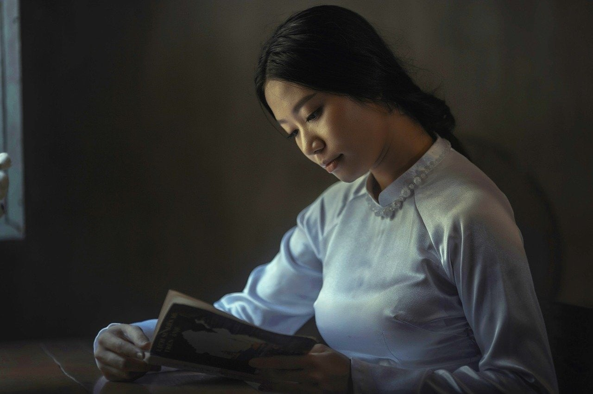
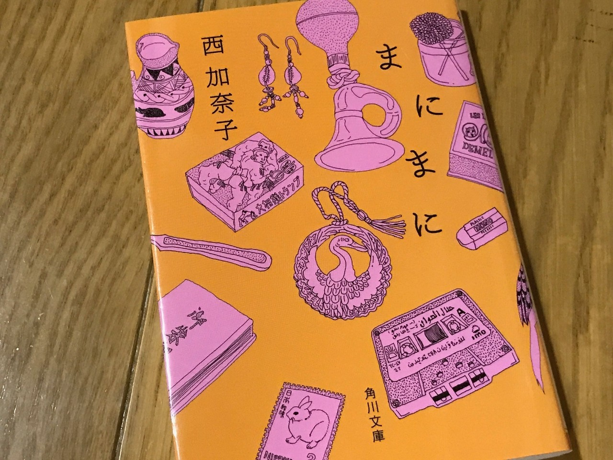

<figure>

</figure>

　小説を読むのが好きだが、エッセイを読むのも好きだ。  
　小説には、その登場人物や語られるストーリー、その中で描かれる世界に作者の考えが反映される。それを楽しむために物語の中に入り込んで没頭する自分がいる。しかし一方でエッセイは、作者の思いがもっとダイレクトに反映される文章が読める。  
　自分が興味を持った人が、普段何を考え、どんな生活をしているのか。そういうことが窺い知れるのは実に興味深い。野次馬根性と思われるかもしれないが、案外人間の楽しみというのは、誰でも皆そういう覗き趣味のようなところにあるのかもしれない。

　小説は、どちらかと言えば想像の世界で、想像の物語が語られることが多い。たとえ、史実や実在する場所が舞台だとしてもだ。  
　ところがエッセイは逆だ。作者の体験や思いがそのまま率直に書かれる。その作家の思いが、リアルに語られているものが多い。  
　だが、小説で描かれる架空の世界も、エッセイで描かれる作者の真実も、読者にとってはどちらも自分の経験ではない。小説だろうとエッセイだろうと、他人の書いた文章を読むとき、読者はそこに書かれていることに思いを馳せ、想像力を働かせて読むことになる。ただ、その想像力の方向が、空想と真実、リアルと虚像、真逆のベクトルを向いているということなのかもしれない。  
　僕は、普段小説を好んで読む。そして、ときどきエッセイを読む。これは、もしかしたら物語世界に凝り固まった自分の頭の中を、逆方向にえいやっと伸ばすような、ストレッチにも似た行為のようにも思える。一服の清涼剤なんて言葉があるが、まさにそんな心持ちになりながら、エッセイを楽しんでいるのだ。

　当たり前だが、世の中にはエッセイをまったく書かない作家というのも存在する。個人的には、普段は自分の世界観でかっちり固めた物語を紡ぎながらも、ときにはエッセイで本音を暴露してくれる作家に親しみを覚える。まったくエッセイを書かない作家は、何か本当の顔は見えてないような印象さえ感じるときがある。だから、好きな作家のエッセイが出版されると、つい手に取ってみる。覗き見の楽しみである。  
　もちろんこれは、どっちの作家がいいという話ではない。僕の好みの問題だ。

　今読んでいる**『まにまに』**というエッセイ。テヘラン生まれで、海外の生活経験を生かしながら書いた**『サラバ！』**で直木賞を受賞した西加奈子の作品である。その独特の経験や、様々思うところなどが書かれている。彼女の小説とはまた違った雰囲気の文章に、存分に想像力の枝葉が伸びていくような感覚を覚える。章が変わると、文体ががらりと変わるのも興味深い。直木賞受賞前と受賞後で心境の変化があったであろうことすら思わせてくれて、それもまた楽しいところだ。  
　こうしてエッセイを読むと、また小説作品も1冊新たに読みたくなってくる。どうやら今回も、清涼剤が程よく効き目をあらわしているようだ。

[https://www.amazon.co.jp/gp/product/4041026385/ref=dbs\_a\_def\_rwt\_bibl\_vppi\_i8](https://www.amazon.co.jp/gp/product/4041026385/ref=dbs_a_def_rwt_bibl_vppi_i8)
