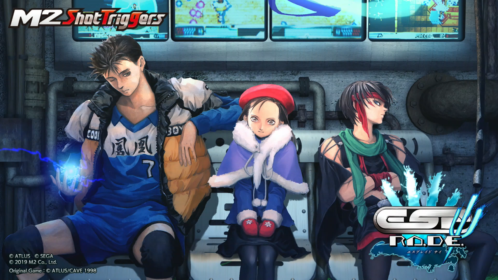
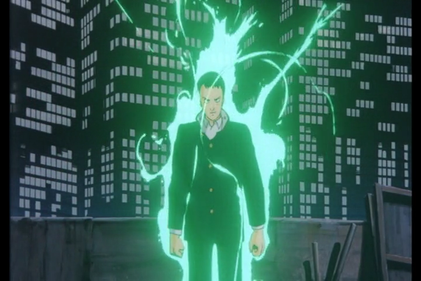
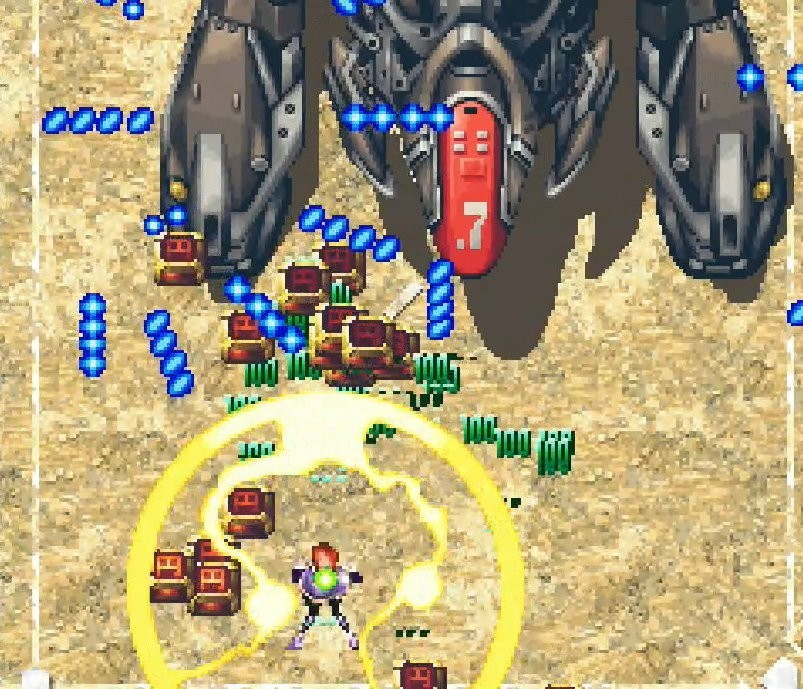
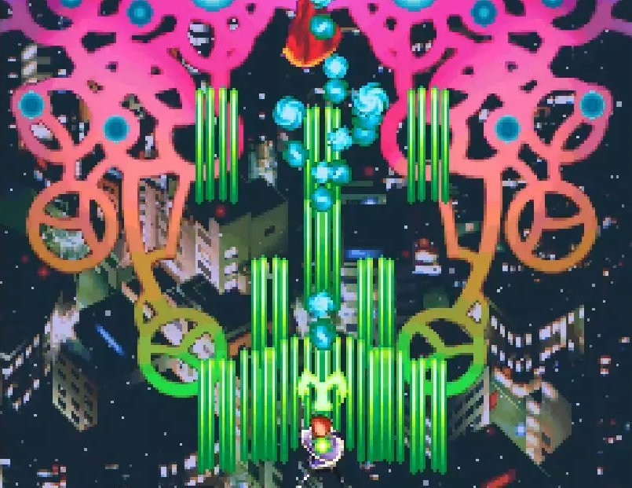

<figure>

</figure>

　超能力者の話が好きだ。ユリ・ゲラーのことではない。子供の頃好きだった、超能力バトルの物語のことである。普段は社会の一員として暮らしている、なんの変哲もない主人公。それが、何かのきっかけで途方も無い能力を使った戦いに巻き込まれていく。そんな（ある意味夢物語だが）日常を脱していく危機感のある物語が大好きだった。  
　僕のこういった嗜好は、もとをたどれば、たぶん角川映画の**『幻魔大戦』**や、筒井康隆の**『七瀬ふたたび』**（**『家族八景』**じゃなくて七瀬の方ってところが重要）辺りが原点なのかなと思う。**『超人ロック』**とか**『地球へ…』**なんて漫画作品もあったけど、こっちは最初から日常感がないので（作品は好きだけど）ちょっと違う。栗本薫**『魔界水滸伝』**だと、ちょうどボーダーライン辺りに存在している感覚だ。ちょっとわかりにくいか。

　まあ、そんな僕の趣味はともかく、20年ほど前に超能力者を主人公に据えたシューティングゲームがあった。それがケイブ開発の**『エスプレイド』**である。

　シューティングゲームだけあって、ゲーム中でストーリーはあまり多く語られない。しかし、空を飛び回り、自在にバリアを操る主人公の姿を見ただけで、これが超能力者を題材にしたゲームだとすぐにわかる。なんという魅力的なテーマ。  
　『エスプレイド』以前にも人間が空を飛ぶシューティングゲームは存在した。しかし、人そのものが飛んでいる、つまり超能力者を雄弁にアピールしているゲームはあまり多くない。『エスプレイド』は、どちらかと言えば地味な、普通の少年少女が主人公である。だが、彼らが超能力者というだけで、俄然アピールしてくるものがあるのだ。

　ケイブという会社は、当時**『首領蜂』**や**『怒首領蜂』**といった、極めて激しいシューティングゲームを世に送り出していた。もちろん、この『エスプレイド』も例外ではない。  
　次々と現れる敵は雨あられのごとく弾を吐き出し、その攻撃は熾烈を極める。たとえ相手が人間であろうと、敵は戦車や戦闘機、戦艦など最新鋭の兵器を遠慮なく投入してくる。それはそうだろう。なんと言っても相手は超能力者だ。生半可な攻撃では倒せない。  
　だが、本当の強敵は近代兵器などではない。ゲームが進むとプレイヤーの前に立ちはだかる、敵側の超能力者。彼らこそがこのゲームにおける真の敵である。ゲームのクライマックスにおける、こういった盛り上げ方もお約束のやり方で嬉しい限りだ。  
　こんなストーリーが、見事にシューティングゲームとして構成されているのが『エスプレイド』の魅力である。ドラマティックなメロディラインのBGMとあわせて、実に燃えるシチュエーションを演出してくれる。

　そんな熱いシューティングゲームが、2019年の今になって家庭用ゲーム機に移植された。これをプレイしない手はないだろう。製作は、移植に定評のあるM2ショットトリガーズだ。

　ところで、家庭用移植にあたってタイトルに付加されたΨ（サイ）の文字。もちろんサイキックのことだよね。うん、超能力者ラブだ。
