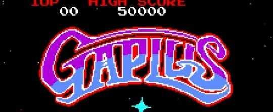
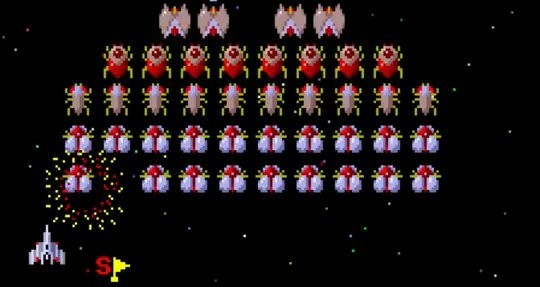

<figure>

</figure>

　子どもの頃よく行ってたマジカルガーデンというゲームセンター。本屋の地下にある、いかにも80年代風味のゲーセンだった。ナムコの直営ではないけど、ナムコのゲーム中心の店で、店内には30台ほどのテーブル筐体が所狭しと並べられていた。壁際には**『ガントレット』**などのアップライト筐体とミディタイプの筐体が置かれ、店の中央に**『ハングオン』**が鎮座していた。スモークガラスのカウンターの向こうでは、店長らしきおっちゃんが、いつも新聞を読んでいる。でも、やる気がないんじゃなくて、ハイスコアボードを更新したり、新製品のスコア競争ミニイベントを企画したり、こじんまりと楽しい空間を作り出していた。

　そんないつも通っていたゲーセンに**『ギャプラス』**が入荷した。ナムコが作ったシューティングゲームだ。その数年前まで根強い人気のあった**『ギャラガ』**をさらに攻撃的に、刺激的にアップグレードしたようなゲームだった。僕はスピード感のある**『ギャプラス』**の方が、断然好きだった。自機がパワーアップすると、画面いっぱいに弾が撃てる。当時としてはありえないぐらいの攻撃力で、もう絶対敵に負けないんじゃないかと思った。でも違った。敵の攻撃はさらに過激化し、（比喩でなく本当に）目にも止まらない速さで襲ってくる。一瞬の勝負が熱いゲームだった。熱中した。

　しかし、そんな**『ギャプラス』**というゲームにも転換期が訪れる。このゲーム、ほぼすべてのステージで、自機を増やすことができる**「スペシャルフラッグ」**というアイテムを手に入れることができた。その情報が、ゲーセンコミュニティの口コミ情報で広まってきたのだ。スコアとステージ数から算出されるスペシャルフラッグの出現方法を表にしたものが出回り、やがてみんながスペシャルフラッグを出すことに心を砕いた。もちろん、僕もだ。

　自機がものすごい勢いで増え、何十機とストックされるのは快感だった。それまでのゲームにこんな大盤振る舞いのものはなかった。敵の激しい攻撃にさらされ、次々にミスをしても、よほどのことがない限りゲームは終わらない。思う存分遊んで、数百万点というスコアを叩き出す。少ない小遣いから投入した100円でいつまでも遊べるから、コストパフォーマンスは抜群だ。みんながみんな、1時間以上遊んでいた。誰かひとりが**『ギャプラス』**をやっていると、「今日は遊べないかー」とあきらめる状況にまでなっていた。

　そんなある日、僕はいつものようにスペシャルフラッグ表をかたわらに置き、**『ギャプラス』**に興じていた。と、ふと横に立つ人が。いつも来るゲーセン仲間かなと顔を上げると店のおっちゃんだった。「え、何？」と思う間もなく、すっとテーブル筐体に100円を置くおっちゃん。  
「100円返すから、終わりにしてくれるかな」  
　と言われた。  
　ゲームを途中でやめてくれと言うのだ。素直な少年だった僕は、ぽかんとしながらも、100円を手にしてテーブル筐体を立った。おっちゃんは、テーブルの下の方に手を入れてゲームの電源を切ると、再度電源を入れた。爆発音がして、再び**『ギャプラス』**のタイトル画面が現れる。納得がいかないとか、そういう前に、あまりに自然に100円を返されてしまったので、思わず受け入れてしまった。腹も立たなかった。そうか、長時間やっていて迷惑だったか。むしろ納得してしまった。あれだけ遊んで100円返してもらったからいいか、という気持ちの方が大きかったのかもしれない。

　その後も、スペシャルフラッグを出しまくって**『ギャプラス』**をプレイしている人がいると、おっちゃんは100円を返して、立ち退いてもらっていた。僕はそれを遠巻きに見ていた。やがて、**『ギャプラス』**のブームは去り、誰もプレイしなくなったテーブル筐体には別のゲームが入れられた。

　今も考える。あの頃、あの**『ギャプラス』**はどれぐらい100円玉を稼ぐことができたのだろう。僕らの心の中に綺羅星の如く輝いているゲームも、実はゲームセンターの厄介者だったんじゃなかろうか。  
　もうマジカルガーデンもなくなってしまったが、あのときのおっちゃんに聞いてみたい気がする。
