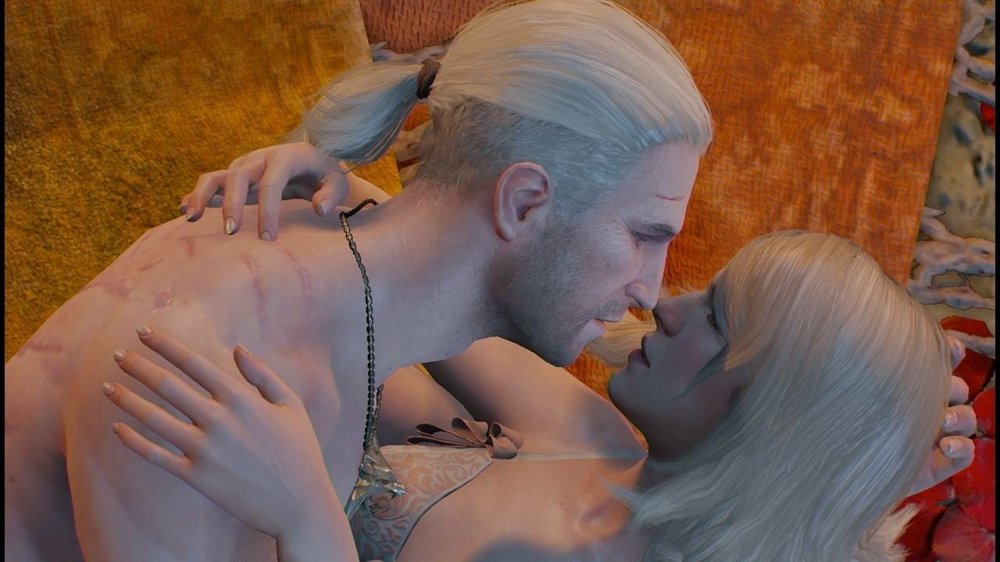
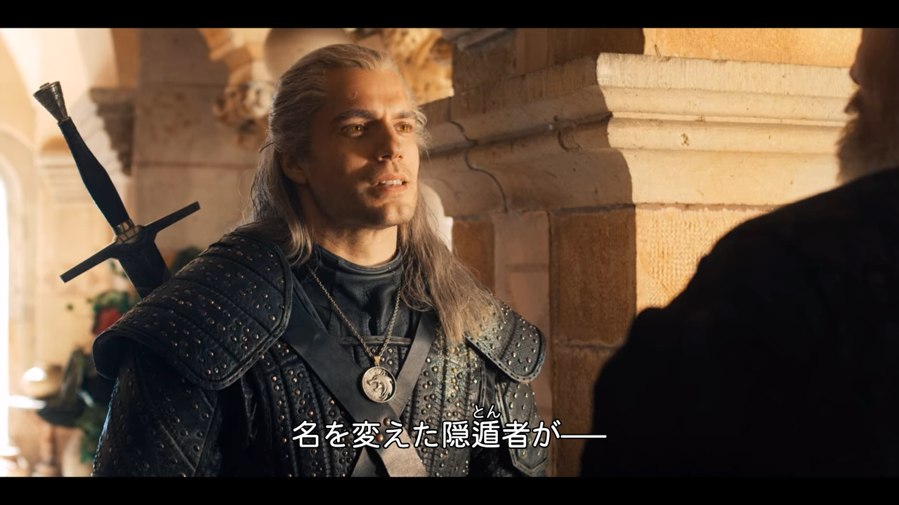
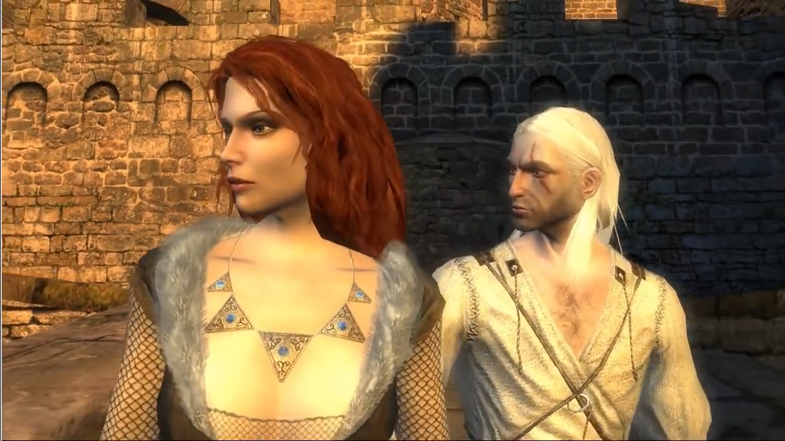
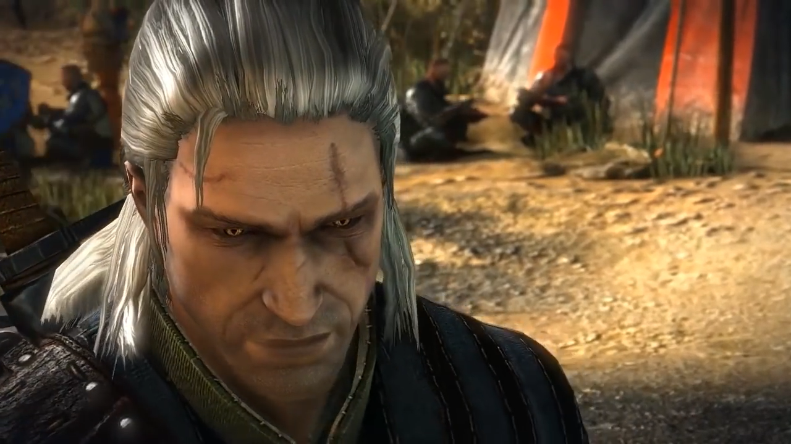
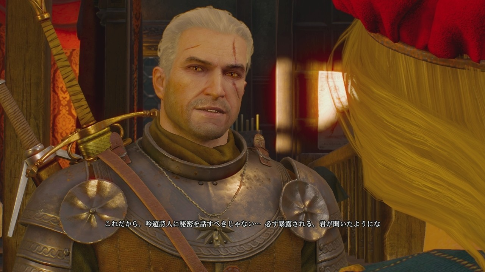
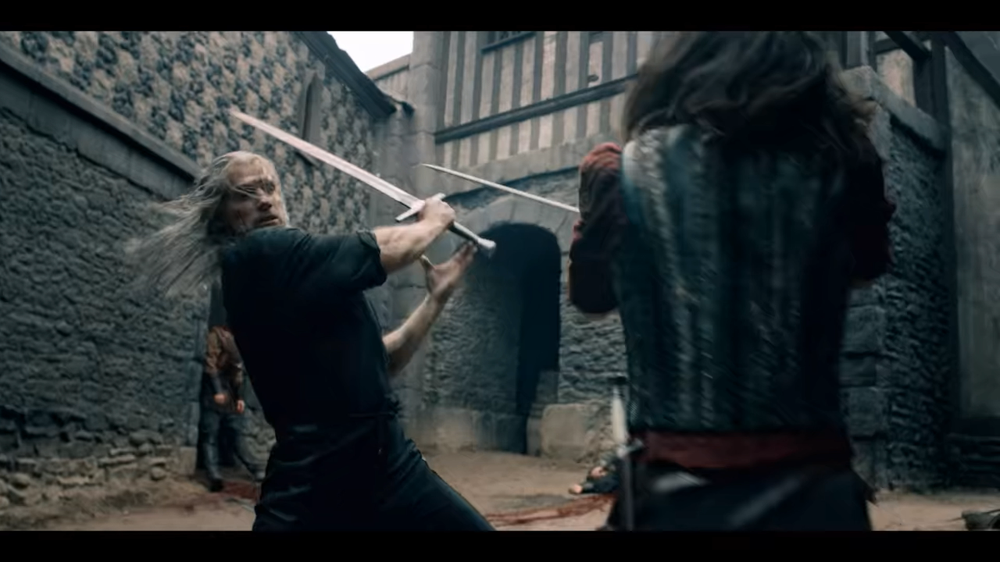
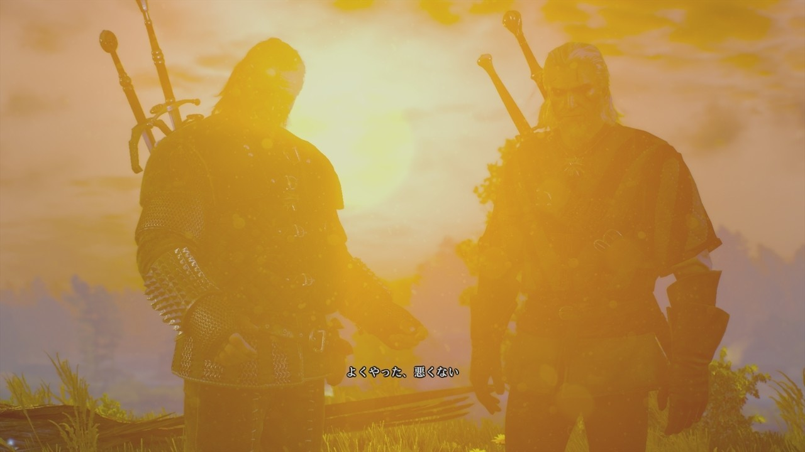

<figure>

</figure>

　Netflixで**『ウィッチャー』**が配信されているので、見てみることにした。同名ゲームのドラマ化だが、ちょっと見た感じではなかなかよさそうな雰囲気で期待大なのだ。特に、主人公のゲラルトが実にかっこよく描かれている。今回はそんな話題に触れてみよう。

　ゲラルトは、魔法によって人工的に作り出された変異体（ミュータント）だ。ゲーム内の世界にあふれる、恐るべき怪物たちを退治することを目的に、何百年もの昔に考え出された超人的な能力を持つ者たちである。その、浮世離れした生活と、ひたすら怪物退治に明け暮れる日々の経験からか、彼らは、どうしても陰のある存在に見えるし、普通の人々からは理解を得にくい。たとえ、ウィッチャーたちが人間を守ってくれる存在だとしても、畏れられ、ときには忌み嫌われる。

　しかし、当のウィッチャーたちはその現実に対し、それほど深刻な思いは持っていないようだ。なにしろ、変異の過程で、人間らしい感情は失われ、強靭な肉体と長い寿命を持つことで、人間の持つ弱さからはかなりの部分で解放されているからだ。ゲームをプレイしていても、ゲラルトや他のウィッチャーが感情的に悩み、葛藤する場面はあまりない。合理的な選択と、冷静な判断力で、目の前の敵を正確に殲滅していくのだ。  
　と、言いたいところなのだが、実際にストーリーを追っていると、ゲラルトはときに笑い、酒を飲み、踊り、美女たちとのセックスを楽しむ。全然人間らしいのだ。この辺りの真相は特に語られないのだが、ウィッチャーと言えども、本能的な快楽は持ち合わせているし、もしかすると、普通の人間と長年接していることで、豊かな感情を獲得するウィッチャーもいるのかもしれない。（特に、シリーズ通してゲラルトは女好きのように描かれている）

　そんなゲラルトだが、初代**『ウィッチャー』**では、CGの技術的な問題もあり、本当に怖い姿で画面に登場する。痩身の体躯と、変異体の特徴である黄金の目からは、爬虫類が人間化したかのような印象を受ける。ちょっとヒーローと言うにはおぞましい姿だ。家庭用のゲーム機に移植されなかったのも納得できる主人公像だったと言わざるを得ない。

　**『ウィッチャー2』**では、ゲラルトという人物のキャラクターも確立され、よりウィッチャーの世界を豊かに表現する主人公が描かれている。僕がプレイしたのはこの作品からであるが、ああ、なるほど、これなら多少かっこいいという感じがなくもない。でも全体的には地味な印象だった。ゲームもクリアしないで投げ出してしまった。あまり感情移入できなかったのかもしれない。

　ところが、**『ウィッチャー3』**において、制作陣は、この、感情がないとか言いながら実は感情豊かに見える、でもちょっと陰のあるヒーローに素晴らしい姿を与えてくれた。物語の主人公にふさわしい、気合の入ったモデリングを用意したのだ。  
　**『ウィッチャー3』**では、第1作目から時間も経っているため、すっかり年をとったように見えるゲラルト。3Dモデリングの技術も上がったためか、実に精悍な顔つきで、ファンタジーの世界を闊歩する英雄として恥ずかしくないイケメンに仕上がっている。やはり、こうでなくては各種ゲーム賞を受賞する作品にはなっていかないのだろう。ゲラルトが、並み居る怪物たちをロングソードで一刀両断にする姿は、実に流麗で美しい。

　さて、そんなゲラルトが、今度はドラマに登場する。もちろん、こちらはCGではなく、実在する俳優が演じる。結論から言えば、ちょっとイケメンに振りすぎてるんじゃないかな？ってぐらい、ゲーム内での美化をさらに増幅してきた人選だった。ビョルン・ヒーヌル・ハラルドソン演じるゲラルトは、ゲームのゲラルトに比べて少し若々しく見える。ファンタジー世界の住人を役者が演じる場合、ともするとお寒いコスプレ程度の見た目で終わる場合があるが、たぶんゲームをプレイした人ならば、納得の出で立ちが見られるのではないだろうか。  
　もちろん見た目だけではない。ゲーム同様長剣を自在に振り回す殺陣では、目にも留まらぬスピードで立ちはだかる相手を切り裂き、時には魔法を使って戦う姿が見事に描かれている。この辺、相当気を使って制作している、監督の意気込みが伝わってくるようだ。

　あまり、人物だけで人気を博しても、肝心の内容がお留守ではいただけないのだが、第1話を見る限り、その点も心配なさそうだ。派手な切り合いのシーンが用意されつつも、物語全体は重厚な雰囲気を保ち、どちらかと言えば渋い世界観で展開するような演出がなされている。基本的には寡黙なウィッチャーも、ゲームのイメージを逸脱しない。ファンタジー世界の描写も良好だ。これからじっくり見たくなる仕上がりだったと言える。

　そんなわけで、ドラマ**『ウィッチャー』**に関連して、主人公ゲラルトの変遷を追ってみたわけだが、年令を重ねるにつれ魅力を増していくかのようなその姿。まるで自分を見ているようだ、と一人満足しながら、結びとしておこう。

