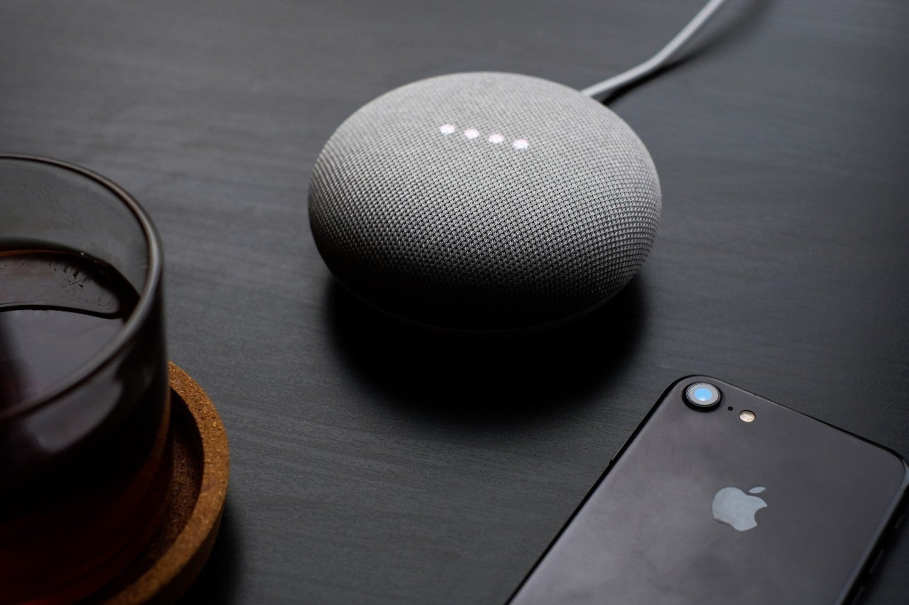

<figure>

</figure>

　Googleが、**『Google Nest Mini』**を条件付きで無料配布していたので、もらってみた。条件というのは、YouTubeプレミアムやGoogle Play Musicなどに加入している人ということ。僕はGoogle Play Musicを使っているので、今回これに該当したわけだ。

　設定は簡単。電源を入れて、スマホにアプリをダウンロードすると、ものの数分で終わる。これは、Googleアカウントがあるせいもあって、実にスピーディだった。

　さて、早速「オッケーグーグル！明日の天気は？」「オッケーグーグル！近くのフレンチレストランは？」「オッケーグーグル！秋葉原までのルート教えて」とやってみる。うん、これは賢い。しかし、全然スピーカーに教えてもらう必要はないものばかりだ。どちらかと言えば、パソコンの画面見たほうが、映像込みで情報が入ってくるので、はるかにわかりやすい。  
　やっぱり、スマート家電とかと連携して、「オッケーグーグル！明かりつけて」とかやらないとイマイチ有益なデバイスではないということか。いや、部屋の明かりつけるのこそ、壁のスイッチ一発でつけたほうが早い。  
　じゃあ、スマートスピーカーって何に使うの？  
　実を言えば、**『Google Nest Mini』**が届く前から、そんなことはわかっていたのだ。今回は無料につられてもらってしまったけど、そもそもスマートスピーカーなんて、まだまだ使いどころないだろうと思って、あえて買わずにいたんだよね。これは僕の想像力が欠如していて、活用シーンが思い浮かばないということなのだろうか。妄想も含めて、ちょっといろいろ考えてみた。

「オッケーグーグル！今日のヘルスチェックして」  
「わかりました。ヤマダさん（仮名）の今日の健康状態は……血圧が高めです。ピルケースの中の血圧の薬が減っていません。忘れずに飲んでくださいね」  
　スマートウォッチと連携して、血圧や心拍数など計れば、健康状態を管理してくれるスピーカーができるかもしれない。

「オッケーグーグル！近くの中華料理店を教えて」  
「わかりました。近くに、6軒の中華料理店があります。でも、冷蔵庫の中の豚肉が今日までの賞味期限です。今日は自宅で自炊しませんか？おすすめの料理は豚の生姜焼きです」  
　スマート冷蔵庫が、ICタグで中身を管理してくれれば、賞味期限切れの食品を泣く泣く捨てることもないかもしれない。世界的にフードロスを削減できるだろう。

「オッケーグーグル！週末遊びに行くところ教えて」  
「わかりました。今週末は近くで8件のイベントがあります。でも給料日まであと3日ですよ。今週末は出かけずに私とお話でもしませんか？」  
　ちょっとお金を使いすぎてしまう独身貴族には、いい財布役として働いてくれるスマートスピーカーが期待される。また、今後さらに高齢化する社会においては、スマートスピーカーは高齢者のいい話し相手になってくれるのかもしれない。

「オッケーグーグル！明日の朝7時に起こして」  
「わかりました。アラームを午前7時にセットします」  
　……  
「ピピピピピピピ……」  
「ヤマダさん、朝7時を過ぎました。起きてください」  
　……  
「ヤマダさん、起きてください」  
「ヤマダさん、血圧、心拍数が検出できません。スマートウォッチが外れていないか、確認してください」  
「ヤマダさん、血圧、心拍数が検出できません。念のため、病院に連絡して、救急車を呼びます」  
「ヤマダさん、血圧、心拍数が検出できません。電気ショックが必要です。スマートウォッチを充電します。周囲の人は離れてください」  
「電気を流します……周囲に人がいる場合は、心臓マッサージをお願いします」  
「ヤマダさん、救急車が到着しました。家の鍵を開けますね」  
「救急隊の方は、テレビに表示されたヘルスチェックログを確認して、速やかに搬送をお願いします」

　……

「オッケーグーグル！今日のヘルスチェックして」  
「わかりました。今日は血圧、心拍数ともに正常値です。ピルケースの中の血圧の薬が減っていません。忘れずに飲んでくださいね」  
「オッケーグーグル！この前は危ないところをありがとう」  
「どういたしまして。私はこれからもヤマダさんの健康管理を行っていきますよ。新しいペースメーカーを検出しました。登録を行ってください」

　こうして、スマートスピーカーが進化した未来では、孤独死が圧倒的に減少することになったのであった。

　なんと。便利じゃないかスマートスピーカー。

終
