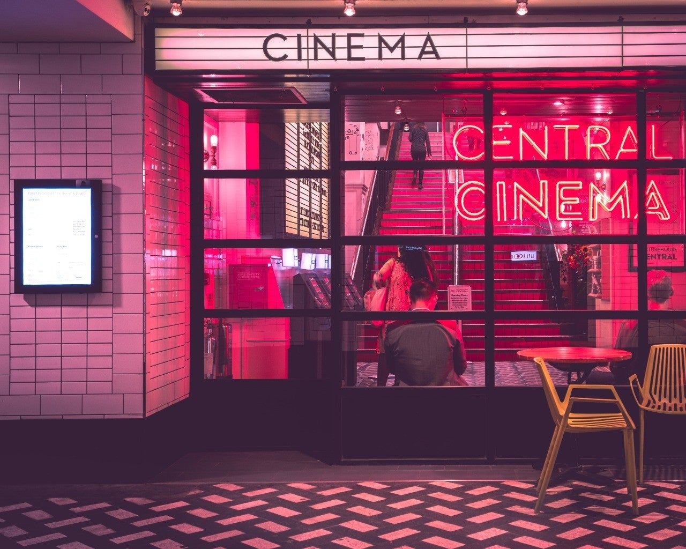
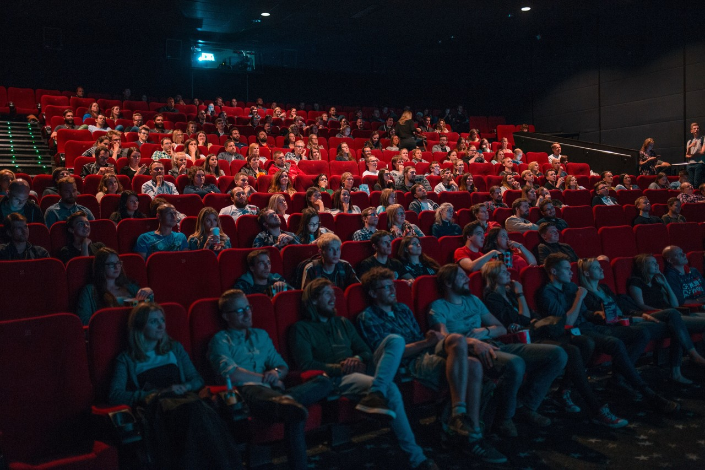

<figure>

</figure>

　実は映画館が苦手だ。あの、狭い椅子に2時間も座っているのは苦痛以外の何物でもない。映画を見ること自体は好きなのだが、映画館が苦手で、ついついお手軽なディスクが発売されるまで新作映画を先延ばししてしまう。ツイッターなんかで、最新映画の話題が飛び交っているのを横目に見ながら、ネタバレに触れないように「見てない見てない」と画面をスクロールするのが僕の日常だ。

　実は余暇の時間の大部分をゲームに費やしている。つまり、映画を見る時間があまりない。たとえ、映画の2時間が確保できても、今なら迷わずその時間をゲームに使うだろう。それほどゲーム好きなのだ。そうすると、やっぱり映画を見る時間はなかなか捻出できない。  
　さすがの僕も、食事を摂りながらゲームをすることはない。だから、30分ぐらいのドラマであれば、夕食の時間にギリギリ見るかもしれない。でも映画はダメだ。食事が終わったらすぐゲームしよう！というゲーム欲が強くて、ついつい見ることを先延ばしにしてしまう。

　そんなわけで、昔はちょっぴり映画好きを気取っていた気もするのだが、今は「映画好きです」と言うのはきっぱりやめた。  
　新作映画を公開初日に見に行き、大画面の迫力や、IMAXとか4DXとか最新技術で目一杯その作品を楽しんでいる人たちの話を聞くと、本当の映画好きはこうじゃなきゃだめなんだよな、と思う。僕も大画面や迫力の音響システムは好きだ。でも、椅子が小さいのはやっぱりダメだ。だから我慢して家のテレビで映画を見てしまう。そんなやつが映画好きを自称しようなんておこがましい。だから「映画好き」はあきらめた。

　ところで、僕もいよいよ映画を安く見ることができる年齢に達してしまった。もしかして「映画好き」の称号を取り戻すきっかけになるのだろうか。
