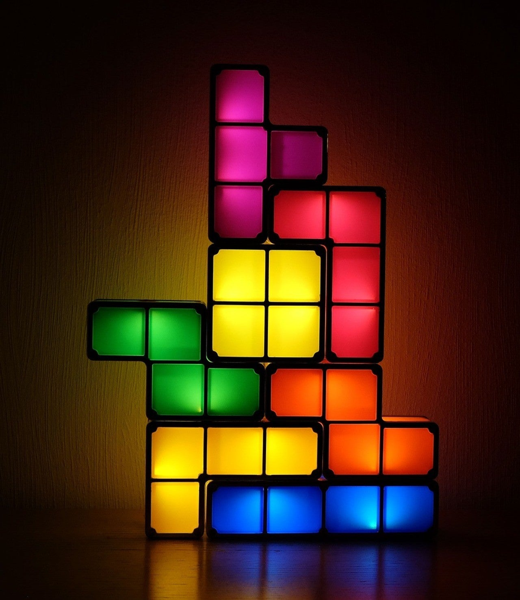
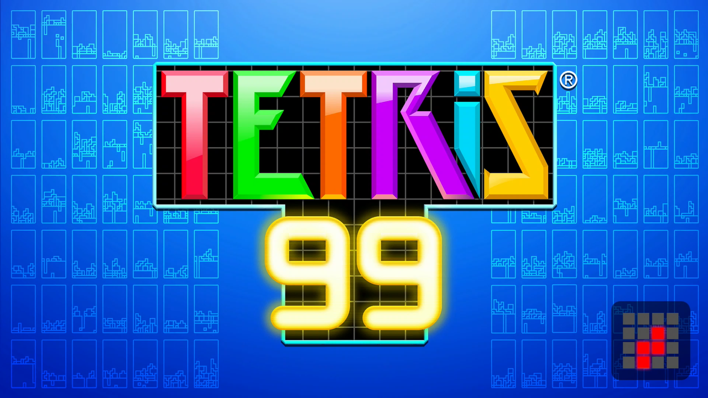
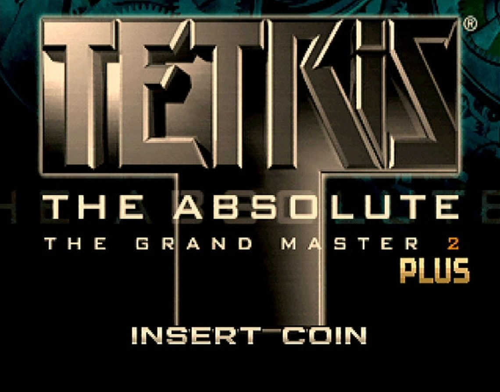
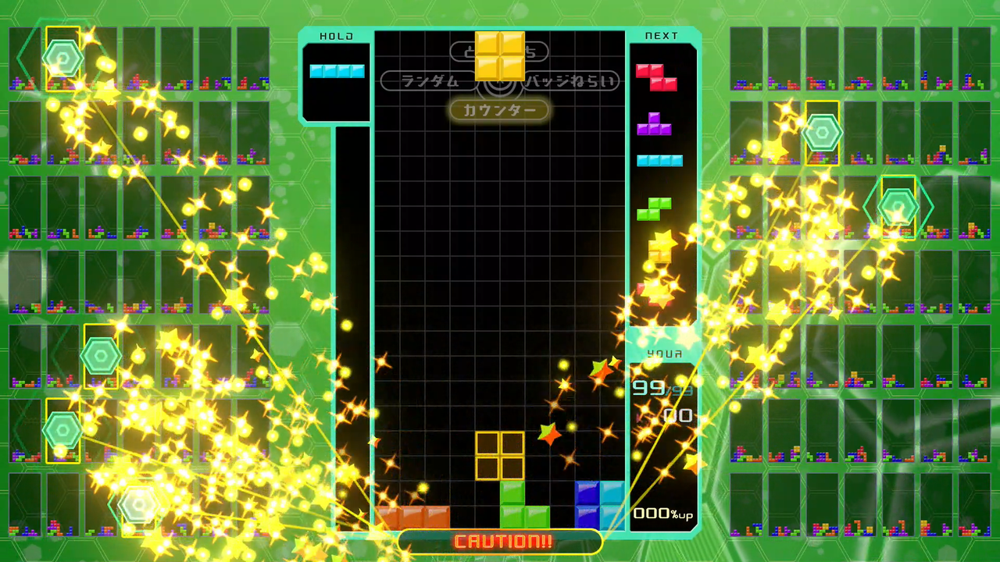
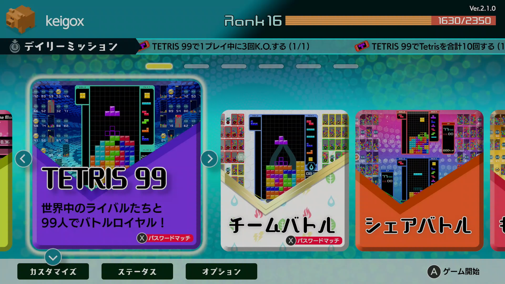

<figure>

</figure>

　最近テトリスで遊んでいる。ニンテンドースイッチ用の**『テトリス99』**というゲームで、先鋭的なテトリスを作り続けていることで有名なアリカが開発している。

　かつてアリカは、ゲームセンター用のテトリスとして、**『テトリス ザ・グランドマスター』**というシリーズをリリースしていた。このテトリスは、画面上部にブロック（テトリミノ）が出現した次の瞬間、画面下まで落下するという、すごく尖ったルールを採用したことで話題になる。僕も、そのスピード感あふれるゲーム展開に魅了されて、自分で基板を買ってまで遊んだ作品だ。

　そのアリカが、ニンテンドースイッチ用にテトリスをリリースしたのだから、これはもう一筋縄で行くはずがない。なんと、**『テトリス99』**ではオンラインで99人と対戦するモードをメインに持ってきたのである。  
　そう、まるで、100人で戦ってただ1人の勝者を目指す人気FPS**『PUBG』**のルールをそのままテトリスに採用してしまったようなゲームになっていたのだ。

　これまでのテトリスは、あくまで自分との孤独な戦いであった。ひたすらテトリミノを積み上げ、消し、そのスコアを更新することが、プレイヤーに課せられた、ただひとつの目標だったのだ。

　しかし、そのストイックなテトリスのゲームシステムは、**『テトリス99』**の出現によって一変する。

　画面上には、自分以外の対戦相手98人分のゲームフィールドが縮小表示され、ひと目で戦況が把握できるようになっている。  
　プレイヤーの目的はテトリミノを消していくことだが、その消し方によって対戦相手にお邪魔ブロックを送り込んで妨害が可能だ。そして、プレイヤーはこのお邪魔ブロックを送り込む作戦を任意に切り替えつつ、自分に有利なゲーム展開を組み立てていく。  
　テトリミノを瞬時に組み合わせる、テトリス本来の判断力も必要ながら、ライバルを蹴落とす作戦を上手に使い分ける戦略性も必要になっている。ここが**『テトリス99』**の新しさ、ユニークな魅力である。

　画面の向こうのライバルたちは、おそらくみんなテトリスに自信ありの強者達ばかりだろう。しかし、99人で対戦となると、ちょっとやそっとでは1位を取ることはできない。勝てない悔しさに、ついついもう1プレイを繰り返してしまう。そうやっているうちに、あっという間に時間が経っている。まさに魔物のようなゲームなのだ。

　しかし、もっとも驚くべきは、こんな悪魔的魅力を持つテトリスが、実は無料で配信されているという点だ。そう、ニンテンドースイッチさえ持っていれば（そして、オンラインで対戦するためのサービスに加入していれば）、誰でも**『テトリス99』**を遊べてしまうのである。

　どうやら、プレイヤー人数が多いみたいで、マッチングも30秒程度で、ほとんど待つ感覚はない。様々な実力のプレイヤーがゲームに参加しているため、今から始める新規プレイヤーも、先達に一方的にボコボコにされてしまうことはほとんどない。安心してプレイしてほしい。

　かように、**『テトリス99』**は、誰にでも気軽にプレイしてほしい進化系テトリスなのである。

　なお、ダウンロードコンテンツとしてソロプレイモードなどなどがセットになって販売されている。「99人の頂上に到達できず悔しい人は、お金を出して、ひとりで練習しなさい」ということなのかもしれない。ゲーマーのプライドを刺激する、素晴らしい課金方法だ。

[https://www.amazon.co.jp/%E4%BB%BB%E5%A4%A9%E5%A0%82-TETRIS-99-Switch/dp/B07T95QTCW/ref=sr\_1\_1?\_\_mk\_ja\_JP=%E3%82%AB%E3%82%BF%E3%82%AB%E3%83%8A&keywords=%E3%83%86%E3%83%88%E3%83%AA%E3%82%B999&qid=1577383493&sr=8-1](https://www.amazon.co.jp/%E4%BB%BB%E5%A4%A9%E5%A0%82-TETRIS-99-Switch/dp/B07T95QTCW/ref=sr_1_1?__mk_ja_JP=%E3%82%AB%E3%82%BF%E3%82%AB%E3%83%8A&keywords=%E3%83%86%E3%83%88%E3%83%AA%E3%82%B999&qid=1577383493&sr=8-1)
