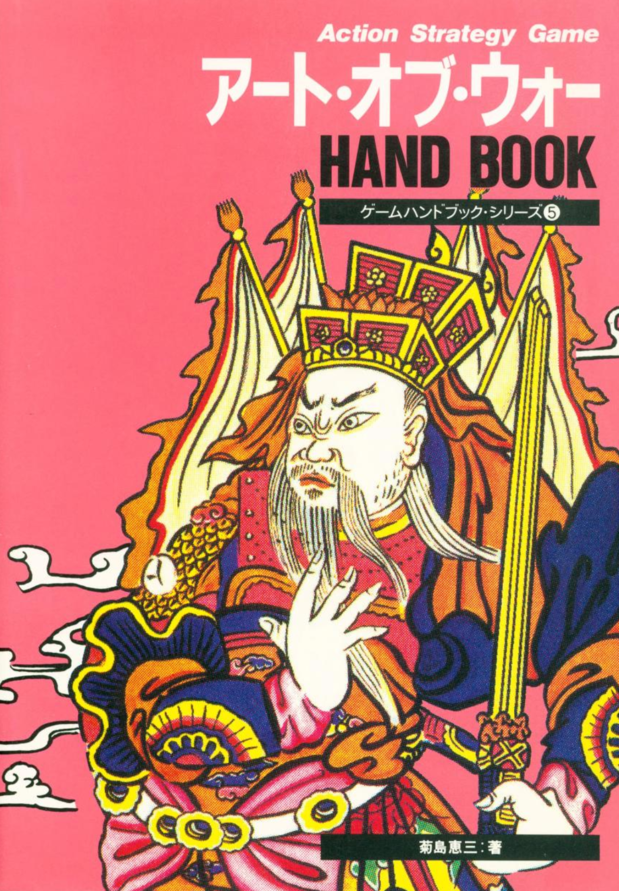
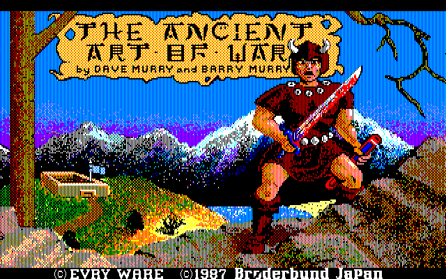
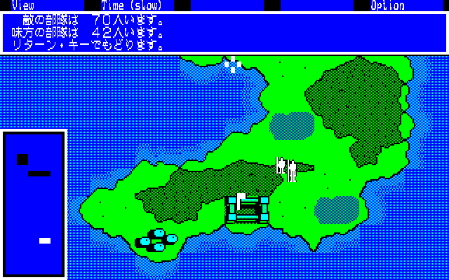
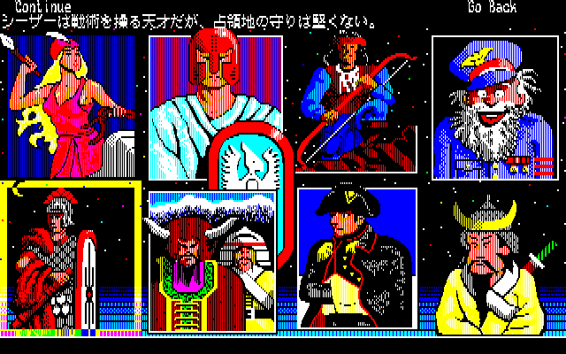

<figure>

</figure>

　リアルタイムストラテジーというジャンルのゲームがある。その名の通り、即時にユニットが移動し、その場で臨機応変な対応が求められる戦略ゲームのことだ。略してRTSなどと呼ばれることもある。

　生来せっかちな性格の僕は、このRTSが好きだ。自分のターンと敵のターンに分けられ、じっくり考えることができるシミュレーションゲームも好きだったのだが、パソコンゲームとしてRTSが登場してからは、すっかりこちらの方を好むようになってしまった。

　一番遊んだのは、**『エイジ・オブ・エンパイア』**シリーズだ。**『スタークラフト』『ウォークラフト』**などの有名タイトルも好きだった。でもこれらは、Windows時代に入ってからの話で、僕の記憶の中では比較的新しい（それでも20年以上前の話だが）。それ以前には、主にPC-8801/9801シリーズで、RTSらしきものを遊んでいた記憶がある。**『ロードモナーク』**なんかは、やはりRTSのカテゴリに含まれるゲームだろう。**『ファーストクイーン』**とそこから派生するシリーズも（あまり戦略的ではなかったけど）RTSらしい動きをするゲームだった。

　しかし、もっと遡ると、もしかしてPC-8801でプレイした**『アート・オブ・ウォー』**が、最初にプレイしたRTSだったように思う。**『アート・オブ・ウォー』**は、米ブローダーバンド社が1984年にIBM-PC等でリリースしていたRTSの元祖だ。  
　プレイヤーは、自分の軍勢に命令を与え、アテナ、シーザー、気狂いイワン、孫子など、神話や史実の中の軍師が率いる敵の軍勢と戦う。もちろん、ユニットはマップ上をリアルタイムに移動し、プレイヤーは休む間もなく、戦略を考えなければならない。

　このゲームのPC-8801版が登場したのは1986年で、オリジナル版に2年遅れての発売となるが、マシンのスペックの都合か、マップが一新されていた。オリジナルのマップを忠実に移植していたPC-9801版では、すべての軍旗を奪取することに重点が置かれていたのに比べ、PC-8801版は、戦闘で相手の部隊を殲滅することがメインになっていたようである。

　**『アート・オブ・ウォー』**のゲームシステムとシチュエーションは、当時他に類を見ない斬新なものであった。その頃すでに洋ゲーに興味を持っていた僕は、国内のゲームに見られない革新的な部分に魅力を感じ、懸命にプレイしたのである。

　が、しかし、そこはパソコンゲームがまだまだ未成熟だった時代。この**『アート・オブ・ウォー』**にも、グラフィック描画の遅さと思考ルーチンの単純さという致命的な欠陥があり、どうにも最後までゲームを制覇するには至らない結果となってしまった。要するに途中で投げ出してしまったわけだ。

　今でも、鮮やかなグラフィックで描かれたタイトル画面や敵の司令官たちを見ると、改めて今のPCスペックで遊んでみたいと思うし、何より、孫子の兵法を引き合いに出してくるような、このゲームの目指していた部分には大きな魅力を感じている。もう一度、本当に賢い孫子の兵たちと剣を交えて戦ってみたいものだ。（もしかしたら、他の機種ではもっと戦略的な戦いが実現されていたのかもしれない）

　とは言え、**『アート・オブ・ウォー』**が、後に一大ジャンルを築いたRTSに興味を持つきっかけになったのは間違いない。他にプレイした本当におもしろいRTSについても、機会があれば紹介したい。

参考文献：菊島恵三（1987）『アート・オブ・ウォー　ハンドブック』株式会社ビー・エヌ・エヌ
