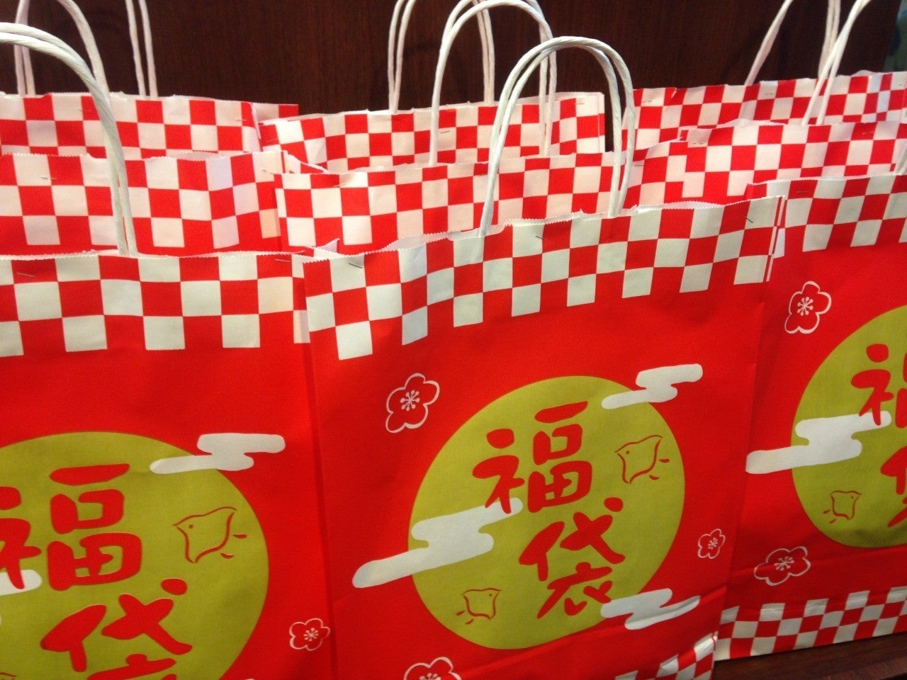

<figure>

</figure>

　いまだかつて福袋というものを買ったことがない。

　貧乏性で中身のわからないものにお金を出すのが嫌なのか、合理的で必要なものは必要なときに買えばいいと思っているのか、自分でもよくわからないが、とにかく福袋を買おうと思ったことがない。

　福袋と言えば正月の風物詩だ。しかし、最近は売り込み合戦が激しいようで、年の瀬が押し迫った12月末になると、もう福袋が登場している店がある。  
　先日奥さんが、雑貨屋さんの福袋を買っていた。帰宅して早速開封した福袋には、それなりに日常生活で使えるものが入っている。  
「このフリース、薄手だからそれほど寒くない日に使えるよ」  
　などと、中身についてひとつひとつ解説してくれる。まあ、そうやって使うシーンをひとつずつ考えていけば、使えないものなど入っていないのであろう。これで値段以上のものが入っているとすれば、確かにお得なのかもしれない。いや、もしかしたら福袋というのは、中にはいっている品物をひとつひとつ見ながら、どうやって使おう、いらないものはどうしようと考えることが楽しいのかもしれない。

　ところで、福袋の販売も場合によっては過熱しすぎて、思わぬトラブルに発展していることもあるようだ。  
　買い占めによるクレームが殺到した挙げ句、肝心の福袋はネットオークションに大量出品される。ハードディスクレコーダーやデジカメなど高額商品が入っている家電量販店の福袋で、殺到した客同士で喧嘩が始まったり、そうでなくても、店員と客の怒号で店内が騒然としたりする風景が見られる。そんな話を聞くと、これは本当に「福」なのかと呆れる。  
　僕など、その話題だけで福袋を買うエネルギーをすべて消耗してしまう。ニュースなどでこうした戦争の如き福袋争奪戦の様子を見るにつけ、今の時代これぐらいの勢いが無いと生きていけない世の中なのかもしれない、と思うことすらある。

　ふと、「じゃあ、逆にどんな福袋なら欲しいのか？」と考えてみた。やっぱり好きなゲームかな？と思ったけど、持っているゲームとダブるのは嫌だし、そもそも興味のないゲームに費やす時間はない。ましてや**『ウィニングイレブン』**が10本も入っている福袋に当たった日には、1年間福どころか貧乏神がついたような気分で過ごさなければならないかもしれない。  
　それなら、本の福袋があれば楽しいのかな、とも考えてみた。いや、これもだめだ。好きな文芸書ならいざ知らず、10年以上前に流行った手垢のついたネタのビジネス書とか、なんで売れたのかよくわからない自己啓発本とか、そういうのばかり詰め込まれていたら、タイトルを見ているだけで鬱になりそうだ。

　結局、中身の見えない福袋に対する期待感というのは、僕の中には存在しない。中身が見えないと買えないヘタレな性格とも言えるかもしれない。  
　どうやら来年も、正月から豪気に金をばらまいて、福を呼ぶ袋の中身を笑い飛ばす勇気は僕にはないようだ。

　こんな僕に、何か興味を引くような福袋があれば、ぜひ教えてほしいものだ。
