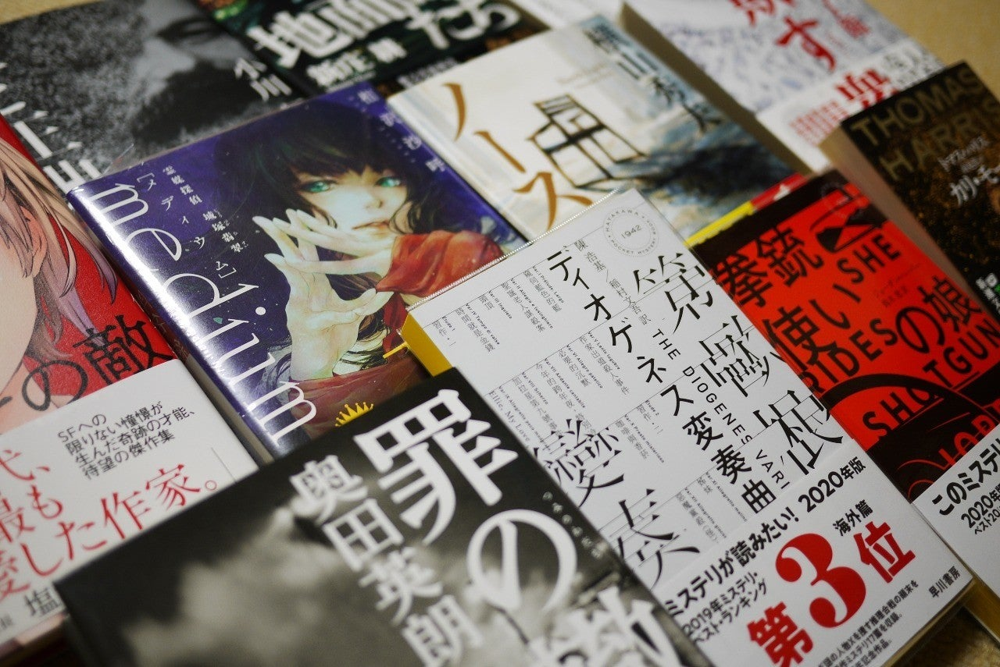

<figure>

</figure>

　今月は、まるまる1ヶ月noteで過ごしてみた。環境が変われば新鮮な気持ちでいろいろ書けるもので、気づけばきっちり31日分記事を書いていた。そんなに気合いを入れて毎日書こうというつもりでいるわけではないのだが、一応これからも書いていこうと思っている。また10年以上続くといいな。

　noteはサービス開始から5年経っているものの、さすがの利用者数である。記事を書き始めたその日から結構なアクセス数があり、「♡スキ」ボタンも押してもらえる。ネットの片隅に愚にもつかない文章を吐き出しているとは言え、こうなるとやる気が出てくる。人間モチベーションが高まる経験というのは日々の生活に必要なことだ。そしてそれは楽しい。

　さて、今年のまとめということで、本来ならば今年読んだ本とか、聴いたアルバムとか、遊んだゲームとかのベスト10でも並べればいいんだろうけど、今年はそういうのはやめておこう。世間の評価と自分の評価と、そんなに違わないから。それに、違っていても大衆を納得させて価値観の変革をもたらすほどの衝撃的な理論は持ち合わせていない。あまり大仰にやるのはやめることにする。あと、本好きとか言いながら1年間に100冊も読めなかったのが後ろめたかったり。これはどうにもいけない。ゲームやりすぎだ。

　それより、『このミス』を読んで、年末に爆裂して本を買ってしまったので、年明けに向けて最優先で読むべき本を並べておこうと思う。備忘録的にね。（こうやって書いておかないと、買ったのを忘れてもう1冊買ってしまう）

## 『medium 霊媒探偵城塚翡翠/相沢 沙呼』

　受賞した本を慌てて読むあるある。タイトルに「霊媒」とかついていてどうして食指が動かなかったんだけど。読んでみよう。遠田志帆の装丁も印象的だ。

[https://www.amazon.co.jp/medium-%E9%9C%8A%E5%AA%92%E6%8E%A2%E5%81%B5%E5%9F%8E%E5%A1%9A%E7%BF%A1%E7%BF%A0-%E7%9B%B8%E6%B2%A2-%E6%B2%99%E5%91%BC/dp/406517094X](https://www.amazon.co.jp/medium-%E9%9C%8A%E5%AA%92%E6%8E%A2%E5%81%B5%E5%9F%8E%E5%A1%9A%E7%BF%A1%E7%BF%A0-%E7%9B%B8%E6%B2%A2-%E6%B2%99%E5%91%BC/dp/406517094X)

## 『欺す衆生/月村 了衛』  

　豊田商事事件をモデルにした小説ってことで、非常に興味深い。

[https://www.amazon.co.jp/%E6%AC%BA%E3%81%99%E8%A1%86%E7%94%9F-%E6%9C%88%E6%9D%91-%E4%BA%86%E8%A1%9B/dp/410339532X/](https://www.amazon.co.jp/%E6%AC%BA%E3%81%99%E8%A1%86%E7%94%9F-%E6%9C%88%E6%9D%91-%E4%BA%86%E8%A1%9B/dp/410339532X/)

## 『拳銃使いの娘/ジョーダン・ハーパー（鈴木 恵 訳）』

　刑務所帰りの父親と逃亡する11歳の娘の話。おもしろそうなシチュエーションに期待。

[https://www.amazon.co.jp/%E6%8B%B3%E9%8A%83%E4%BD%BF%E3%81%84%E3%81%AE%E5%A8%98-%E3%83%8F%E3%83%A4%E3%82%AB%E3%83%AF%E3%83%BB%E3%83%9F%E3%82%B9%E3%83%86%E3%83%AA1939-%E3%82%B8%E3%83%A7%E3%83%BC%E3%83%80%E3%83%B3%E3%83%BB%E3%83%8F%E3%83%BC%E3%83%91%E3%83%BC/dp/4150019398/](https://www.amazon.co.jp/%E6%8B%B3%E9%8A%83%E4%BD%BF%E3%81%84%E3%81%AE%E5%A8%98-%E3%83%8F%E3%83%A4%E3%82%AB%E3%83%AF%E3%83%BB%E3%83%9F%E3%82%B9%E3%83%86%E3%83%AA1939-%E3%82%B8%E3%83%A7%E3%83%BC%E3%83%80%E3%83%B3%E3%83%BB%E3%83%8F%E3%83%BC%E3%83%91%E3%83%BC/dp/4150019398/)

## 『ノースライト/横山 秀夫』  

　新築の家から消えてしまった家族を描いたミステリ。軽井沢が舞台らしいので身近な印象。

[https://www.amazon.co.jp/%E3%83%8E%E3%83%BC%E3%82%B9%E3%83%A9%E3%82%A4%E3%83%88-%E6%A8%AA%E5%B1%B1-%E7%A7%80%E5%A4%AB/dp/4104654027/](https://www.amazon.co.jp/%E3%83%8E%E3%83%BC%E3%82%B9%E3%83%A9%E3%82%A4%E3%83%88-%E6%A8%AA%E5%B1%B1-%E7%A7%80%E5%A4%AB/dp/4104654027/)

## 『カリ・モーラ/トマス・ハリス（高見 浩 訳）』

　猟奇殺人者にねらわれる女性を描いたサイコスリラー。トマス・ハリス作品は実に久しぶりだけど、どうなのか。

[https://www.amazon.co.jp/%E3%82%AB%E3%83%AA%E3%83%BB%E3%83%A2%E3%83%BC%E3%83%A9-%E6%96%B0%E6%BD%AE%E6%96%87%E5%BA%AB-%E3%83%88%E3%83%9E%E3%82%B9-%E3%83%8F%E3%83%AA%E3%82%B9/dp/4102167102/](https://www.amazon.co.jp/%E3%82%AB%E3%83%AA%E3%83%BB%E3%83%A2%E3%83%BC%E3%83%A9-%E6%96%B0%E6%BD%AE%E6%96%87%E5%BA%AB-%E3%83%88%E3%83%9E%E3%82%B9-%E3%83%8F%E3%83%AA%E3%82%B9/dp/4102167102/)

## 『地面師たち/新庄耕』

　地面師と言えば、最近実際に起きた数十億円の被害を出した事件が記憶に新しい。それをモデルにしたと思われる犯罪小説。

[https://www.amazon.co.jp/%E5%9C%B0%E9%9D%A2%E5%B8%AB%E3%81%9F%E3%81%A1-%E6%96%B0%E5%BA%84-%E8%80%95/dp/4087716848](https://www.amazon.co.jp/%E5%9C%B0%E9%9D%A2%E5%B8%AB%E3%81%9F%E3%81%A1-%E6%96%B0%E5%BA%84-%E8%80%95/dp/4087716848)

## 『嘘と正典 /小川 哲』

　『ゲームの王国』の小川哲による作品集。

[https://www.amazon.co.jp/%E5%98%98%E3%81%A8%E6%AD%A3%E5%85%B8-%E5%B0%8F%E5%B7%9D-%E5%93%B2/dp/4152098864](https://www.amazon.co.jp/%E5%98%98%E3%81%A8%E6%AD%A3%E5%85%B8-%E5%B0%8F%E5%B7%9D-%E5%93%B2/dp/4152098864)

## 『罪の轍/奥田 英朗』

　東京オリンピックの時代に起きた誘拐事件の話。奥田英朗は以前にもオリンピックを題材にしたミステリを書いていて興味深い。

[https://www.amazon.co.jp/gp/product/4103003537](https://www.amazon.co.jp/gp/product/4103003537)

## 『息吹/テッド・チャン（大森望 訳）』

　映画**『メッセージ』**の原作者による作品集。2010年の作品だけど、著者についてあまり知らないので読んでみる。

[https://www.amazon.co.jp/%E6%81%AF%E5%90%B9-%E3%83%86%E3%83%83%E3%83%89%E3%83%BB%E3%83%81%E3%83%A3%E3%83%B3/dp/4152098996](https://www.amazon.co.jp/%E6%81%AF%E5%90%B9-%E3%83%86%E3%83%83%E3%83%89%E3%83%BB%E3%83%81%E3%83%A3%E3%83%B3/dp/4152098996)

## 『ディオゲネス変奏曲/陳 浩基（稲村 文吾 訳）』

　香港の推理作家による作品集。日本では2年前に**『13・67』**が出版されて話題になっていた。

[https://www.amazon.co.jp/%E3%83%87%E3%82%A3%E3%82%AA%E3%82%B2%E3%83%8D%E3%82%B9%E5%A4%89%E5%A5%8F%E6%9B%B2-%E3%83%8F%E3%83%A4%E3%82%AB%E3%83%AF%E3%83%BB%E3%83%9D%E3%82%B1%E3%83%83%E3%83%88%E3%83%BB%E3%83%9F%E3%82%B9%E3%83%86%E3%83%AA-%E9%99%B3-%E6%B5%A9%E5%9F%BA/dp/4150019428](https://www.amazon.co.jp/%E3%83%87%E3%82%A3%E3%82%AA%E3%82%B2%E3%83%8D%E3%82%B9%E5%A4%89%E5%A5%8F%E6%9B%B2-%E3%83%8F%E3%83%A4%E3%82%AB%E3%83%AF%E3%83%BB%E3%83%9D%E3%82%B1%E3%83%83%E3%83%88%E3%83%BB%E3%83%9F%E3%82%B9%E3%83%86%E3%83%AA-%E9%99%B3-%E6%B5%A9%E5%9F%BA/dp/4150019428)

## 『なめらかな世界と、その敵/伴名 練』

　SFの作品集なんだけど、伊藤計劃へのトリビュート収録ということで読んで見る。

[https://www.amazon.co.jp/%E3%81%AA%E3%82%81%E3%82%89%E3%81%8B%E3%81%AA%E4%B8%96%E7%95%8C%E3%81%A8%E3%80%81%E3%81%9D%E3%81%AE%E6%95%B5-%E4%BC%B4%E5%90%8D-%E7%B7%B4/dp/4152098805](https://www.amazon.co.jp/%E3%81%AA%E3%82%81%E3%82%89%E3%81%8B%E3%81%AA%E4%B8%96%E7%95%8C%E3%81%A8%E3%80%81%E3%81%9D%E3%81%AE%E6%95%B5-%E4%BC%B4%E5%90%8D-%E7%B7%B4/dp/4152098805)

## 『自由思考/中村文則』

　小説はポスト村上春樹な中村文則だが、エッセイはもうちょっと砕けた感じがあっておもしろそうだ。

[https://www.amazon.co.jp/%E8%87%AA%E7%94%B1%E6%80%9D%E8%80%83-%E4%B8%AD%E6%9D%91%E6%96%87%E5%89%87/dp/4309028144](https://www.amazon.co.jp/%E8%87%AA%E7%94%B1%E6%80%9D%E8%80%83-%E4%B8%AD%E6%9D%91%E6%96%87%E5%89%87/dp/4309028144)
