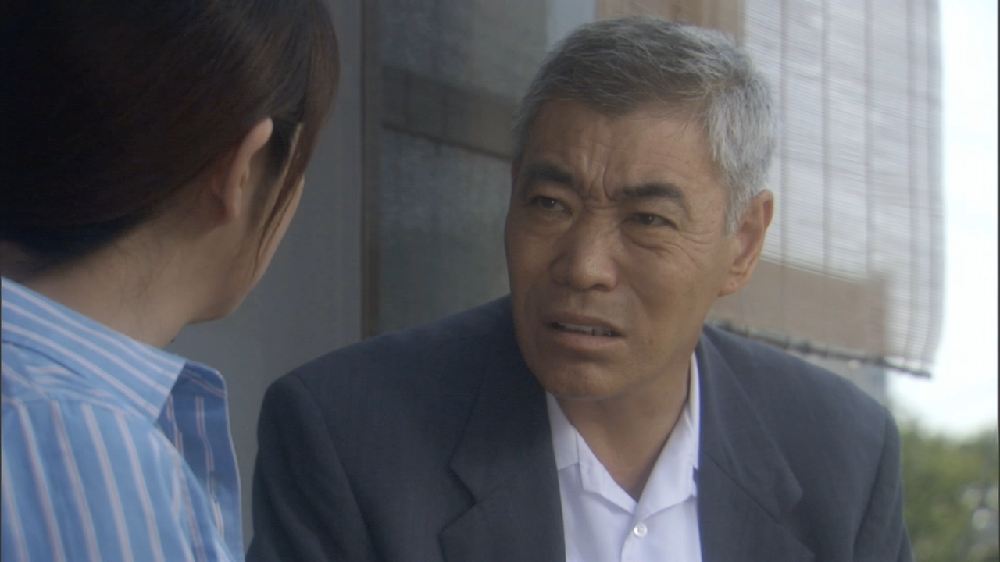

<figure>

</figure>

　年末に部屋を片付けながら、ドラマWの**『一応の推定』**というドラマを見ていた。ドラマWは、WOWOWがオリジナルで制作しているドラマシリーズだ。その時々の話題の小説を原作として作られたドラマが多い。ジャンルは多岐にわたるが、どちらかと言えば社会派の話が多いの好みでよく見ている。と言っても、WOWOWには加入していないので、ネットの配信で見ているのだが。

　**『一応の推定』**はもう10年も前のドラマで、今見ると随所に古くささを感じる。もとは2006年に発表された広川純という人の小説で、松本清張賞を受賞している。でも、それほど話題にもならず、ほとんどの人が知らないような作品だ。あ、週刊文春のミステリーベストテンには入っているらしい。

　物語は、列車に轢かれて亡くなった老人が、事故死だったか自殺だったかを調べる保険調査員の話。一応事件は起きているのだが、刑事ドラマと違って保険の調査するだけだから地味だ。刑事じゃないからアクションシーンはないし、犯人を逮捕するわけでもない。世の中には税務署から来たおっさんが犯人捜しするドラマもあるから、保険調査員が地味な職業だとかそんなことを言うつもりはないが、この話に限って言えば地味だ。かなり地味。

　しかし、その地味さ加減が嬉しい。見ていて安心できる。民放の2時間ドラマなんか、最近は観光地巡りの視聴率稼ぎ番組にしかなっていないから、その点からすれば、原作を忠実に再現しようとしていて誠実な作りになっている。で、主人公の保険調査員を演じるのが榎本明なのだが、これがまたナイスなキャスティング。頑固一徹みたいなクソ親父のキャラクターを淡々と演じて見せてくれる。それが実にいいのである。（まあ、物語のプロットが単純とかいろいろ意見はあるんだろうけど）

　近年はドラマWも洗練されてきて、池井戸潤の作品などを非常にドラマティックな演出でドラマ化してくれている。非常に見応えのある作品が多いので、今からでも後追いで見てみようと思っているシリーズだ。うん、今年はこの辺を攻めていこう。

[https://www.amazon.co.jp/%E4%B8%80%E5%BF%9C%E3%81%AE%E6%8E%A8%E5%AE%9A-%E6%96%87%E6%98%A5%E6%96%87%E5%BA%AB-%E5%BA%83%E5%B7%9D-%E7%B4%94/dp/4167753820](https://www.amazon.co.jp/%E4%B8%80%E5%BF%9C%E3%81%AE%E6%8E%A8%E5%AE%9A-%E6%96%87%E6%98%A5%E6%96%87%E5%BA%AB-%E5%BA%83%E5%B7%9D-%E7%B4%94/dp/4167753820)
