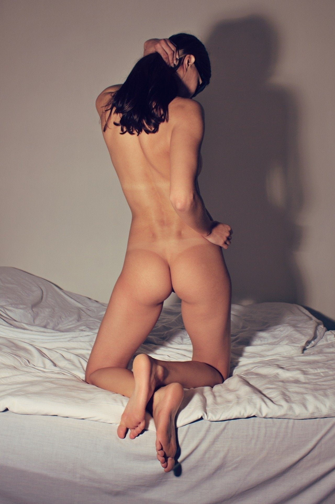

<figure>

</figure>

　実家が近いので、いつも元旦だけは家に帰る。  
　実家で、普段見ないテレビを見ていると、塩野七生が学習院高等科の生徒に講演をしている番組が流れていた。塩野七生の歴史に対する見方、姿勢がよくわかってなかなか興味深い番組だった。こういう番組を見ると、たまにはテレビもいいかなと思う。

　そんないい番組を見ながら、自分の今年の目標に思いを巡らす。そんな大それたことを目標として持つつもりもないが、何も目標なく暮らしていくのも寂しい気がする。たとえ1年の終わりにそれが達成されていないとしても、元旦になにか目標を持つのはいいことなんじゃないかと思う。

　普段あまり実行できていなくて、でも目標を持つと、少しは日々の生活に張り合いが持てるぐらいのこと……さて、なんだろう。

　少し考えて決めた。今年の目標は「かかとケア」だ。

　元来乾燥肌の僕は、夏でも割と肌がカサつく。冬になると、もうあきらかに乾燥肌になってくる。おかげで、年齢の割に脂ギトギトとか、そういう感じにならないのはありがたくはある。でもこのカサカサは、ちょっとなんとかしたい。特に、かかとが気になる。角質がひび割れて、靴下があきらかにダメージを受けるぐらい硬くなってしまう。  
　でも、このかかと、毎日クリームを塗っていると、目に見えて改善する。改善するのだが、この「毎日塗る」というのができない。毎日習慣化するのが苦手な質なのだ。（それで、こういう文章も毎日書こうと努力していたりする）  
　そんなことを考えて、早速ドラッグストアでクリームを買ってきた。これを毎日塗ろう。「なんだ、そんな目標」とほとんどの人は思うかもしれない。でも、こういう小さなことを続けられる人になることが、僕の人生の中では一番の課題だったりするのだ。（思えばいろいろ続けられない人生であった。）

　元旦から読んでみたら、人の足の裏の話でさぞかし不快であったことと思うけど、目標を大事にするというテーマってことで勘弁してほしい。（書き出しと内容とまったく無関係になってしまったが）

　今年もよろしくお願いします。
