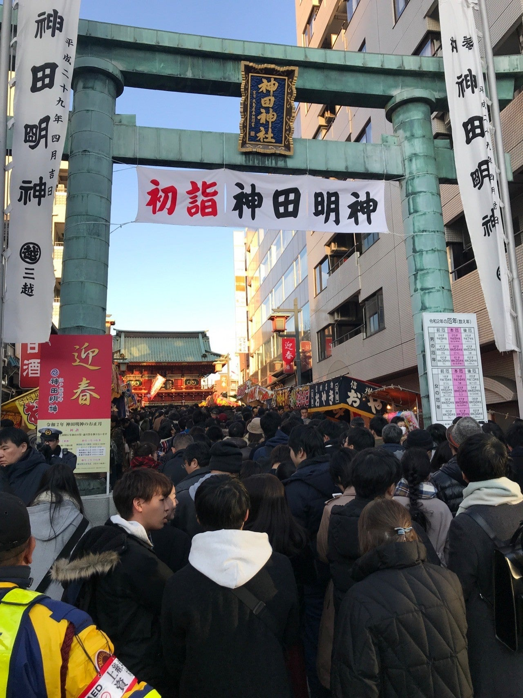

<figure>

</figure>

　今年は珍しく正月2日から東京にいる。東京にいるついでに、神田明神でもお詣りして行こうと思ったら、甘かった。ちょっと参拝などという程度の覚悟ではとても無理なレベルで人が並んでいた。さすが東亰。初詣も選ばれた人にしか許されない地であった。

　仕方ないので秋葉原のゲームセンターへ。これも、例年の正月にはあまりないことかもしれない。秋葉原には、電子マネー決済で遊べるゲームセンターがあるのが嬉しいのだ。

　そもそも最近は現金をほとんど持ち歩かなくなっているので、あまり小銭を作りたくない。ゲームセンターで1000円札を両替しても、その両替した100円玉を必ず使い切るわけでもなく、どうしても小銭入れが膨らんでしまう。その膨れ上がった小銭入れが嫌なのだ。もはや、100円玉の手持ちがなければ、ゲームセンターはやめておくか、というぐらいの意識である。ゲームセンターは、そういう客もいるってことも考慮しないとダメな時代かもしれない。両替機置いておけば勝手に両替してゲーム機に金入れてくれるなんていうのは、安直な考えになってきているのだ。  
　ゲームセンターとしても、両替機のため大量の100円玉を用意しなければならない。それなのに、両替された100円玉のほとんどはゲーム機に投入されず、客に持ち帰られてしまうという問題もある。最近では、コミケ前の両替にゲームセンターの両替機が利用されて問題視されている騒ぎもあった。どう考えても両替という行為そのものが莫大なコストとリスクを抱えていて、もはやゲームセンターにとってボトルネックと言えるだろう。  
　そんなことをあれこれ考えると、電子マネーの使えるゲームセンターは、店にも客にも双方にメリットとがあるんじゃないかと思っている。いや、間違いなくメリットしかないのだ。

　昨年消費税がアップした際には、少なからずゲームセンター経営者の悲鳴が聞こえてきた。SNSが普及したおかげで、今まで聞こえなかったゲームセンター側の生の声を耳にする（目にする）機会が増えたのだ。  
　しかし、消費税対応こそ電子マネーの出番であり、常に小銭で商売をしてきたゲームセンターこそ、真っ先に電子マネーを取り入れるべきだったんじゃないだろうかと思わずにはいられない。

「ゲームセンターは40年間値上げなしでやってきた」  
　などという、嘆きとも愚痴ともつかない意見を聞くこともある。だが、こんなのは時代錯誤も甚だしい。飲料の自動販売機がこまめに値上げをし、今では当然のように電子マネー対応しているのを見ると、ゲームセンターは、やっぱり後手に回っている印象は否めない。  
　そして、経営が苦しくなってきたところで、設備投資にかける金はないという話に行きついてしまう。正直言って、設備投資できない業種に成長を見込むのはちょっと難しいんじゃないのかなという気もする。やっぱりどこかで方向転換が必要だったんじゃないだろうか。

　もちろんゲームセンターの機械も、設定で値上げすることはできる。今まで100円だったのを、200円にする。つまり、「コインいっこ入れる」ところを、2個にするのは簡単なのだ。でも、これは誰の目にも急激な値上げが過ぎるだろう。しかし、だからと言って、今からゲーム機のコインを入れる装置（コインシューター）を進化させてもダメなのである。ゲームの中身の機械（基板）がソフトウェア的にコインの種類を判別できないため、そういう改造には対応できないのだ。どう考えても、ゲームセンターには電子マネーを導入するしか道がないのである。これだけ電子マネーが普及してきた今こそチャンスじゃないか。そして、堂々と1プレイ110円に値上げすればいいのだ。

　しかし、現実にはそうはいかない。ほとんどの店が技術的パラダイムシフトを迎えられないがために、相変わらず1プレイ100円体制を続けている。これでは、先陣を切って電子マネー対応した店も迂闊に値上げはできない。もう業界全体で足の引っ張り合い。自ら苦しい構造を作り出しちゃっているのである。そして今日もまた、SNSで阿鼻叫喚の声が聞かれることになる。ああ、なんという非生産的なサイクル。ゲームの神様よ、どうかこの者たちに救いの手を。

　まあ、ゲーセン筐体に100円玉を「チャリーン」と入れる方が気分出るっている人もいるんだろうけど。あれはあれで、コインが引っかかったりして、店の人呼んだり、コンティニュー失敗したりと、面倒なんだよね。素人考えで言っちゃうけど、早くなんとかした方がいい。
