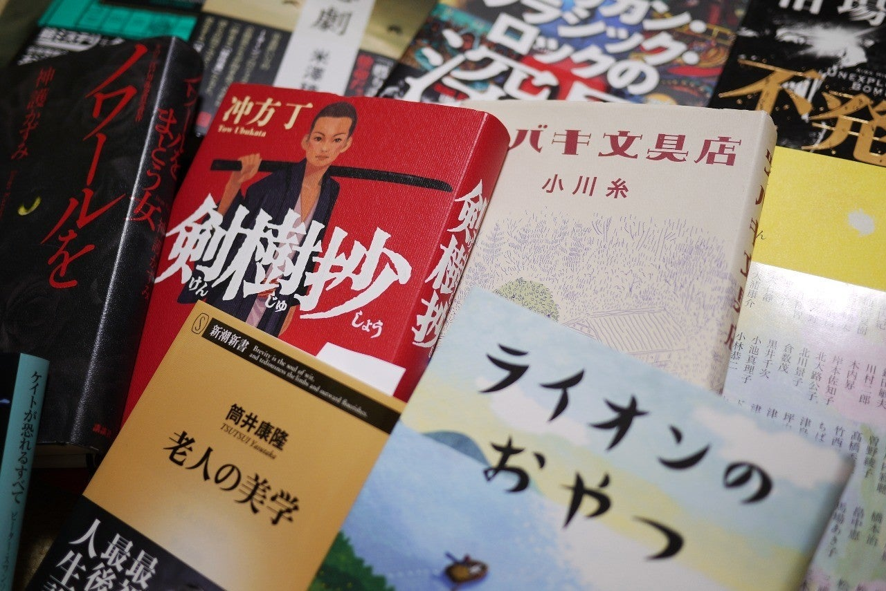

<figure>

</figure>

　相沢沙呼の**『medium 霊媒探偵城塚翡翠』**を読み終えた。ゆっくり読もうかなと思っていたのだが、読み始めたら面白くて夜を徹して一気読みしてしまった。おかげで眠い。渦巻くような感情が自分の体のうちから沸き起こってくるのを感じる激しい読後感であったが、まだそれをうまく言語化できない。感想については後日改めて書こうと思う。

　それより、1冊読み終えて充実感を持つと、危険なことに、新たな本を5冊ぐらい買っていいんじゃないかと思ってしまう。僕の悪い癖だ。そうやって、5冊ぐらい買っていいだろうと思って本屋へ行くと、10冊買ってしまうというのが、我が家に本がたまっていくメカニズムだ。これは最近解明された。

　そんなわけで、年末に買った本もろくに消化せず、買い込んできた本をまた備忘録的に書いておこう。ブックオフが20％オフとかやっていたのもいけないんだ。以下順不同。

## **『イヴリン嬢は七回殺される | Stuart Turton, スチュアート タートン, 三角 和代』**

　時間が巻き戻るループものミステリという特異なジャンル。

[https://www.amazon.co.jp/%E3%82%A4%E3%83%B4%E3%83%AA%E3%83%B3%E5%AC%A2%E3%81%AF%E4%B8%83%E5%9B%9E%E6%AE%BA%E3%81%95%E3%82%8C%E3%82%8B-Stuart-Turton/dp/4163910484](https://www.amazon.co.jp/%E3%82%A4%E3%83%B4%E3%83%AA%E3%83%B3%E5%AC%A2%E3%81%AF%E4%B8%83%E5%9B%9E%E6%AE%BA%E3%81%95%E3%82%8C%E3%82%8B-Stuart-Turton/dp/4163910484)

## **『ケイトが恐れるすべて (創元推理文庫) | ピーター・スワンソン, 務台 夏子』**

　ミランダもまだ読んでない（買ってない）のだが、先にこっちを読んでしまおうか。

[https://amazon.co.jp/dp/4488173063](https://amazon.co.jp/dp/4488173063)

## **『ベストエッセイ2013 | 日本文藝家協会』**

　20年以上刊行され続けている、その年ごとのエッセイ集。もう版元品切れのものが多いので、見かけると買っている。

[https://www.amazon.co.jp/%E3%83%99%E3%82%B9%E3%83%88%E3%83%BB%E3%82%A8%E3%83%83%E3%82%BB%E3%82%A4%E3%80%882013%E3%80%89-%E6%97%A5%E6%9C%AC%E6%96%87%E8%97%9D%E5%AE%B6%E5%8D%94%E4%BC%9A/dp/4895286886](https://www.amazon.co.jp/%E3%83%99%E3%82%B9%E3%83%88%E3%83%BB%E3%82%A8%E3%83%83%E3%82%BB%E3%82%A4%E3%80%882013%E3%80%89-%E6%97%A5%E6%9C%AC%E6%96%87%E8%97%9D%E5%AE%B6%E5%8D%94%E4%BC%9A/dp/4895286886)

## **『ツバキ文具店 | 小川 糸』**

　普段人が死ぬ話ばかり読んでいるので、たまには柔らかいのも読みたくなるのだ。

[https://www.amazon.co.jp/%E3%83%84%E3%83%90%E3%82%AD%E6%96%87%E5%85%B7%E5%BA%97-%E5%B0%8F%E5%B7%9D-%E7%B3%B8/dp/4344029275](https://www.amazon.co.jp/%E3%83%84%E3%83%90%E3%82%AD%E6%96%87%E5%85%B7%E5%BA%97-%E5%B0%8F%E5%B7%9D-%E7%B3%B8/dp/4344029275)

## **『剣樹抄 | 冲方 丁』**

　冲方丁は12人の子ども以来かな。歴史小説はあまり読まないんだけど、さて。

[https://amazon.co.jp/dp/4163910506](https://amazon.co.jp/dp/4163910506)

## **『ノワールをまとう女 | 神護 かずみ』**

　第65回江戸川乱歩賞受賞作。

[https://amazon.co.jp/dp/4065170974](https://amazon.co.jp/dp/4065170974)

## **『不発弾 | 相場英雄』**

　食肉偽装を扱った**『震える牛』**の作者による、粉飾決算の話。

[https://amazon.co.jp/dp/4103507616](https://amazon.co.jp/dp/4103507616)

## **『Iの悲劇 | 米澤 穂信』**

　タイトルの「I」はIターンのこと。それにまつわるトラブルを描いた連作もの。

[https://amazon.co.jp/dp/4163910964](https://amazon.co.jp/dp/4163910964)

## **『ライオンのおやつ | 小川 糸』**

　いつも陰惨な殺人事件ばかり読んでいるので以下略

[https://amazon.co.jp/dp/4591160025](https://amazon.co.jp/dp/4591160025)

『BURRN! Special Edition ROCK ICONS アメリカン・クラシック・ロックの深層』

　ロックは俺の栄養分。アメリカンロックは主食ではないけど。

[https://amazon.co.jp/dp/440164770X](https://amazon.co.jp/dp/440164770X)

## **『クルーグマン教授の経済入門 (ちくま学芸文庫) | ポール クルーグマン, Paul Krugman, 山形 浩生』**

　以前図書館で借りて読んだ本。手元に置いておきたい。

[https://amazon.co.jp/dp/4480092153](https://amazon.co.jp/dp/4480092153)

## **『ロートレック荘事件 (新潮文庫) | 筒井 康隆』**

　最近また御大の著作をいろいろ読みたく。

[https://amazon.co.jp/dp/4101171335](https://amazon.co.jp/dp/4101171335)

## **『老人の美学 (新潮新書) | 筒井 康隆』**

　御大が「美学」と言われるなら読んでおきましょう。

[https://amazon.co.jp/dp/4106108356](https://amazon.co.jp/dp/4106108356)

## **『下流志向〈学ばない子どもたち 働かない若者たち〉 (講談社文庫) | 内田 樹』**

　もうだいぶ前に話題になった本。現在は下流志向がさらにすすんでいるのではないかと思い、再読したい。

[https://amazon.co.jp/dp/4062763990](https://amazon.co.jp/dp/4062763990)
