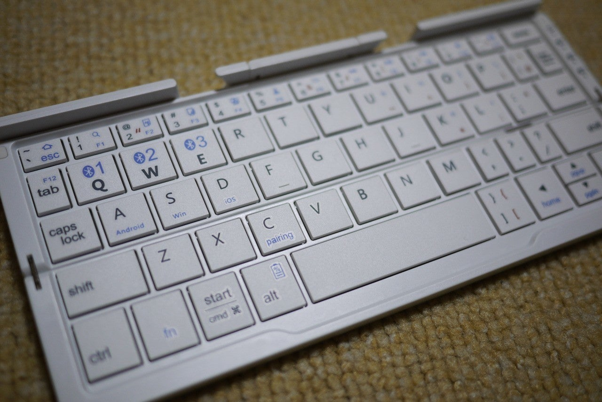
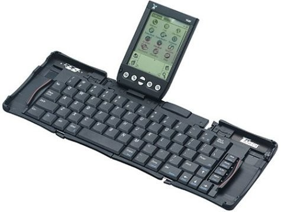
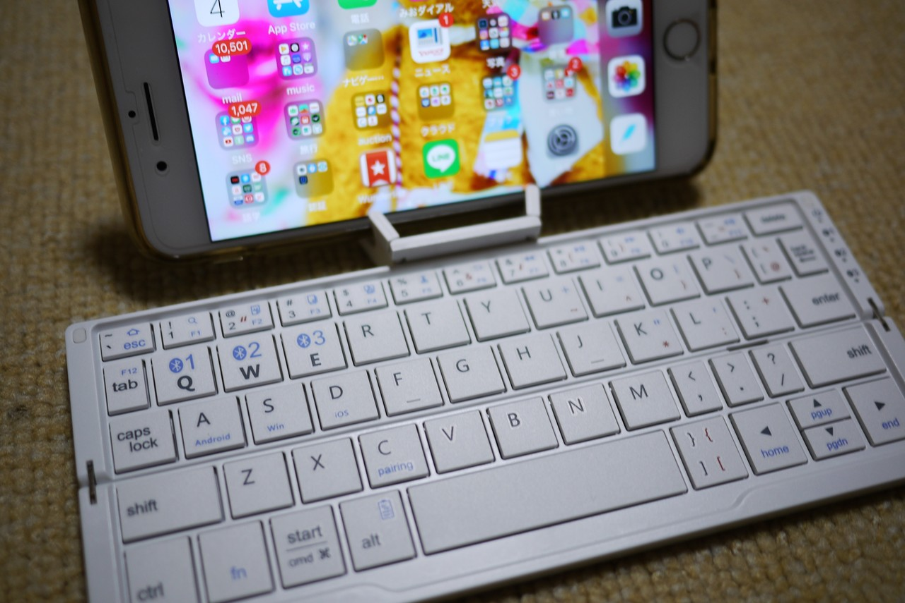
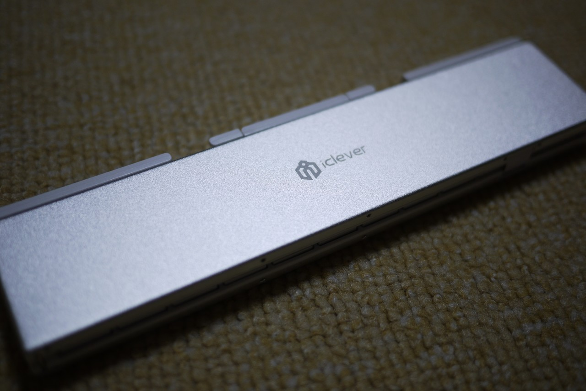

<figure>

</figure>

　モバイルでの文章書き環境をいろいろと模索している。

　旅行などで外出しつつも毎日ブログを書きたい場合は、MacBookProを持ち歩いている。しかし、スマートなように見えて意外に重いのがMacBookPro。僕の持っている5年前の13インチモデルは、2kg程度ある。バッグに入れて歩くにはちょっと大きくて重い。

　最近は、第2世代iPad Pro12.9インチを試していた。重量はおおよそ700ｇぐらい。ぎりぎり持ち歩けるかな、という重さである。しかし、雑誌を読む目的で大きいモデルを買ってしまったため、サイズ的に持ち歩きには適さない。  
　さらに、画面上に現れるソフトウェアキーボードがやっぱりちょっと使いにくい。キーボードからの文字入力というのは、実物のキーに触れてタッチタイピングすることで、打ち間違いに気づくし、キーの位置も把握できる。画面上のキーボードでは、圧倒的に打ち間違いが増えるのだ。

　そこで、ちょっと思案してみた。今から20年以上前に、PDAというものを使っていたことがあるのだが、そのとき折りたたみキーボードというものを使っていたことを思い出した。

　普段はコンパクトにまとまっていて、ガシャガシャと開くとほぼフルサイズのキーボードに変形する便利ガジェットだ。

　で、今そういうキーボードが無いのか探してみたら、意外にもいろいろなモデルが売られているのだ。店頭で見たり、ネットで検索したりして、icleverの『IC-BK11』というモデルを買ってみた。

[https://amazon.co.jp/dp/B07FP638C3](https://amazon.co.jp/dp/B07FP638C3)

　折りたたみキーボードなのだが、縦に二つ折りという変わったモデルだ。その、二つ折りにしたときのスリムな形状が気に入ってこれを選んでみることにした。

　このキーボード、iPhoneに組み合わせてみると（ご丁寧に、スマホやタブレットを立てられるスタンドが付いている）、おお、これはその昔使っていたPDA+折りたたみキーボードのスタイルにかなり近いじゃないか。

　Bluetoothによるペアリングも良好で、トラブルもなく接続した後は、スムースにキーボードから文字が入力できる。しかも、MacBookProを使っているときのように、日本語入力と英語入力の切り替えもできる。さらに、3台の機器まで接続機器を登録でき、切り替えも自由自在だ。  
　ちょっとキーボードのサイズが小さめなのだが、実際にキートップに触れながらの入力は、画面上のキーボードに比べて遥かに快適である。  
　折りたたんだ状態で、普段使っている小さな肩掛けバッグにも収納できるので、持ち歩きも容易だ。実に便利な一品だ。

　そんなわけで、しばらくは、このキーボードとスマホで、出先での文章入力を試してみよう。  
　実はnoteを毎日書くに当たって、日によってはiPad Proで入力していたり、iPhoneのフリック入力で書いていたり、いろいろ試していたのだ。どれもイマイチ快適ではなかったため、これでモバイル環境が安定するといいなと思っている。

　思うところあれば、またここで使用感を書いてみたい。うん、新しいガジェットで何かを始めるのは楽しいものだ。
