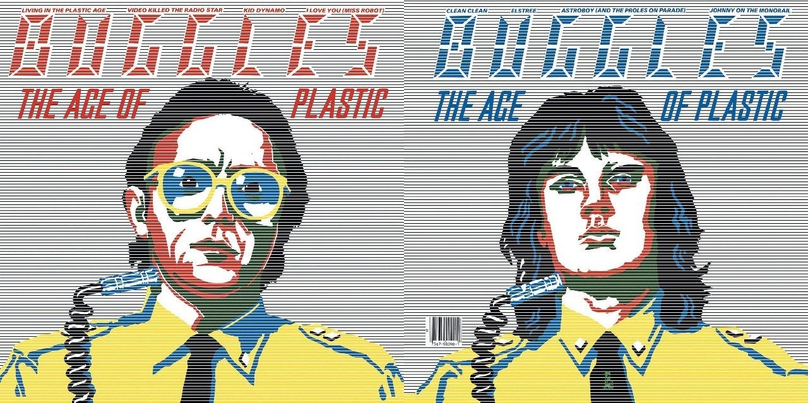

<figure>

</figure>

　80年代の音楽を聞いていると、その共通した音にノスタルジーを感じる。

　昨日はバグルスの**『The Age of Plastic』**というアルバムを聞いていた。シンセの音色、ドラム、そしてヴォーカルまでがすべてオーバープロデュース。作り込まれた豪華な音だ。シンプルなロックが幅を利かせていた70年代からすると、テクノロジーも音楽産業もリッチになりつつある時代だった。とにかくプロデュースに手を入れて加工しまくったゴージャスなサウンドがシーンの中心になりつつある頃だった。

　僕自身は、今でも70年代のギター、ベース、ドラムのシンプルなバンドサウンドが好きだが、それでもときどき80年代のポップサウンドを聞くことがある。一番音楽を貪欲に求めていた時期に聞いていたサウンドは、必ずしもその後一番のお気に入りの音楽になったわけではない。でもその当時流行っていたサウンドの特徴は、記憶の奥底に強固に残っている。この手の音楽を聞くと、強烈に80年代当時の風景、あの頃聞いたラジオ番組、LPをレンタルして聞きまくったこと、そんなことが脳裏に蘇ってくるのだ。

　でも、実を言うと、そんな古い記憶を思い出として楽しむと言うよりは、あの頃からすでに30年以上が経過したのかという事実に愕然とする自分がいる。どちらかと言えば、通り過ぎた過去を今さら思い出して懐かしむのは、あまり好きじゃないのかもしれない。別に当時の自分に嫌な思い出があるわけでもなく、懐かしい音楽とともに何か過去のトラウマが蘇ってくるわけでもない。ただ単に、自分が過ごしてきた時の流れのあまりの大きさに向き合うのが恐ろしいのかもしれない。

　ときどき懐かしい音楽を聞いて当時を思い出すことはあっても、今はまだ前を向いて走り続けたい。過去を振り返るのはもっと先でいいだろう。そのときに、時の流れを畏れず、自分のしてきたことに正面から向き合えるといいなとは思う。

[https://www.youtube.com/watch?v=HRiCWXR-C4c](https://www.youtube.com/watch?v=HRiCWXR-C4c)
