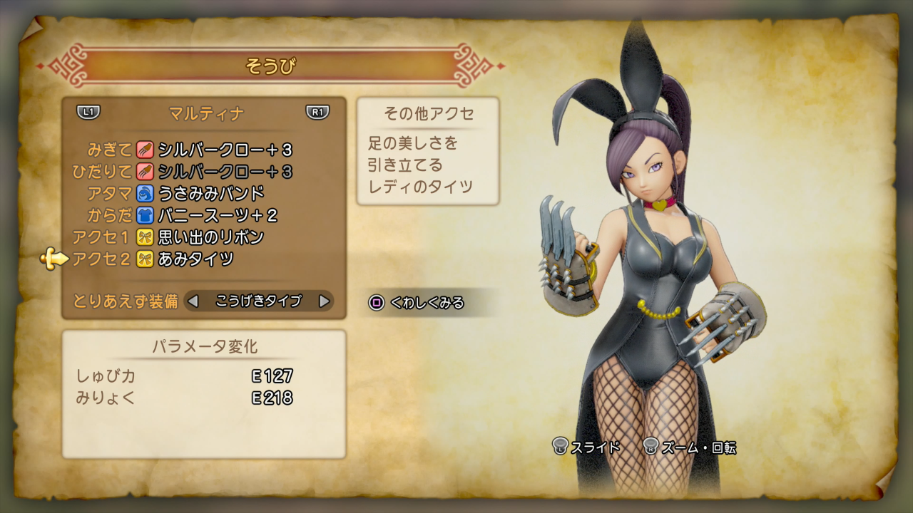

<figure>

</figure>

　本当に、本当に今さらで誠に恐縮なのだが、**『ドラゴンクエストXI』**を始めている。

　ドラクエは途中で投げ出した9や、途中で飽きた10に続いての、久しぶりのプレイだ。しかしこれがもう、ベタベタのドラクエだった。未だに需要があるのかよくわからない（あるんだろうなあ）鳥山明キャラデザに、今時珍しいぐらい牧歌的で素朴なすぎやまこういち音楽。そして、古風なコマンド式バトルのJRPGスタイル！ああ、こんなゲームをプレイするのは本当に久しぶりだ。純朴なゲーム少年バンザイ。

　そう思って遊んでいるのだが、実は自分でも面白いのかどうかよくわからない。操作性はよく、1から伝統のシンプルウィンドウで描画される画面は視認性も高い。そういう意味でストレスなく遊べるのは、さすがドラクエブランドってことなのかもしれない。しかし、**すぎやまこういち**のちょっとダサめなBGMを聞きながら世界を旅するプレイ感は、あまりに刺激がない。こういうのをワクワクできたのは、あの頃あのときあの時代だったからなのではないのだろうか。

　それよりも気になるのが、ゲーム内に適度に散りばめられた小ネタ。ギャグが、もはやおっさんくさい。中年向け。いや、もっと言えば加齢臭すら漂ってきかねないレベルの高さなのだ。毎度おなじみ**「ぱふぱふ」**から、**バニーガールコスチューム**、**学園制服防具**などなど、すごくクサい。におってくる。思えばこれまでも、この手のドラクエギャグを本当に楽しいと思ったことはなく、この辺もどこに需要があるのか実に疑問だ。

　それでも、なんだかんだ言いながら、もう30時間を超えて遊んでいる。あれ？やっぱりこれは面白いと言うべきなのか。いや、これはすでに伝統芸能の域に達していて、僕などのレベルの低いゲーマーにはとても理解できない高尚な作品なのかもしれない。作りての一貫した主張（ぱふぱふ）を、一方的にプレイヤーに提供（強要）しながら、遊ぶ者をゲームから遠ざけずに継続的にプレイさせてしまう。そんな芸当ができるゲームはなかなか無いんじゃないか。さすがドラクエ、30年の歴史が証明する確かな品質なのかもしれない。

　そんなことを思いながら、今日も冒険の書を開く。これ、最後までプレイできる感じだな。う～ん、さすがです。

