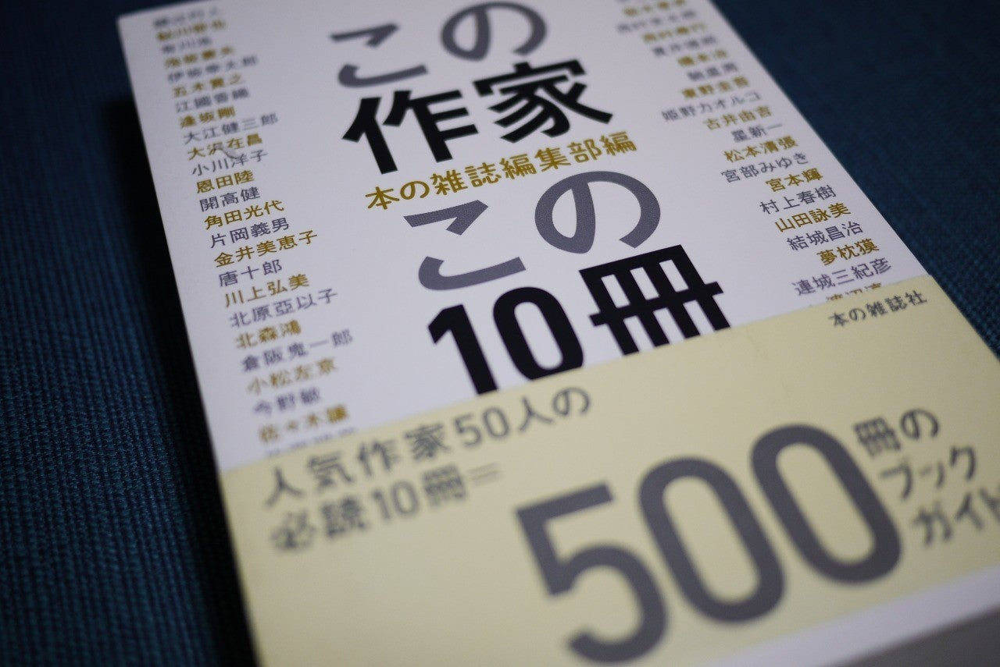

<figure>

</figure>

　本の雑誌社から出ている本が好きで、よく買っている。**『この作家この10冊』**という本も、本の雑誌社から刊行されている1冊だ。

　2015年に発行されている本で、新旧問わず、割と有名な作家が10冊の代表作とともに紹介されている。これは、**『本の雑誌』**本誌で連載されている企画で、この作家ならこの10冊を読もう！というコンセプトで、毎月セレクトされた作家を紹介しているものだ。

　実は、以前からそのうち買おうと思っていたこの本、なぜか最近になってすべての書店から消えてしまった。今のところ、本の雑誌社のサイトでは「発売中」となっているので、品切れというわけではないのかもしれない。しかし、いかんせんあまりメジャーとは言い難い本の雑誌社の出版物である。いつ絶版となってもおかしくないため、なんとか古本で探して入手しておいたのだ。

　昨年になって、**『この作家この10冊 ２』**も刊行されているため、併せて読むと、また新たな作家観の発見につながって楽しいかなと思っている。出版不況と言いながらも、書店には本があふれている時代。こんな本のガイドブックもあっていいんじゃないかと思う。まあ、こういういの買うから余計日本が増えてしまうという話もあるんだけど。

　それはともかく、**『この作家この10冊**』の方も、重版になるといいな。何しろ本の雑誌社と来たら、この手の自社編集ムックについては、なかなか電子書籍を出してくれないので、売り切れるとそこで終わりなのだ。

　各書店の在庫を検索すると、まだ残っている書店もあるみたいなので、興味ある人は早めに買うのがよさそう。

[https://amazon.co.jp/dp/486011275X](https://amazon.co.jp/dp/486011275X)
