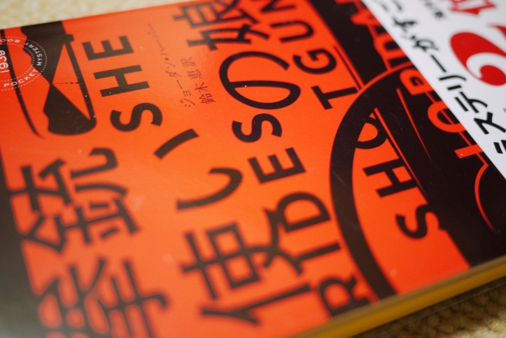

<figure>

</figure>

**※なるべくネタバレなし**

　作者のジョーダン・ハーパーは、米テレビドラマ『メンタリスト』等を手掛けた脚本家。小説においては、これが処女作。

　刑務所帰りの父親ネイトは、服役中にギャング組織の人間を殺害してしまう。結果、組織を通じてネイトとその家族に処刑命令が出される。ネイトの妻は、哀れなことに夫の蛮行の巻き添えを食って殺害されてしまう。出所したネイトは、ひとり残された11歳になる娘のポリーを連れ、組織からの逃亡を企てる。ポリーは突如それまでの日常を失い、父親に連れられるままに暴力と犯罪の世界に身を晒すことになる。その中で、自ら生きる術を学び、やがて父親とともに組織と対峙することを余儀なくされていく。

　父と娘の関係を中心に据えたクライム小説。全編がアクションに満ちているが、テレビドラマの脚本家らしく、物語の視点が登場人物ごとに次々と切り替わる。その誰もが、バイオレンスに満ちた生活に身を投じていて、常に死と隣り合わせの緊張感あふれるシチュエーションが描かれる。一般的な小説からすると目まぐるしい展開ではあるが、スピード感あふれる描写になっている。この辺りは映像化されたものを見てみたい気もする。

　少年時代から犯罪を生きる術としてきたネイトの生活は、当然のように荒んでいる。ネイトと行動をともにすることで、父親と同じ生活を強要されるポリーの姿は痛々しい。徐々に荒廃した生活に順応し、暴力の感覚に目覚めていく少女の姿には、共感より恐るべき結末の到来を予感せずにはいられない。この物語は、どちらに転んでも悲劇ではないか。読みながらそう思わずにはいられない緊張感と焦燥感。いや、これは絶望と言ってもいい感覚なのかもしれない。そんな息苦しいストーリーを、救いの無さから引き上げてくれるのが、ところどころでポリーが見せる子どもらしい仕草と、彼女の大好きな熊のぬいぐるみだ。それだけが、この物語を人間らしい安心感で満たしてくれる。危なっかしいバランスの上にギリギリで乗っかっているような物語、それがこの**『拳銃使いの娘』**である。

　どこまでも容赦なく、徹底して描かれる命のやり取りの結末はどうなるのか。それは実際に読んで確かめてほしい。

　ミステリというよりは、純粋にアクション小説として読んだ方が誤解がない。実際、このミス海外編の2位に選ばれてはいるが、本格ミステリ・ベスト10と週刊文春では圏外、ミステリが読みたい！では9位という位置づけだ。ミステリという観点からすれば妥当だと思う。

　ちなみに、原書は2017年発刊。エドガー賞最優秀新人賞、アレックス賞などを受賞している。

## 『拳銃使いの娘 (ハヤカワ・ミステリ1939) | ジョーダン・ハーパー, 鈴木 恵』  

[https://amazon.co.jp/dp/4150019398](https://amazon.co.jp/dp/4150019398)
