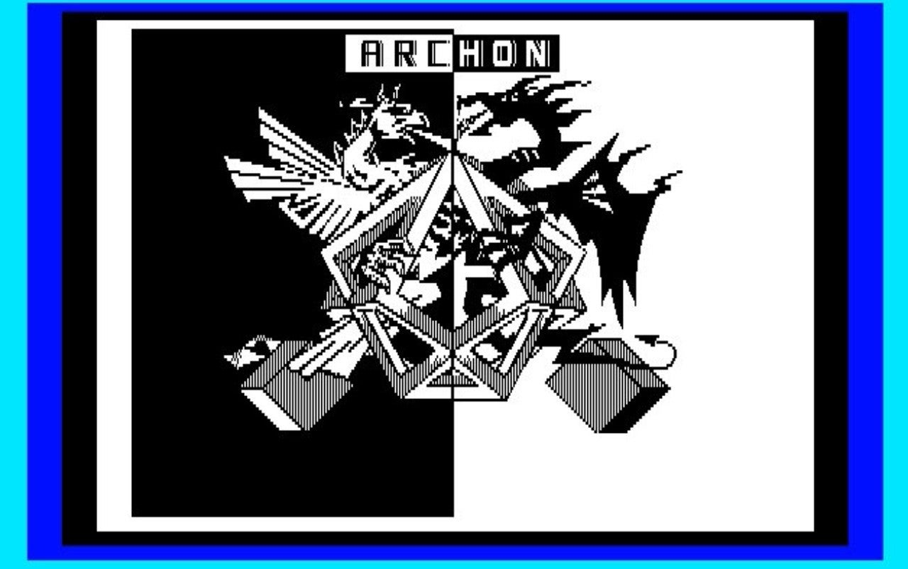
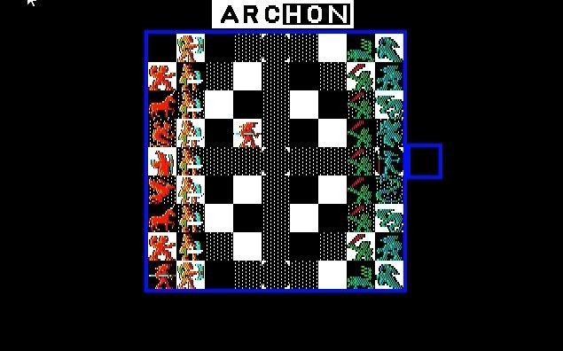
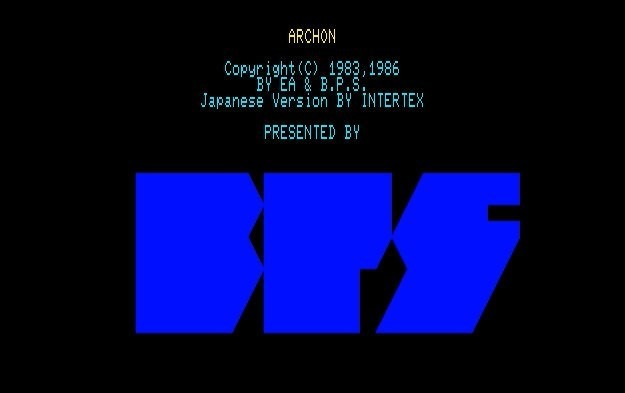

<figure>

</figure>

　今日はレトロゲームの話。その昔PC-8801mkIISR（88SR）で遊んだ**『アーコン』**である。

　**『アーコン』**は一見してチェスに似たゲームで、9×9の盤上を、光と闇の軍勢に分かれた駒を動かし、相手の王を倒すことが目的となる。しかし、ただのチェスじゃないところがこのゲームの肝である。ひとつのマス目に敵と味方の駒が侵入すると、画面が切り替わってアクションゲームで戦闘が始まる。このアクションゲームに勝利した方が、そのマス目を取れるというわけだ。だから、アクションゲームが上手ければ、どんなに攻められても負けないし、アクションゲームが下手ならば、いくら戦略を考えても、絶対に勝てないのだ。まあ、ユニットの能力差がはっきりしているので、そんなに簡単に技術差だけでは勝てないのがいいバランスだ。

　これが、コンピュータと勝負すると何とも味気ないシンプルなゲームに過ぎないのだが、当時、友人と対人戦をすることで、ものすごく盛り上がってプレイしていた。88SRのどちらかと言えばビジネス向きっぽいキーボードを二人で分け合って使い、対戦するのだ。もう、キーボード叩きまくりの白熱した試合が展開すること間違いなしである。当時のパソコンのキーボードは本当に丈夫だったんだなあ、と思う。

　さて、この**『アーコン』**、僕が遊んでいたのはBPSの移植による国内版で、冒頭に書いたようにPC-8801シリーズ用である。SR以降では、FM音源によるBGMも搭載されていた。（これがまたノリがよく、かっこいいのだ）他にも、98版やX1版など主要な国内パソコンに移植されていた。  

**※追記：98やX1には移植されてないという情報をいただきました**

[https://twitter.com/ume3fmp/status/1328721782270955521](https://twitter.com/ume3fmp/status/1328721782270955521)

　オリジナルはエレクトロニック・アーツが1983年にAtari 8bitマシン用にリリースしたゲームで、開発はJon Freeman（ゲームデザイン）、Anne Westfall（プラグラム）の二人からなるFree Fall Associatesというチームによるものである。ちなみに、Atari版のマニュアルなどには、他にもデザイナーとしてPaul Reiche IIIの名がクレジットされている。  
　ゲームは、後にApple IIやAmiga,Commodore 64等々、数多くのパソコンに移植され、海外版のみながら、NES版も存在する。

　一方日本では、先述したとおりBPS(Bullet Proof Software）から発売されていたが、実際に開発に関わったのは、Intertex（インターテックス）という会社らしい。こちらは資料がなくて詳細不明。当時のゲームソフトパッケージに、開発が遅れたことに対するお詫びの文章が封入されていたことで、神奈川県の会社ということが判明している。  
　国内版は、タイトル画面で1986年とクレジットされているが、開発の遅れもあって、実際に発売されたのは1987年のようだ。こちらは、当時のアイオー等パソコン雑誌の広告で確認ができる。

　いずれにしても、当時日本ではあまり知られていなかった『アーコン』の面白さを見抜き、国内向けに移植、発売したBPSはさすがとしか言いようがない。それにも増して、このソフトを買ってみんなで遊ぼうと言い出した、僕の友人のM君も、大した洋ゲー鑑識眼持ちだったのかもしれない。

　なお、2010年には、Steamで**『Archon Classic』**なるゲームが売られている。Chad Leeなる人物がCEOを務めるReact Gamesという会社が開発販売していて、一応ゲームの雰囲気は感じ取れる。このCEOのインタビュー映像などもYouTubeなどで発見できたが、現在は会社ごとフェードアウトしている感じで、やはり詳細はわからなかった。

　今また、当時88SRで盛り上がった**『アーコン』**をプレイしてみたい気もしているが、あれは、あのとき、あの時代、あの仲間だからこその盛り上がりであり、もう二度と体験できない貴重な思い出だったのかもしれないとも思っている。  
　おっといけない。レトロゲームで感傷に浸るのはやめておこう。それでは、この辺で。

[https://www.youtube.com/watch?v=\_72OvV1E6no](https://www.youtube.com/watch?v=_72OvV1E6no)
