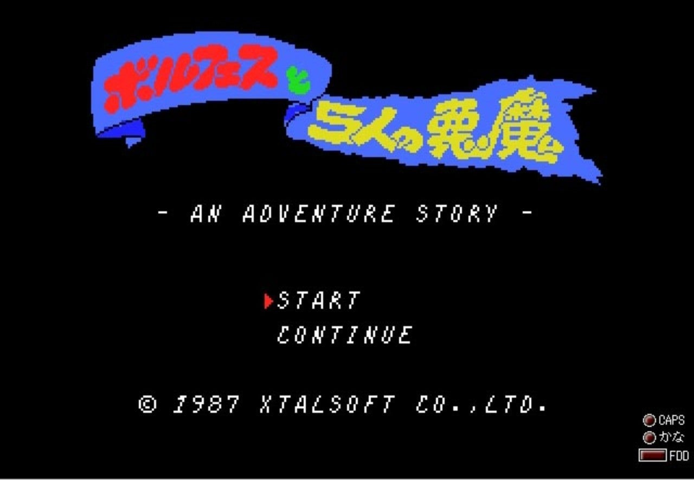
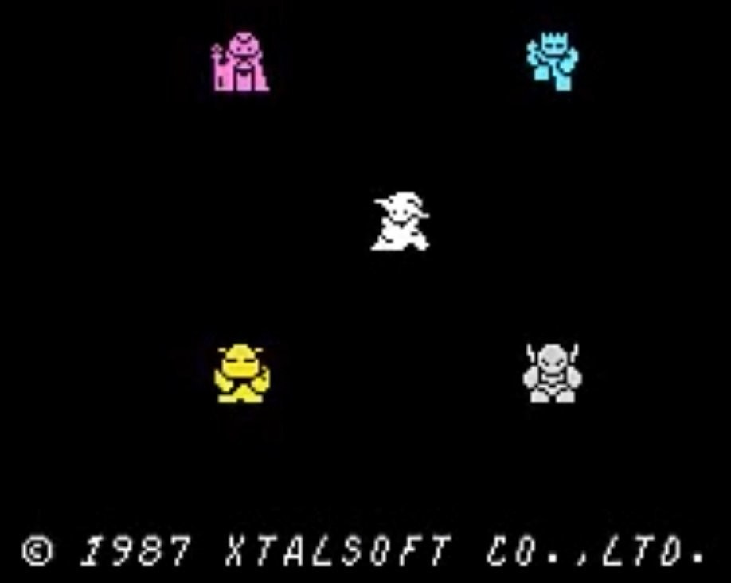

<figure>

</figure>

　ときどき古いゲームを思い出すシリーズ。MSXで1987年に発売されたアクションロールプレイングゲームっぽいゲームだ。僕の大好きなクリスタルソフトってところがポイント高い。（けど、その話はまたいつか）

　と言いつつ、実は今までMSXを持っていたことがない。これからも手に入れる予定はない。当時、友人の遊んでいるのを横からちょっとあそばせてもらって面白かった記憶がある程度なのだ。でも記憶に残るんだから、それなりのゲームだったんだよね。きっと。

　さて、このゲームだが、主人公はボルフェスと名乗る魔法使いで、杖を投げて（！？）敵を攻撃する。ゲームを進めると新たな武器が手に入り、より戦いやすくなる仕掛けだ。画面がファミコンの**『ゼルダの伝説』**に似ていて、プレイヤーが画面端まで行くと、画面がスクロールする。『ゼルダの伝説』では1画面分スクロールするのだが、**『ボルフェスと5人の悪魔』**は、半画面分ぐらいしかスクロールしない。だから、画面内の敵もスクロールアウトしないで残る。そこが**『ゼルダの伝説』**とちょっと違う。

　タイトルに**『5人の悪魔』**とあるが、ゲーム中ボスを倒した場合などに、強力な4人の悪魔の力を手に入れることができる。（残り一人の悪魔は敵）すると、主人公ボルフェスはそれぞれの悪魔に変身して戦うことができる。マニュアルによると、前述した杖などの武器が7種類、変身できる悪魔が4人で、結構多彩な攻撃ができる。状況に応じて多様性あるプレイができるのが、このゲーム最大の売りだ。  
　ガクガクとしたスクロールのゲームが多かった印象のMSXだが、このゲームはスクロールもスムース（常にスクロールしていないので、あまり目立たない）だった。数多くいる敵の動きもこなれていて、技術力の高さがうかがえる。同時に、BGMも他にない独自路線の楽曲が多彩にそろえられていて、ゲームを盛り上げてくれていた記憶がある。

　さて、そんなMSX史上に明けの明星のごとく輝く**『ボルフェスと5人の悪魔』**だが、パッケージやマニュアルの記載によると、ゲームデザインとプログラムは富一成、サウンド関係は藤岡千尋となっている。富氏は後に日本ファルコムでも名前を見るし、藤岡氏も現在に至るまでメジャーなタイトルで活躍している。ちなみに、富氏はクリスタルソフト初期のソフトで**『高速機動部隊』**というシミュレーションゲームを作っている（タイトル画面に名前がクレジットされている）ようだ。これは、テキストベースでヘックスマップ表示を実現したSLGで、僕もMZ-2000で結構遊んだ覚えがある。

　と、思いつくままに書いてしまったが、実はこの**『ボルフェスと5人の悪魔』**が全然有名じゃないのである。同年発売のMSXのソフトだけ見ても、**『ハイドライド3』『グラディウス2』『沙羅曼蛇』『イース』『ザナドゥ』**など、そうそうたるメンバーが名を連ねている。残念ながらあまりメジャーになりきれなかったタイトルなのかもしれない。これだけ有名タイトルが並んでいる中から、このゲームを選ぶのは相当マニアックなゲーマーと言わざるを得ないだろう。レトロブームもいいけど、こういうゲームが再評価される機運が高まるといいね。
