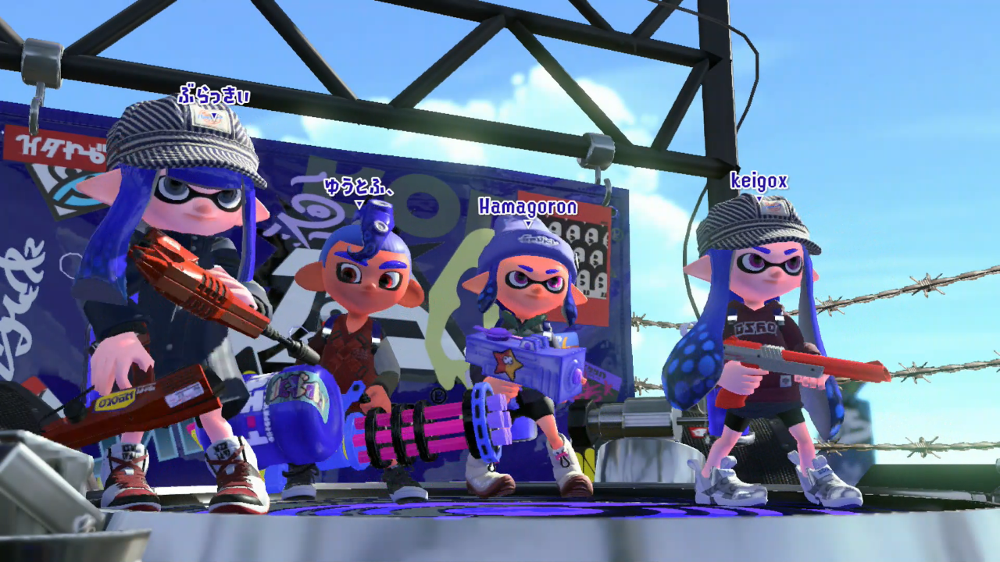

<figure>

</figure>

　**『スプラトゥーン2』**を定期的に遊んでいる。

　「定期的」って言い方は妙だ。じゃあ、他のゲームは定期的に遊んでいないのか。そう、ちょっと他のゲームと遊び方のサイクルが違うのだ。

　**『スプラトゥーン』**はWii Uでリリースされたゲームだが、こっちは発売前から面白そうだな、と目星をつけて買った。だから、口コミで人気が爆発して、ハードともども品薄になる頃にはかなり遊び込んでいた。その延長で、スプラトゥーン2も買ったわけだが、こちらはSWITCH本体の人気とあわせて、買うのに苦労した。

　で、スプラトゥーンもスプラトゥーン2も、かなり遊んだ。もうコントローラがすり減るんじゃないかってぐらい遊んだ。実際2回ぐらい壊れた。その結果、ある程度満足感を得て、スプラトゥーンに対するプレイ欲はすっかり落ち着いた。飽きたり、つまらなくなったりしたわけではないけど、他に遊びたいゲームも出てくるので、そっちをプレイするようになったわけだ。

　ところがである、僕の周りにはまだスプラトゥーン2を遊んでいる人が何人もいる。（奥さんもその一人だ）さらには、なぜか一定の期間をおいて集まって遊ぶ仲間ができた。オンラインでも、なんとオフラインでもだ。これが「定期的に遊んでいる」という意味だ。

　というわけで、普段はほとんど遊ばなくなったスプラトゥーン2だが、ゲーム好き仲間で数ヶ月に一回集まって遊んでいる。しかし、数ヶ月ぶりに遊ぶと、これがまた楽しいのである。たぶん、集まっているみんなも、僕と同じで、普段はスプラトゥーン2をやっていない。ほとんどこのときだけ遊んでいるんじゃないかと思う。でも楽しいのだ。

　ゲーム機を持ち寄ってみんなで遊ぶのが楽しいのは、もう過去にゲームボーイはじめ様々なゲームマシンで証明済みだ。でも大人になって、みんなでゲームを遊ぶのが楽しいと実感するなんて思ってもみなかった。いい年して笑っちゃう話だが、楽しい。

　別に日々スプラトゥーン2をやり込んで、大会に出ようと気を吐いている（所謂「ガチ勢」というやつか）わけでもない。かと言って、友達付き合いに、集まりのオマケでゲームを遊んでいるわけでもない。いざ始まれば結構真剣に数時間プレイする。集まってプレイするたびに、違う武器の使い方や、ステージの構成、あるいは集まったメンバーのチーム分けなど、いろいろ発見があって楽しいのだ。もちろん、仲間で集まってわいわいやること自体も楽しいのだが、それだけではなく、大前提としてゲームそのものが面白い。すごく懐の深いゲームに出会ったなという感じはある。

　きっと、これを一人で本気になってやり込んでいると、ネットの向こうの顔の見えない相手に対して勝敗のみでムキになるに違いない。ゲームの楽しい部分、奥深い部分は急速に消費され、つまらなくなるかもしれない。あるいは、ガチ勢になって胃の痛い戦いを永遠に続けるのか。そのどちらでもなく、「定期的に遊ぶ」っていうのが、実に健全で、ちょっと忙しい大人の遊び方に合っているのか。そんな風に考えている。

　こういう集まりを企画してくれる仲間に感謝だし、そこにみんなで遊べる奥深いゲームがあったことも嬉しい事実だ。これは、前作のスプラトゥーンだと持ち寄れないから、同じように遊ぶのはちょっと難しい。いろいろなタイミングに恵まれて、こうやって長く遊べるゲームに出会えるのは、ゲーマーとして本当に幸せなことなんじゃないだろうか。そんなことを思っている。

　実は先日もその集まりがあったのだが、なんと僕は熱を出してしまって参加できなかった。すごく残念だが、さすがにみんなで集まる場所に風邪ひきで行くのは迷惑だ。しかし、ここがまたスプラトゥーン2のすごいところ。みんなが現地に集まって遊んでいるゲームに、僕は自宅からオンラインで参加していた。オンラインプレイなんて、普段やっているごく当たり前のことなんだけど、今更のようにインターネットのすごさを改めて感じてしまった。

　ゲームやってないで寝ろって？ごもっともです。
