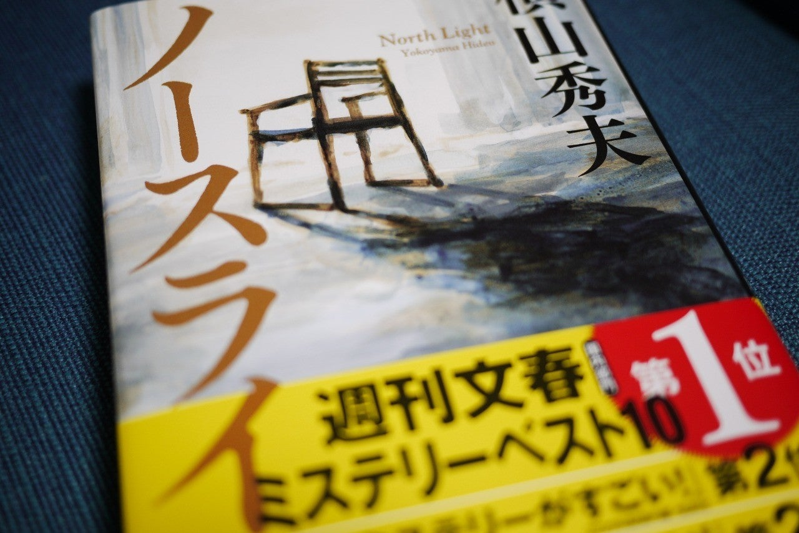

<figure>

</figure>

**※ネタバレなし**  

　昨年発表された横山秀夫の新作。**『64』**から実に6年ぶりというから、待ちに待った新作という表現が当てはまるのではないだろうか。

　一級建築士を主人公に、彼の設計した新築の家を残して謎の失踪を遂げた家族の行方を追う、警察の登場しないミステリ。家に残されたブルーノ・タウトの椅子だけを手がかりに、複雑に絡み合った糸を解きほぐすような緻密な謎解きが描かれる。  
　横山秀夫作品らしく、登場人物の背景はリアルに、なおかつ重層的に設定されていて、物語が展開すると同時に、彼らの内面が明かされていく。その過程が非常に丁寧に書かれていて、小説の本筋である謎よりも、登場人物の生き様の方が気になってしまう。主人公の生い立ち、過去の経験、そのときそのときの社会情勢、そういったものが複合的に語られることで、人物像はよりくっきりと鮮明な形を持ち、読む者に迫真のドラマを焼き付ける。単なる謎解き読み物ではなく、誰がどんな考えで行動しているのだろうかということを、主人公とともに考えているような気持ちにさせる小説だ。  
　ブルーノ・タウトという実在した建築家を謎の中心に据え、彼にまつわる実在の史蹟や施設を効果的に登場させる手法も、物語にリアリティを与える一助となっている。重厚なミステリドラマを求める向きには魅力的な小説ではないだろうか。

　ミステリゆえ、これ以上具体的なことは書かないが、じっくりと想像をめぐらせながら読んで欲しい1冊である。

　余談だが、主人公の設計した家のある場所をはじめ、物語に登場する場所が、行ったことあったり、身内が住んでいたり（！）などなど、個人的になじみ深いところが多かったりして驚いた。偶然の一致ではありながら、親しみを感じながら読んでしまった。これは他の誰にもできない体験だ。

