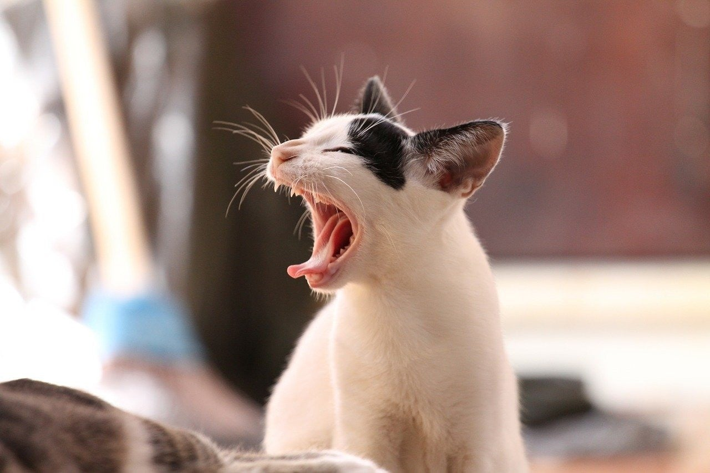

<figure>

</figure>

　銚子電鉄で企画されていた、猫を愛でる列車**『ぬくねこ電車』**が、批判を受けて中止だそうである。おもちゃにされる猫がかわいそうということらしい。

　人間にベタベタされて猫が嫌なのかどうなのか、本当のところはわからない。猫とわかりあえたっていうのも人間の思い込みだし、猫が嫌がっているっていうのも人間の勝手な想像に過ぎないと思う。

　以前、1回だけ猫カフェというところに行ったことがある。店内に多くの猫が放し飼いにされていて、その中でお茶など飲みながら癒やされようという目的の店だ。うーん、どうかなあ。癒やされるのかなあ？というのが正直な感想だ。

　しかし、それよりも、その店で人間に愛でられている猫たちの、なんと退屈そうなことか。もう慣れきっているのか、あきらめているのか、抵抗もせず、ただぐだーっと惰眠を貪る猫たち。

　これが猫！？猫という動物は、もっと無秩序に走り回り、気が乗らなければ人間の手が届かぬ高所で欠伸をし、柱や壁で爪を研いで住居を荒らすものだ。甘えたいときだけ寄ってきて、飽きればシャーッと威嚇して逃げていく。それが猫じゃないのか。猫カフェではそういう奔放な猫の姿は見ることができなかった。

　きっと、猫を愛でる列車も同じことになるだろう。走っている車両の中を走り回り、車両のシートを引きちぎり、乗客に粗相をするような猫では、トラブルの元になる。大人しくて、人間にされるがままになっている駄猫だけがそろえられるのだ。

　そう考えると、猫電車は無くてもいいのかなと思っている。別に動物愛護の観点もないし、猫がかわいそうとも思わない。でも、ワイルドじゃない猫を見てもちっとも面白くないのだ。きっと猫自身も、自由に暴れ回って好き勝手やりたい、そう思っているんじゃないかな。

　おっと、これも人間の勝手な想像か。

[https://headlines.yahoo.co.jp/hl?a=20200115-00010012-chibatopi-l12](https://headlines.yahoo.co.jp/hl?a=20200115-00010012-chibatopi-l12)
