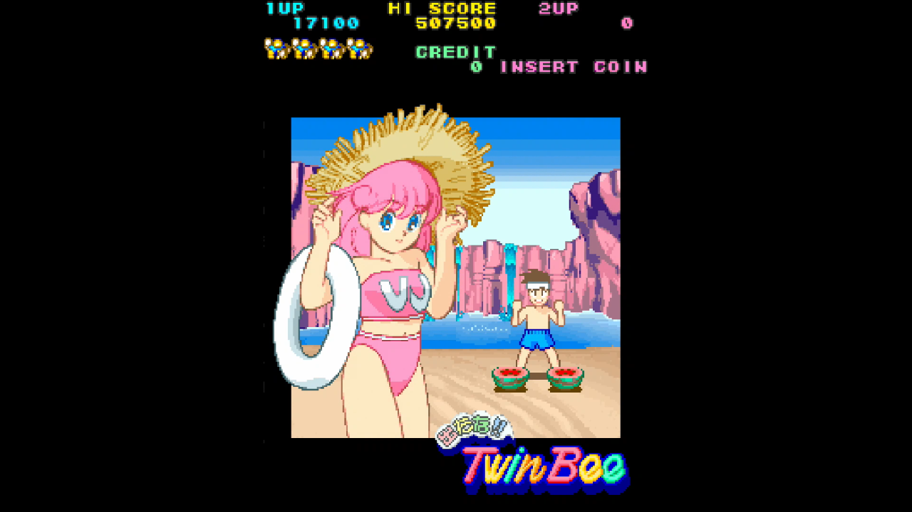
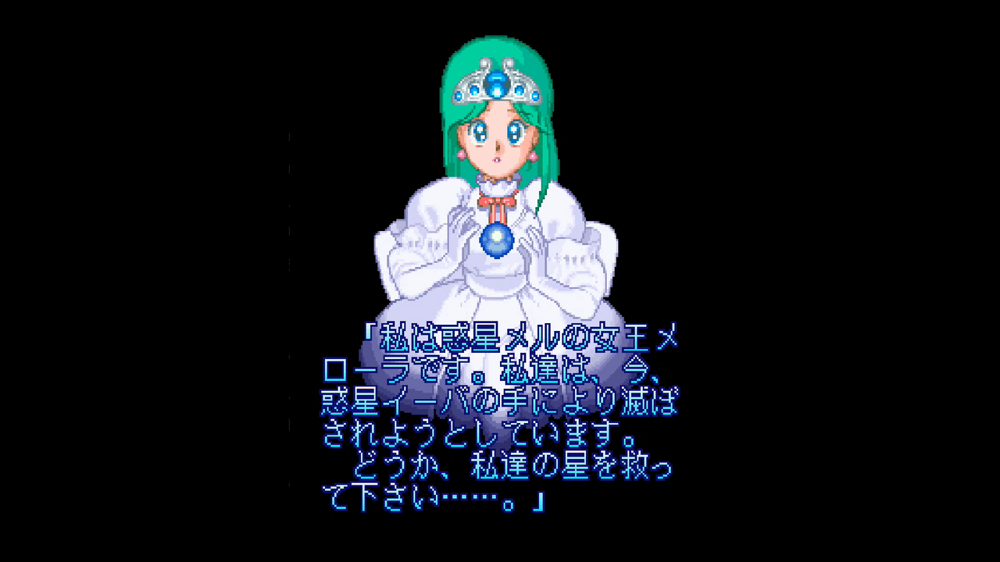

<figure>

</figure>

　**『出たな！！ツインビー』**の話である。今日アーケードアーカイブスにラインナップされた。PS4とSWITCHで遊べる。もう即購入、ダウンロードしたよ。

　**『ツインビー』**は、雲の中に潜むベルを撃ちながらパワーアップし、ステージ最後のボスを倒すとステージクリアとなる縦スクロールシューティングだ。**『出たな！！ツインビー』**は、その続編となるゲームで、よりカラフルなグラフィックや、前作からさらにパワーアップした音楽を引っさげてゲームセンターに登場するや否や、一躍人気タイトルとなった。

　しかし、この「ベルでパワーアップする」というゲームシステムが異様な難しさを作り出していたのも事実である。ベルは撃った回数で特定のパワーアップに変化する（色が変わる）のだが、雨あられのようにプレイヤーを攻撃してくる敵機を倒しつつ、あるいはかわしつつ、その敵に混じって落ちてくるベルを回収しなければならないのだ。

　雲からベルが出てくるというファンタジックな設定は、この一見してかわいらしいゲームの世界観に合っている。ルールとしても明快でわかりやすい。しかし、重力加速度に引かれて自由落下するベルを、特定の色で、しかも敵を避けつつキャッチするのは、至難の業だ。画面内を縦横無尽に飛び交う敵を必死で倒しながら、「今、何回ベル撃ったっけ？」と数えていなければならない。この、マゾヒスティックなゲームシステムは、今にして思えば実にコナミらしい。ド派手なパワーアップを見せつけておきながら、一度やられると地獄を味わう**『グラディウス』**シリーズとも共通する、コナミ流の意地悪なやり方だ。そういう意味で、当時こんな底意地悪いゲームを連発していたコナミは全然凝りないメーカーだったと思う。いや、凝りないのはそんなゲームをやり続けた我々ゲーセンキッズの方か。

　当時の僕は毎日ゲームセンターに通い、懸命に**『出たな！！ツインビー』**をプレイした。それはなぜか。キャラクターがかわいいかったのだ。当時のコナミのゲームに登場していたキャラクターを思い出してみてほしい。**『ゼクセクス』『究極戦隊ダダンダーン』『マーシャルチャンピオン』**などなど。どちらかと言えばかわいくない系の女の子ゲームを量産していたコナミのゲームの中にあって、**『出たな！！ツインビー』**は群を抜いて洗練された絵柄のゲームだった。少なくとも、僕にはそう見えた。  
　しかも、それを全面に押し出すのではなく、あくまで面クリアのデモでちょっと見せるだけ。それを見たいがためにゲームをプレイしていたのだ。いや、そんなことはないんだけど、やっぱりちょっとそんなところはあった。チョイ見せの極意で、プレイヤーを魅了する実にずるいゲーム。やっぱりコナミは意地が悪いメーカーだ。

　とにかく、絵柄のかわいらしさと、音楽の完成度の高さで、あり得ないぐらい意地の悪いゲームシステムを覆い隠してしまう。それが**『出たな！！ツインビー』**の本質と言える。若い僕が騙されてプレイし続けたとしても、それは仕方ないことであろう。当時「萌え」なんて言葉はまだなかったかもしれないけれど、キャラ萌えだけで遊ばせるゲーム、それが**『出たな！！ツインビー』**だったのである。

　しかし、いかに魅力的な絵柄でプレイヤーを引きつけようとも、難易度の高いステージでやられて強力なパワーアップを失うと、その後はまったく復活できなくなるのも**『出たな！！ツインビー』**の困ったところである。捨てゲーはよくないとか、そんなきれいごとを言ってる場合じゃないレベルで復活できないのだ。この辺り、コナミの開発者はどう考えていたのか、聞いてみたいものである。いや、絶対そんなの何も考えてないな。断言できる。

　こんな、素敵に意地が悪いゲームが家庭用のゲーム機で遊べるなんて、本当に素晴らしい時代である。みんなも**『出たな！！ツインビー』**をダウンロードして、当時のコナミの性格の悪さを実感してほしい。本当に性格悪い。書いていて腹立ってきた。

　でも当時、1周はクリアできるぐらいまでは遊んだんだからな。2周はあきらめた。絵も同じだったし。
