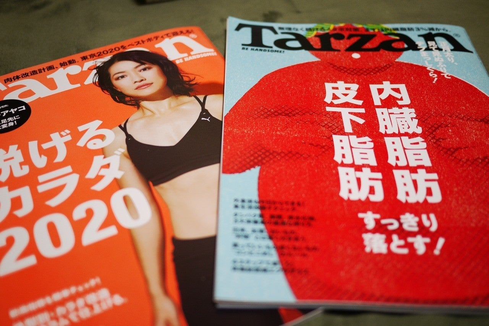

<figure>

</figure>

　ときどき雑誌**『Tarzan』**を買う。いつも脂肪とエクササイズのことばかり書いてある雑誌だ。

　正直言って、**『Tarzan』**に載っているエクササイズは、どれもレベルが高くて、僕の弛んだ日常では完遂できない。体に脂肪をつけない食べ物についてもよく載っているが、こちらも意識高すぎて毎日食べるのは無理だ。だいたい、掲載されているメニュー通りに毎日食事していたら、食費がかかりすぎる。そもそも、定期的に「脱げるカラダ」とか特集しているが、どこで脱いでみせるって言うんだ。

　きっと、この雑誌を読んでいる人のほとんどが、そこに書かれていることは夢物語として読んでいるに違いない。**『Tarzan』**は、健康やスポーツにカテゴリされる雑誌ではなく、ファッション系の雑誌だ。意識高い食事して、スマートにエクササイズをして、おしゃれなエクササイズウェアを買う。そういうハイソで健康的な生活をきれいきれいに見せるためにあるのだ。

　そこまでわかっていて、じゃあなぜ**『Tarzan』**を買うのか。

　それは、自分のやる気をアップさせるためである。**『Tarzan』**に載っている、どのエクササイズも食事も実践できなくても、そこに書かれている「脂肪を減らそう！」という文章の圧力と、これみよがしに大写しになっている美男美女の筋肉美を見て、モチベーションがアップすればいいのである。そう思いながら、また今週（隔週刊だけど）も**『Tarzan』**を買ってしまうのであった。

　いや、毎号は買ってないよ。ホントに。
