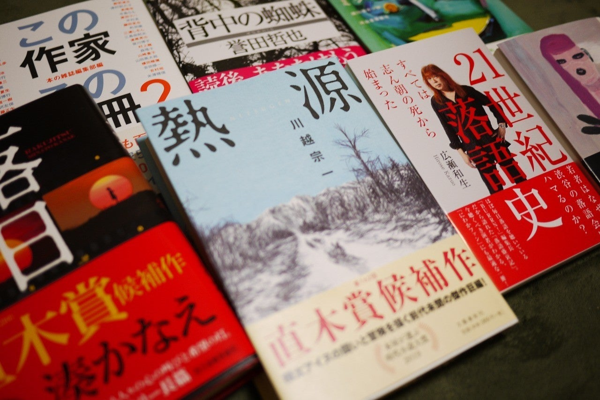

<figure>

</figure>

　年末年始に買った本を5冊ほどやっつけたら心に余裕ができた。余裕ができて、また少し本を買ったので備忘録代わりに書いておこう。ここに書くと意外に覚えていて、同じ本を買わずに済むのだ。もちろん、アプリなど使って買った本は記録しているのだが、それでも漏れが出てくるところが自分らしいと半分諦めている。とは言え、なるべくその自分らしさに抗っていこうではないか。

## 『この作家この１０冊　ＰＡＲＴ２ | 本の雑誌編集部』  

　先日『1』を買ったつづき。こっちはまだ現役で普通に売っている。1巻2巻あわせて、100人の作家がいるわけだが、10冊ずつ読むとなると1000冊だな。10年近くかかるね。

[https://amazon.co.jp/dp/4860114353](https://amazon.co.jp/dp/4860114353)

## 『背中の蜘蛛 | 誉田 哲也』

　双葉文庫の警察小説アンソロジーに収録された**『裏切りの日』**に大幅加筆して長編化した作品。アンソロジーの方を読んでいないのでまったくの初読み。

[https://amazon.co.jp/dp/4575242144](https://amazon.co.jp/dp/4575242144)

## 『落日 | 湊 かなえ』

　最近久しく読んでいなかった湊かなえ。ミステリで直木賞候補ということでとかく話題だが、そんな先入観は捨てて読んでみたい。

[https://amazon.co.jp/dp/4758413428](https://amazon.co.jp/dp/4758413428)

## 『熱源 | 川越 宗一』

　以前から読もう読もうと思っていたら、第162回直木賞受賞していた。おかげで、ちょっと手に入りにくかったぞ。（近所の書店にはなかった）一応時代小説のカテゴリで、普段あまり読まないジャンル。

[https://amazon.co.jp/dp/4163910417](https://amazon.co.jp/dp/4163910417)

## 『21世紀落語史 すべては志ん朝の死から始まった (光文社新書) | 広瀬和生』

　BURRN！編集長 広瀬和生による、現代の落語界を解説した本。広瀬和生は今の落語家を盛り上げようと、いろいろ本を出している。それが実を結ぶといいねえ、と思いながら見ているのだが。それにしても、どうして著者本人を表紙にした。

[https://amazon.co.jp/dp/4334044557](https://amazon.co.jp/dp/4334044557)

## 『鳥肌が (PHP文芸文庫) | 穂村 弘』

　これも以前から読みたかった、歌人 穂村弘によるエッセイ。いつの間にか文庫が出ていたので購入。この本は、単行本のときも表紙の人物に鳥肌が立っているかのような突起が施されていたのだが、文庫化に際してもそれを再現する装丁の凝りよう。何の意味もないけど、嬉しいよね。

[https://amazon.co.jp/dp/4569769438](https://amazon.co.jp/dp/4569769438)

## 『セロトニン | ミシェル・ウエルベック, 関口涼子』

　**『H・P・ラヴクラフト:世界と人生に抗って』**の著者でもある、フランスの作家ミシェル・ウエルベックの作品。モンサント、現代社会への絶望、セロトニンというキーワードでピンときて読んでみることにした。

[https://amazon.co.jp/dp/4309207812](https://amazon.co.jp/dp/4309207812)

　というわけで、控えめに（？）7冊。要するに直木賞と直木賞候補作を中心に読んでみようというわけだ。半月で5冊読んだから、来月には消化しきってしまいたい。可能なのか！？がんばろう。
