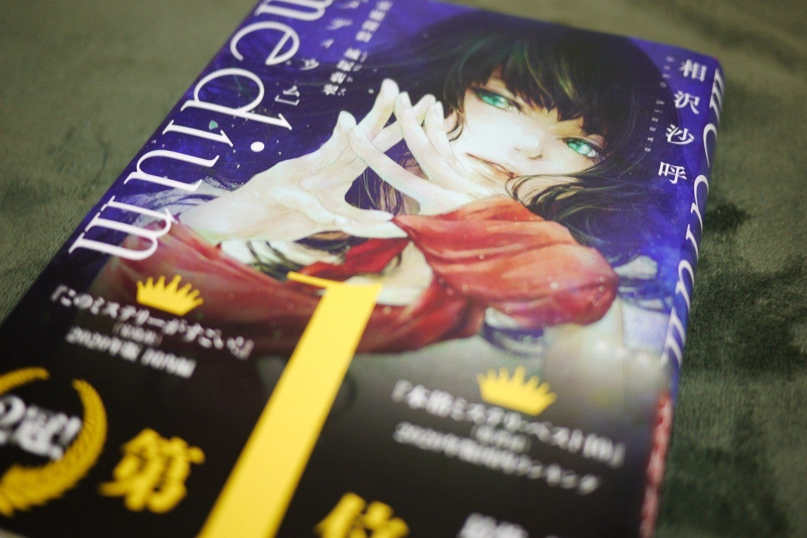

<figure>

</figure>

**※具体的なネタバレはないけど、未読の人は退場推奨！**

[https://amazon.co.jp/dp/406517094X](https://amazon.co.jp/dp/406517094X)

　**「俺の純粋な気持ちを返してくれ！」**

　と、物語の終盤まで読んで叫びたくなった。

　とにかく、読む前からタイトルの**『霊媒探偵』**という肩書が気になって気になって、本当にミステリとして大丈夫なのかという気持ちでいた。しかし、それについては杞憂であった。結局、最後にはミステリとして技巧を凝らした結果の大どんでん返しにやられてしまう僕なのである。

　主人公が霊媒を名乗るぐらいなので、各事件の端々に荒唐無稽な場面が登場する。そこで鼻白むことなく、ラストまで行ければ楽しめるだろう。もしかすると、少し子どもっぽいプロットについていけない読者もいるのかもしれない。遠田志帆による鮮麗なる表紙が物語る通り、どちらかと言えばライトノベルのような、どこか軽いノリのタッチでストーリーは展開する。連続殺人事件をテーマとしているのに、主人公たちにはどこかで未来に対する明るい希望のようなものが感じ取れる。そんな小説なのだ。

　だからこそ、つらい事件に直面する中にあっても、それを解決し、次のステージへ進もうとする登場人物のポジティブな生き様に共感できる。ここには、決して鬱々とした死臭漂う陰惨なミステリに成り果てない魅力がある。それは、悲惨な連続殺人事件を、登場人物とともに解き明かそうとする読者にとっても、大いなる光、希望であるのだ。

　そう思って読んでいたのに！

　最後になんという仕掛けを用意してくれたのか。一瞬、「そんなのありかよ……」と絶句してしまう。しかし、まてよ。これはこれで痛快な物語ではないのか。ここまで育んできた、登場人物に対する愛情はすべて裏切られたけど、今度は彼らの新たな魅力を感じ始めている自分がいるではないか。

　そう、風雲急を告げるストーリーは、あくまで希望を失わず、迷える読者たちはなんら悲嘆に暮れることはない。この新たな展開を素直に受け入れ、その抗いがたい魅力に思う存分溺れるがいいのだ。

　ああ、この世にこんな素晴らしい裏切りがあるなんて。思っても見なかったよ。

　読み返したけど、何書いてあるか全然わかんね。とにかく一読をおすすめする良作。
