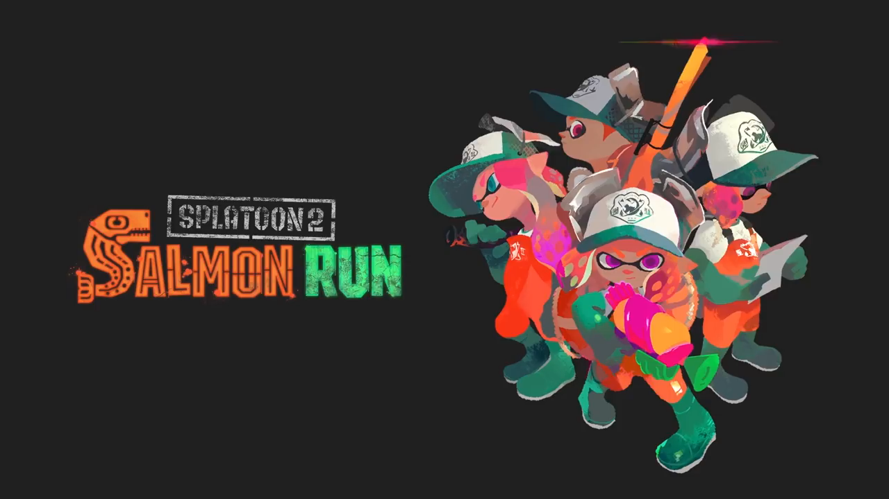
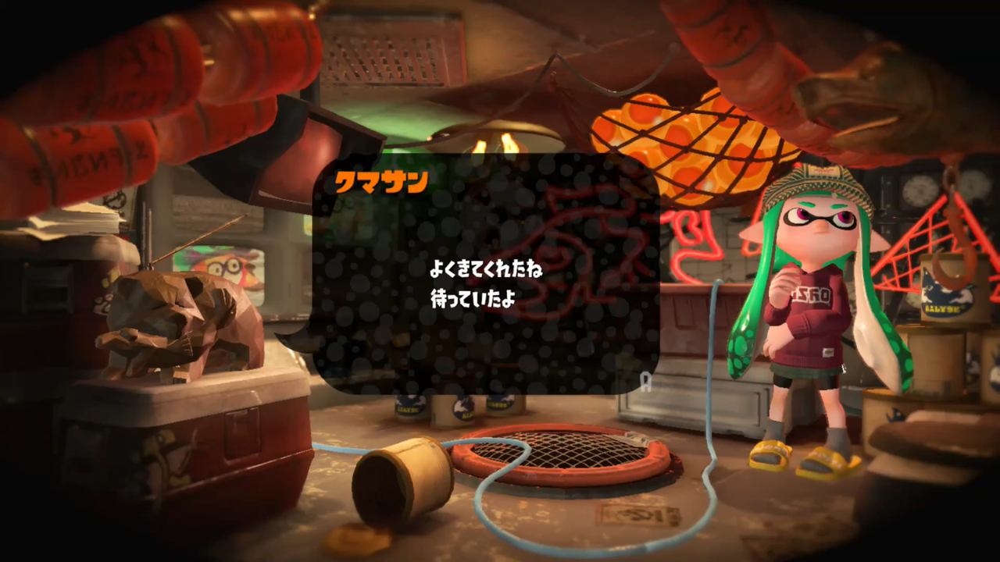
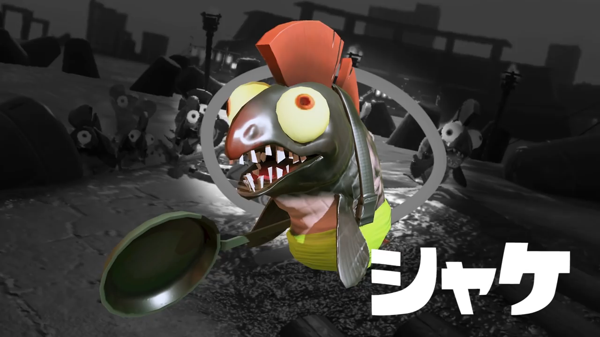
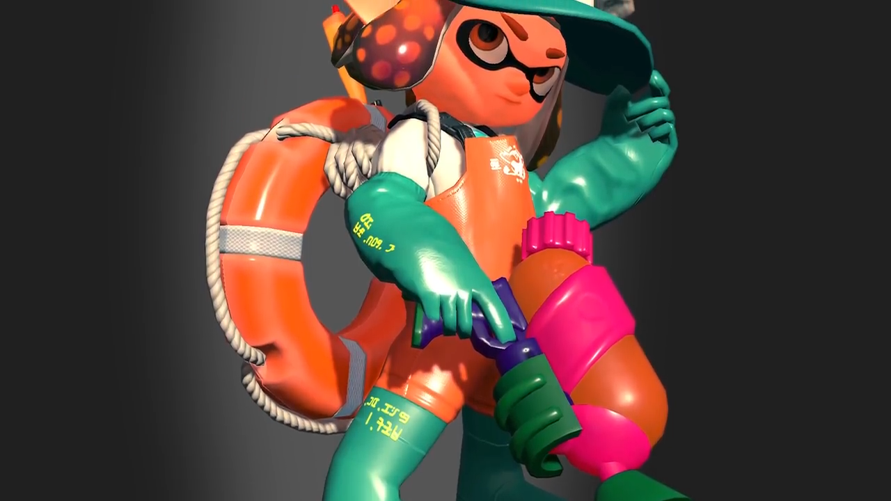

<figure>

</figure>

　今でも**『スプラトゥーン2』**を定期的に遊んでいる話は以前書いた。仲間と一緒に遊ぶ**『スプラトゥーン2』**は大変楽しいのだが、それ以外にも未だにこのゲームを遊び続ける理由がある。それは、**『サーモンラン』**の存在だ。

　**『サーモンラン』**は、迫りくる大量のシャケ（鮭）を倒し、出現するイクラを拾いまくる、**『スプラトゥーン』**本編とはまったく別のルールで構成されたゲームだ。昔、**『Gears of War 2』**で、次々と現れるローカスト（敵）を仲間とともに倒すモードがあったが、あれと似たようなゲームだ。よくわからない？**『コールオブデューティー』**シリーズで、続々と襲ってくるゾンビを倒すモードがあったりするけど、あんなようなものだと思ってもらってもかまわない。

　ゲーム内で、**『サーモンラン』**をプレイするための「クマサン商会」というバラック小屋のような怪しげな店に入る。そこには、この**『サーモンラン』**を仕切っている元締めとも言うべき、クマサンが待ち構えている。彼の姿は、なんと木彫りの熊そのもの。もう、その姿から人を食っている、いや、イカを食っている（？）ようなものだが、よく見るとクマサンの背中にはアンテナがついている。きっと、本物の元締めはどこかにいて、無線でブラックなアルバイトに飛び込んでくる未来ある若者を騙しているに違いない。胡散臭い姿のクマサンは、いたいけないイカたちに、シャケを倒して「金イクラ」を集めてこいと命じる。その言葉はあくまで穏やかで紳士的だ。だが、それが大きな間違いであることを、プレイヤーたちはすぐに思い知ることになる。

　そう、このクマサンが紹介してくれる**『サーモンラン』**は、ゲーム内で「ブラックなアルバイト」として位置づけられている。**『サーモンラン』**が、ただのシャケ漁だと思って油断すると痛い目を見る。迫りくるシャケたちは、魚というよりは、海底から這い出てきた「深きものども」とも言うべき怪物たちだ。ラヴクラフト先生もびっくりのおぞましい姿のシャケたちは、地面を歩くこともできる。大挙して押し寄せてきて、プレイヤー操るイカたちを地獄へ叩き落とそうと迫ってくるのだ。いや、地面を歩くだけではない。シャケの中には、ミサイルを発射するもの、ビームを撃ってくるもの、爆弾をなげつけてくるものなど、もはや魚ですらない異形の神々のようなおぞましい連中が入り混じっている。その光景は、ぶっちゃけホラーだ。哀れ、ブラックバイトと知らずにクマサンに雇用されてしまったプレイヤーたちは、4人の力を合わせて、目の前に迫りくる大量のシャケを屠殺しなければならない。これはもはや漁ですらない。命を賭けたバトルだ。

　**『スプラトゥーン2』**本編では、思い思いの服装でオシャレにインクを塗って戦うイカたちだが、**『サーモンラン』**ではそんな生ぬるいことは許されない。全員が漁師合羽（漁師が着用するウレタン素材の装備）に身を包み、本編のステージがある都会からは孤立した北海の辺境でシャケと格闘する。いや、服装の見た目が変わるだけではない。ゲーム本編では、パワーアップ要素のあった服を着ることができないのだから、そのプレイヤー強化要素も発揮されず、己の力のみで勝負しなければならない。頼りになるのは、クマサンから一方的に貸し出された武器のみ。あとは、4人の力を合わせて、知恵と勇気でこの戦いを乗り越えなければならないのだ。（もちろん、武器は貸し出し制なので、ゲームが終了しても手に入ったりはしない）

　なあに、大丈夫。日々**『スプラトゥーン2』**で、ライバルとの熱いバトルを繰り広げているイカの諸君なら、その熱い心と絆で、この試練を乗り越えられるだろう。やる気さえあればがんばれる！それが**『サーモンラン』**だ。

　どう考えても小林多喜二のプロレタリア文学が思い起こされる**『サーモンラン』**。これはもう、現代に蘇る**『蟹工船』**ではないか。いや、**『鮭工船』**か。熾烈を極めるシャケの攻撃は、一瞬の判断ミスがパーティの全滅を招く。シャケたちに有効な武器を持っているのに、瞬殺されようものなら、狩場には言葉にならない怨念のようなものがうずまき始めるのだ。幸い（？）このゲームにチャット機能はない。ふがいない相棒を罵倒しようにもその手段は用意されていない。しかし、確実に憎悪を含んだ場の雰囲気は醸成され、荒れた漁の結果はいつでも全滅だという形でプレイヤーに襲いかかる。

　生き残りたければ知恵を絞れ！目の前の仲間と協力し、力を合わせるのだ！君たちの絆が本物になったとき、道は開ける。この熱いゲームモード、いや過酷な労働が呪縛のように僕を離さない。それが、未だに**『スプラトゥーン2』**をプレイし続けるもう一つの理由だ。さあ、今日も地獄さ行ぐんだで！

※公式の**『サーモンラン』**紹介PV

[https://www.youtube.com/watch?v=U6sT0xpViw4](https://www.youtube.com/watch?v=U6sT0xpViw4)
