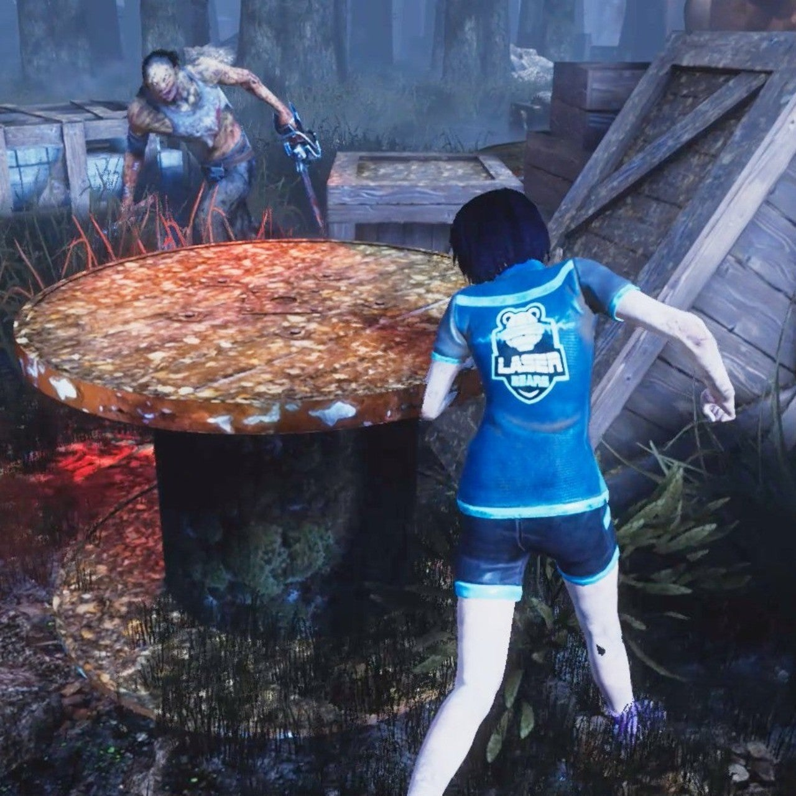

<figure>

</figure>

## はじめに

　ここ2年ほど、すっかり入れあげてるゲームがある。『Dead by Daylight』だ。ネットにアップされているゲームプレイ動画などを通じてジワジワと知名度が上がり、今ではすっかり人気タイトルとなったゲームだ。

　しばらくは毎日のようにプレイしていた『Dead by Daylight』。好きが高じて、いろいろ感想めいたものを書きちらかしたりしている。しかし、書いたものをどこかにアップするでもなく、かと言って、あまりに散漫すぎて本にまとめるでもなく、何本もの記事をそのまま寝かせてきた。せっかくなのでnoteで書き溜めたものを吐き出していこうと考えている。

## 『Dead by Daylight』の概要

　『Dead by Daylight』は、カナダのBehaviour Interactive Inc.（ケベック、1996〜）によって開発され、PAYDAYシリーズ等で知られるStarbreezeから発売されている。（注：これを書いた当時パブリッシャーだったStarbreezeは、その後経営不振に陥り、本作の権利はBehavior社が1,600万ドルで買い取ったと報道された）端的に言えば、「殺人鬼」と4人の人間「生存者」による鬼ごっこのような対戦ゲームである。オンライン専用のゲームで、（チュートリアル以外に）CPUによるキャラクターの操作が一切ない。純粋な人間同士の対戦が特徴である。ゲーム中、味方が存在せず1人だけでプレイする殺人鬼は、ひ弱な生存者たちに比べて圧倒的な力を持つ。その力をフルに発揮して、生存者たちを捕え、エンティティと呼ばれる闇の存在にその生命を捧げることを目的とする。一方、絶望的な状況に置かれた4人の生存者たちは、知恵と力を合わせて殺人者を出し抜き、悪夢のような惨劇の舞台から逃げ出さなければならない。ホラー映画的な恐怖と緊張感が実に楽しい、新機軸のゲームである。

## 『Dead by Daylight』の誕生と人気の広まり

　2016年6月14日にWindows版（当初はSteamのみで販売、現在はMicrosoft Storeでも販売されている）が発売された『Dead by Daylight』は、わずか1週間で27万本を売り上げ、その開発費を回収したことが報じられている。その後、YouTubeなどでゲームをプレイする動画が盛んにアップロードされたこともあり、このユニークなゲームは広く一般に知られることになる。早くも同年8月には100万本の売り上げを達成しているようだ。国内でも、日本語対応以前からユーチューバーなどによって先を争うようにプレイ動画が配信されたことから、多くのファンを取り込むことができたようだ。発売当初のゲーム配信において、「パーク」と呼ばれるプレイヤーの能力をブーストする装備を「ノーワン」「バベチリ」など略称で呼びながらプレイする姿が見られ、英語を読み解きながらプレイするに値する面白さが伝わってくる。そして、発売から1年後の2017年にはWindows版が日本語対応したことからも、日本国内でも人気が高まってきたことが窺い知れる。

　その後、2018年6月にはPS4/Xbox One版がリリースされ、ここで一気に国内人気に火がつくことになる。どちらかと言えばプレイの敷居が高いPC版ではなく、比較的安価にプレイ環境を整えられるコンシューマー機で遊べることの意味は大きい。さらに多くのユーザーが、手軽に『Dead by Daylight』を遊べるようになったのである。かくいう私もWindows版が発売された当初Steamでこのゲームを購入していたのだが、残念ながら手持ちの貧弱な性能のPCでは起動することすらかなわず、悔しい思いをしていたのだ。PS4版発売の朗報に飛びつき、ようやくプレイできるようになった。

## ユニークなゲーム性

　『Dead by Daylight』は、公式サイトにて”asymmetrical horror game”（非対称型ホラーゲーム）と説明されている。その名の通り、追う側と追われる側が、勝利条件、キャラクター能力、人数等すべてにおいて対等でない対戦ゲームだ。あまりにパワフルで破壊的な殺人者を前に、どう考えても、一方的で不公平な戦いが展開するかと思いきや、これがさにあらず。生存者も4人の力を合わせ、ひとりひとりの能力を効果的に発揮することで恐るべき殺人者と対等に渡り合える。場合によっては、力で圧倒的にまさる殺人鬼が一方的に翻弄されて終わるゲーム展開すらあり得るのだ。

## ゲームの評価は賛否両論あるが……

　しかし、対人戦のみで構成され、しかもネット回線の環境など前提条件が異なるネット対戦ということで、何よりもそのゲームバランスの悪さが、否定的な話題になることも多い。Steamのレビューなどを見ても、概ね肯定的な意見が多いものの、決して絶賛の嵐というわけではない。とは言え、これは、対人戦ゲームの宿命であり、プレイヤーとしては殺人鬼に倒されれば「キラーが強すぎる」と非難し、生存者がそろって逃げ出してしまえば「サバイバー有利だろ」と愚痴りたくなるものである。そんな、ネット上の熱いやり取りも含めて、実に興味深いコミュニティを形成しているゲームとも言える。前述したパブリッシャーの交代で、今後の採算性などが心配された『Dead by Daylight』であるが、Behavior社はその後も意欲的にゲームのアップデートを行っている。新キャラクターや新ステージの追加にとどまらず、ゲームシステムそのものも大胆に手を加えて、常に新しいゲームに生まれ変わる『Dead by Daylight』。将来性という意味で、今後の展開がますます楽しみなゲームだ。実はいろいろバグも見受けられるけど、広い心で今後に期待したいゲームなのである。

## おわりに

　というわけで、長文で書いてしまった。実はこんな文章が他にも何本か眠っている。今後も折を見て放出していこう。
