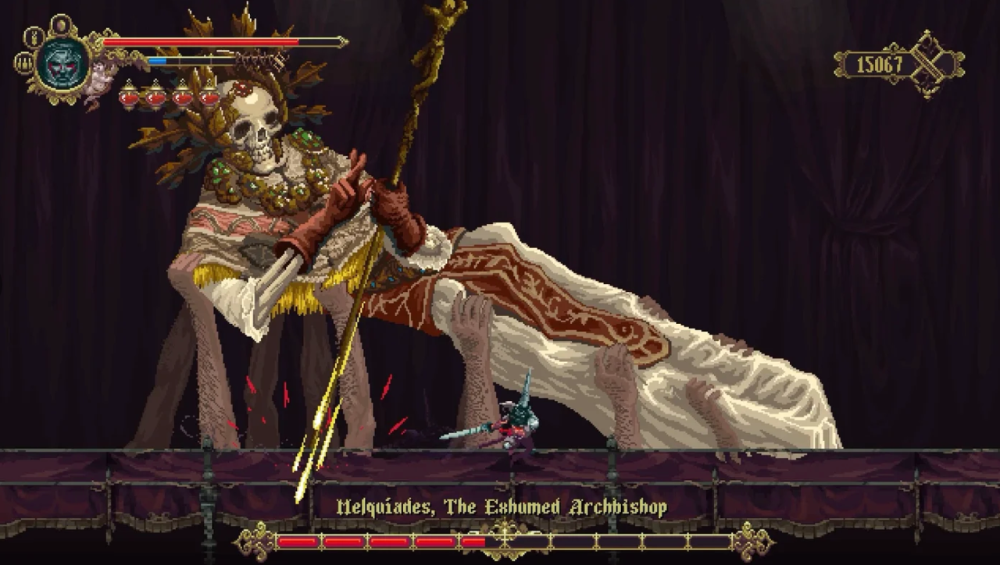

<figure>

</figure>

　任天堂スイッチは、比較的インディーゲームがリリースされる。任天堂のオフィシャルサイトでも、「Hello! Indie World」と銘打ってインディーゲームの紹介に力を入れているぐらいだ。あまりにいろいろリリースされるので、追いきれなかったり、Steam版も出ているので買い方に迷ったり、プラットフォーム的に混乱しないでもないので、自分用にメモをしておこう。

[https://www.nintendo.co.jp/software/feature/indieworld/](https://www.nintendo.co.jp/software/feature/indieworld/)

## Stories Untold | Devolver Digital

　少し前にSteamでも販売されていたコマンド式アドベンチャーゲーム。日本語化されていなかったのだが、スイッチではローカライズされてのリリースだ。Steamの紹介を読むと、"a narrative-driven experimental adventure game"と書かれていて、未プレイの人間としては、その全貌が気になるところ。

[https://ec.nintendo.com/JP/ja/titles/70010000023008](https://ec.nintendo.com/JP/ja/titles/70010000023008)

## 198X | Hi-Bit Studios | ハチノヨン

　これも昨年Steamで販売されたタイトル。80年代風のピクセルアートな5本のゲームをプレイできるという触れ込みのゲーム。サウンドに古代祐三も参加しているそうだ。

[https://ec.nintendo.com/JP/ja/titles/70010000024615](https://ec.nintendo.com/JP/ja/titles/70010000024615)

## 東方スペルバブル | タイトー

　インディー枠ではないけれど。最近、コンシューマのダウンロードソフトによく登場する東方二次創作。東方キャラクタやアレンジ楽曲を使った**『パズルボブル』**で、それはOKなの？と思ったら、タイトー製でした。開発はよくわからないが、サウンドにはZUNTATAも絡んでいるようで、タイトー謹製なのかな。ダウンロードソフトに5800円という価格で手が出しにくいかも。

[https://ec.nintendo.com/JP/ja/titles/70010000024387](https://ec.nintendo.com/JP/ja/titles/70010000024387)

## Hob 決定版 | Runic Games | Perfect World

　これも2017年にSteamで発売済み。失われたテクノロジーが息づく古代遺跡を探検するファンタジックなアクションゲーム。**『ゼルダの伝説BoW』**のヴィジュアルが好きな人には向いているんじゃないかというアピアランス。ゲーム内容も、フィールド内のギミックを切り抜ける、ゼルダの伝説ライクな設計のようだ。Steam版が安くてローカライズ済みなので、そちらでもいい気がするけど、スイッチ版はタッチスクリーン、カメラオプション等追加機能搭載とのこと。

[https://ec.nintendo.com/JP/ja/titles/70010000026415](https://ec.nintendo.com/JP/ja/titles/70010000026415)

## Valfaris | Steel Mantis | eastasiasoft  

　サイドビューの、エフェクトがド派手なアクションゲーム。金属質を意識した硬派なヴィジュアルと、もともとエクストリームなメタルバンド**『セルティック・フロスト』**でベースを弾いていたカート・ヴィクター・ブライアント（クルト・ヴィクトル・ブライアント表記も）が担当したメタリックなBGMが売り。個人的には音楽だけで応援したくなるゲーム。Steam版がローカライズ済みなので、そちらでもいいかな。

[https://ec.nintendo.com/JP/ja/titles/70010000023028](https://ec.nintendo.com/JP/ja/titles/70010000023028)

## Demon's Tilt | WIZNWAR, FLARB LLC | FLARB

　先ごろSteam版が早期アクセスから正式版になったデジタルピンボール。すでにSteam版を持っているのだが、スイッチ版では縦持ちプレイが可能というところで気になっている。

[https://ec.nintendo.com/JP/ja/titles/70010000020649](https://ec.nintendo.com/JP/ja/titles/70010000020649)

Joggernauts | Space Mace | Digital Bards

　一列に並んで歩く4色のキャラクターを、迫りくる障害物と同じ色に切り替えて進む、アクションパズルゲーム。コミカルな絵柄と、リズミカルなゲーム内容は、ハンディな任天堂スイッチにぴったりのゲーム性だ。でも、Steam版がセールで380円なので、遊ぶとすればPCかな。

[https://ec.nintendo.com/JP/ja/titles/70010000016929](https://ec.nintendo.com/JP/ja/titles/70010000016929)

## SELF | deBell | indienova

　ローレゾなドット絵で描かれるシュールな映像を見て、主人公の記憶を取り戻していくアドベンチャーゲーム。公式の説明では「カフカタイプ」と称している。なんだそれ。動画を見ても一見して何をしているのかわからないところが、却って興味をそそる。しかしこれもSteam版が格段に安いので。

[https://ec.nintendo.com/JP/ja/titles/70010000020872](https://ec.nintendo.com/JP/ja/titles/70010000020872)

## Bookbound Brigade | Digital Tales USA LLC | イントラゲームズ

　常に8人で行動する英雄たちを操作するメトロイドヴァニアなアクションゲーム。このゲームのユニークなところは、英雄たちの隊列を変化させることで迷宮のギミックを切り抜けていくところ。コミカルで個性的なグラフィックも魅力的。

[https://ec.nintendo.com/JP/ja/titles/70010000022791](https://ec.nintendo.com/JP/ja/titles/70010000022791)

## リトルタウンヒーロー | ゲームフリーク

　少し前に発売済みのロールプレイングゲーム。村から外へ出てはいけない掟のある村を舞台に、襲いくる魔物を倒す。戦闘では、ひらめいたアイデアが攻撃方法となり、ときには村人の助けを借りて、魔物を倒しながら、この世界の謎を解き明かす。独自のゲームシステムが楽しい。音楽は**『UNDERTALE』**のトビー・フォックスが担当。

[https://ec.nintendo.com/JP/ja/titles/70010000022254](https://ec.nintendo.com/JP/ja/titles/70010000022254)

## Blasphemous | The Game Kitchen | Team17  

　グロテスクで残虐なダークファンタジー/ゴシックホラーな世界を、鮮やかなドット絵で描いたサイドビューのアクションゲーム。ゲームは、攻撃と防御、回避を駆使する硬派なシステムで、高難易度ゲーム好きにはたまらなさそう。と、思ったらSteam版持ってた。

[https://ec.nintendo.com/JP/ja/titles/70010000023532](https://ec.nintendo.com/JP/ja/titles/70010000023532)

## Mosaic | Krillbite Studio | Raw Fury

　大勢の人間が、その部品であるかのごとく、毎日同じ動きを続ける大都市。そこで孤独を感じている主人公が、徐々に世界の変化を感じ取っていくアドベンチャーゲーム。と言っても、紹介文と動画見て書いているだけなので、詳細がよくわからない。ディストピアを感じさせる、独特な雰囲気が特徴的。

[https://ec.nintendo.com/JP/ja/titles/70010000017647](https://ec.nintendo.com/JP/ja/titles/70010000017647)

## Into The Breach | Subset Games

　数ターンで勝負がつくこともある、詰将棋的なシミュレーションゲーム。都市に迫る怪物を、ロボット兵器などを駆使して蹴散らす。Steam版が日本語化されていない（一応有志による日本語化ファイルあり）ため、ローカライズされたスイッチ版が出るなら、それはそれで意味がある。USでは発売済みのようだが、日本ではまだ任天堂のサイトにも上がってきていない。少し先の発売かな。

[https://store.steampowered.com/app/590380/Into\_the\_Breach/](https://store.steampowered.com/app/590380/Into_the_Breach/)

　なんか、他にも気になるソフトがあった気がするけど、とりあえず新旧混じえて書いておいた。インディーゲームは大きなメーカーでは作れないような個性的な作品が登場する。任天堂スイッチのような裾野の広いコンシューマー機でこれらのゲームが遊べることは、昔のように多様なゲームが登場する可能性を広げていくのではないだろうか。いい傾向だと思う。

　うん、早速なにか買って遊んでみることにしよう。

## ※おまけ

## ヒューマン・リソース・マシーン デラックス「初めてのぷろぐらみんぐ入門セット」 | フライハイワークス  

　以前、初心者でもとっつきやすいプログラミングゲームとして話題になった、**『ヒューマン・リソース・マシーン』**と、続編**『セブン・ビリオン・ヒューマンズ』**に、ガイドブックがついたオールインパックが3月12日に発売になる。ダウンロードソフトではないが、プログラミングゲームとして優秀な2本に、解説書が付属するということで、この手のゲームが好きな人は改めて購入してもよさそうな1本だ。

[https://amazon.co.jp/dp/B08346TPNG](https://amazon.co.jp/dp/B08346TPNG)
