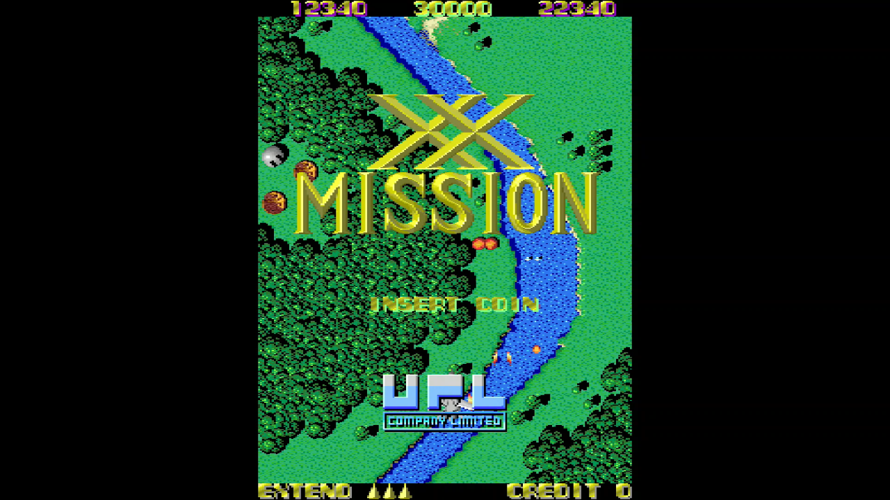
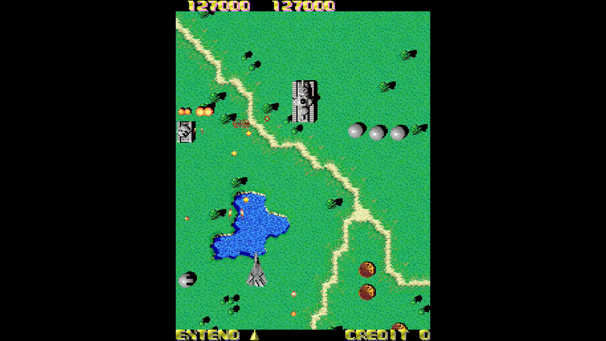

<figure>

</figure>

　突如アーケードアーカイブスに『XX MISSION』がラインナップされて驚いている。

　**『XX MISSION』**は1986年にUPLからリリースされた縦スクロールシューティングゲームだ。空中と地上を撃ち分けて攻撃するタイプのゲームで、銀色（グレー？）を基調とした立体的な敵キャラと、単調なBGMから、個人的には「UPLのゼビウス」的な捉えをしている。

　実際、ゲームもひたすら現れる敵を撃ち落とす内容で、あまり変化のないステージを進んでいく。本当にときどき巨大な敵機が飛来するが、それを考慮しても「地味」というイメージは拭えないゲームだろう。

　**『ゼビウス』**の発売は1983年なので、当時日進月歩で進歩していたアーケードゲーム界にあって、単に**『ゼビウス』**フォロワーと考えるには、あまりにも遅すぎる登場だ。しかし、ゲームセンターで不人気だったかと言うと、さにあらず。意外に「いつでも誰かがプレイしている」ようなゲームだった気がする。それも、ゲームキッズがこぞって遊ぶというよりは、スーツに身を包んだサラリーマンが、静かにこの地味シューに興じているという印象が強かった。

　そう、**『XX MISSION』**は、当時ゲームセンターからほとんど姿を消していた『ゼビウス』の代わりに、「ひたすら敵を撃つ」わかりやすいゲームシステムのシューティングという位置づけを担っていたのだ。86年と言えば、縦横にスクロールが変化する**『沙羅曼蛇』**、お金で武器を買う**『ファンタジーゾーン』**、ロボットが合体する**『サイドアーム』**、写真のようにリアルな東京の風景が美しかった**『スクランブルフォーメーション』**など、シューティング百花繚乱の時代。ひたすら森と荒野の上空を飛行する**『XX MISSION』**の立ち入る隙はなかったのかもしれない。

　しかし、世の中には派手なシューティングより、このストイックなゲームに心ひかれる人たちもいたことは間違いない。地味だけど、いつも誰かがプレイしている。**『XX MISSION』**はそんなゲームだったのだ。

　僕は当時健全なゲームキッズだったので、**『XX MISSION』**はそれほどプレイしなかった。しかし、今回改めて遊んでみると、うん、ストイックなシューティングゲームいいんじゃないかな。繰り返しプレイする中で、敵の出現パターンが体になじみ、次のプレイでは難なく敵をさばくことができるようになる。自然に自機が動くまでやり続けた頃には、この修行めいた戦いは快感に変わるのかもしれない。あまり盛り上がりのないミニマルなBGMも洗脳効果を伴ってプレイヤーの耳に染み込んでくる。今僕は、テーブル筐体の並ぶあの日のゲームセンターを思いながら、かのサラリーマンゲーマーを追体験しているのかもしれない。
