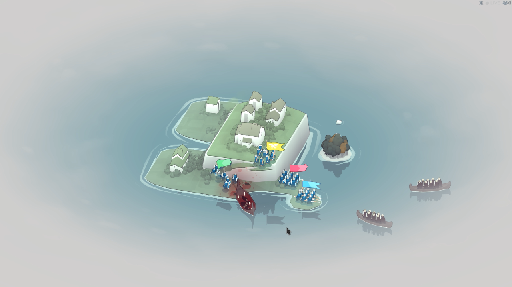
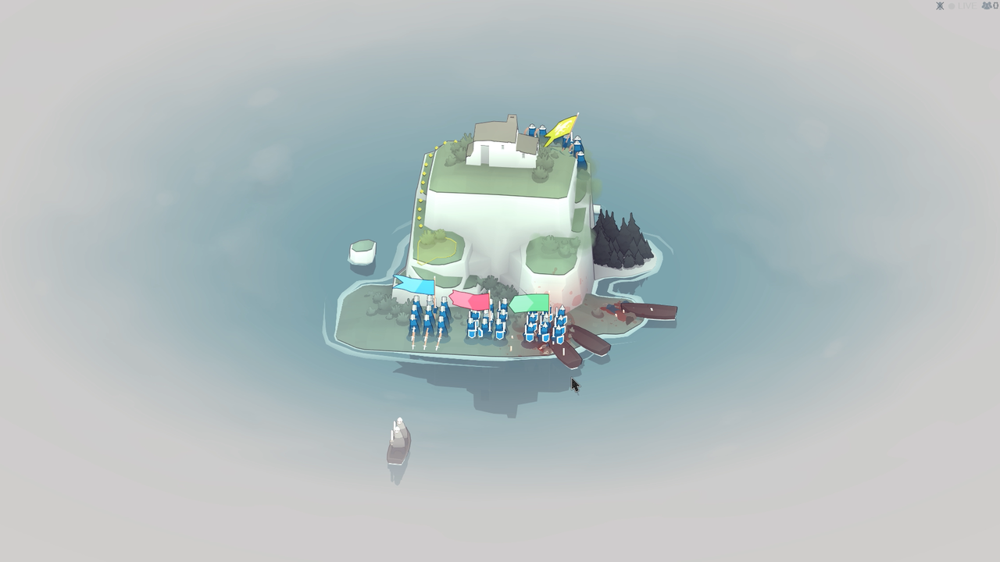
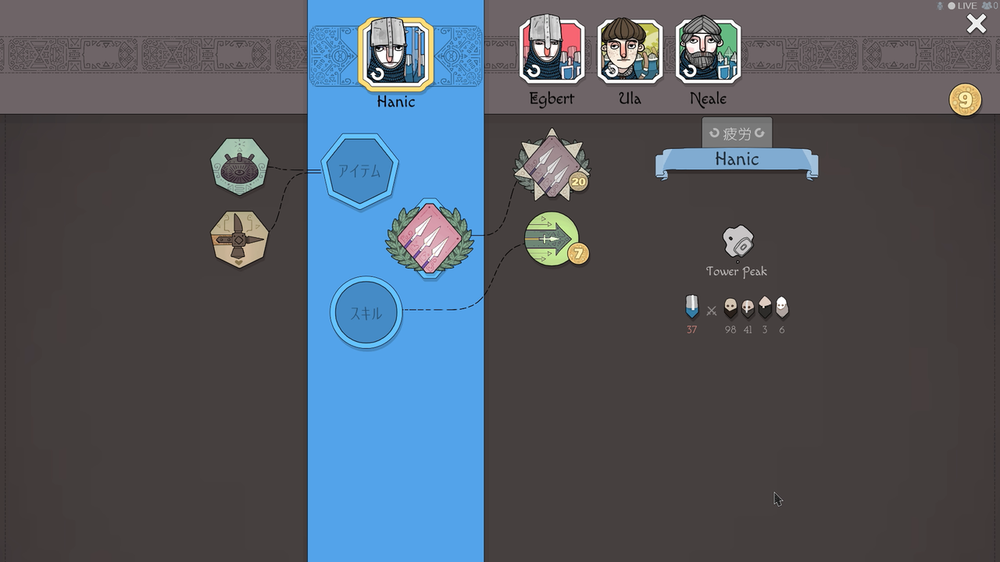

<figure>

</figure>

　Steamの春節セールで買った『Bad North』というゲームを遊んでいる。2018年に発売された、ヴァイキングをテーマにしたRTS（リアルタイムストラテジー）だ。

　開発はスウェーデンのマルメにあるPlausible Concept。なるほど、ヴァイキングのゲームにふさわしい土地柄なのかもしれない。

　ゲームは、海を渡って島に攻めてくるヴァイキングを、複数ユニットに指示を出して撃退するという単純明快なルール。自分の操るユニットは、島の上でのみ行動できる。ユニットには、盾を持って弓兵に強い歩兵、長い槍での攻撃が強力な槍兵、弓で上陸前のヴァイキングを攻撃できる弓兵のどれかを指定して割り当てることが可能だ。あとは、狭い島の中をクリックで移動させれば、敵と出会ったときに適切な行動で戦ってくれる。シンプルで簡単操作。それでいて幅広い戦略が広がる、よくできたゲームだ。

　何よりも、マップを小さな孤島に設定したことで、1ゲームが数分で終了するライトウェイトなプレイ感に仕上がっているところが秀逸。ちょっと遊ぶのに向いている。PS4やスイッチにも移植されているが、特にスイッチではスキマ時間に遊べる良作というイメージが強いんじゃないだろうか。

　さらに、そのゲームの舞台となる孤島は常に周囲を深い霧で覆われており、これが幽玄な北欧の海、例えばバルト海のようなヴァイキングが跋扈した歴史の舞台を思わせる。オーランド諸島辺りを思い浮かべながらプレイすると雰囲気は抜群。霧の中から出現するヴァイキングたちの驚異が、端的なグラフィックで表現されているのだ。決して贅を尽くしたCGではないが、かわいらしい動きとボイスで戦いの様子が生き生きと描かれる。

　RTSとしては単純極まりない作りではあるが、ステージをクリアして稼いだポイントでクラスのレベルを上げたり、スキルを取得したりすることができる。自分なりの戦い方を構築できるのも魅力的だ。

　ユーザーフレンドリーな『Bad North』だが、実は一度死んだユニットのリーダーは生き返らなかったり、1ステージの戦いがどのような結果になろうとも強制的にセーブされてしまったりと、シビアな一面もある。決してヌルいだけのゲームではなく、真剣に戦略を考えなければならない一面もあわせ持っている。

　RTSのエッセンスを抽出したような北欧生まれのゲーム。霧と氷に囲まれた島々で、ヴァイキングを相手にプリミティブな戦いをぜひ体験してほしい。

　余談だが、個人的にスウェーデンをはじめとする北欧は、近来活発に活動しているゲームスタジオが多いイメージがある。こういうシンプルで独自性のある、ゲーム本来の楽しさを追求したようなゲームがいろいろ出てくるのは、ゲームファンとしてはうらやましい。ガチャと萌え絵で収益は上げられても、それで盛ったアプリをゲームと称している国々とは一線を画しているな、と感じるのであった。

[https://www.youtube.com/watch?v=anhoDyIFQBY](https://www.youtube.com/watch?v=anhoDyIFQBY)
