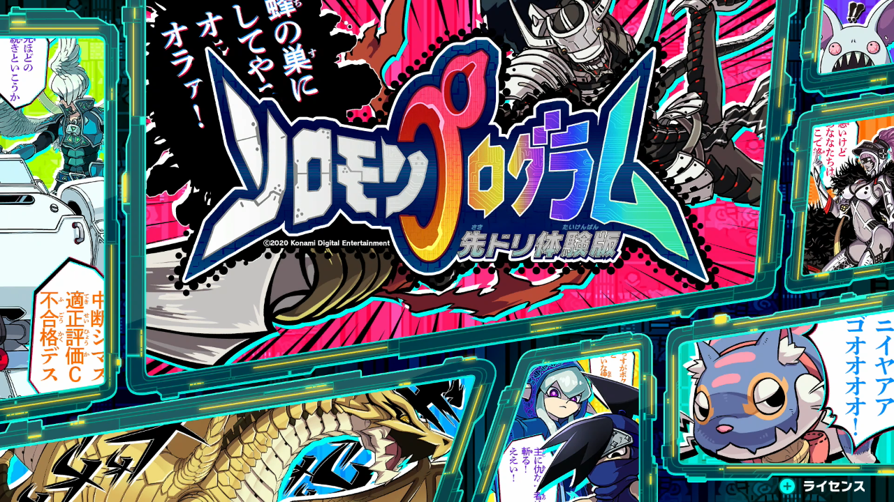
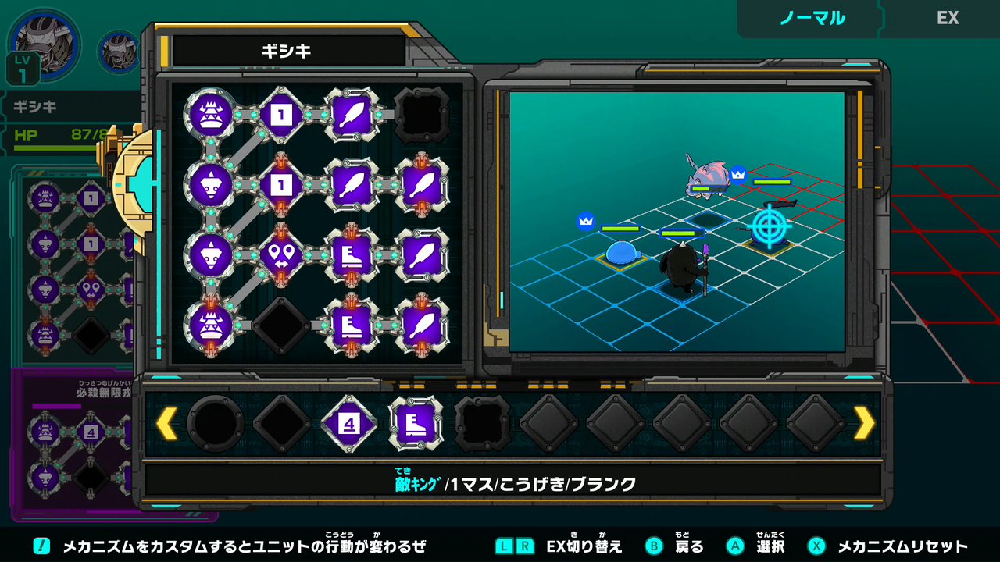
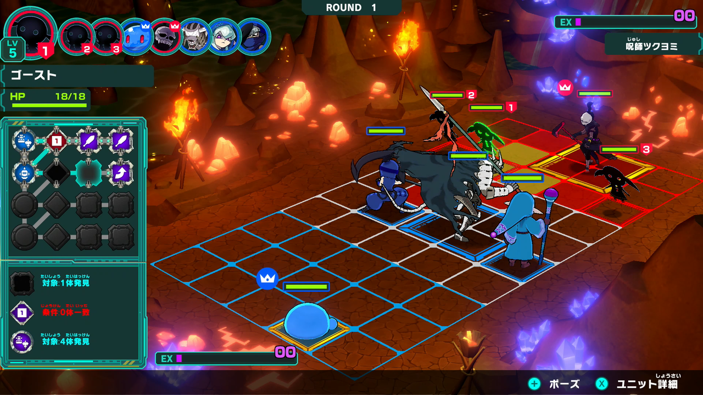

<figure>

</figure>

　**『ソロモンプログラム』**というゲームの体験版を遊んでいる。これは、**『ミラコロコミック』**という「未来から来たコロコロコミック」という触れ込みの子ども向け漫画雑誌に付いているシリアルコードでダウンロードできるゲームだ。

　プレイヤーは4体までのキャラクターでデッキを組み、それぞれのキャラクターの動きをプログラムして敵とバトルする。このプログラム部分は、動作や条件を指定するパネルを置くことで設計していく。今流行りの「プログラミング」をデッキ構築型ゲームに組み込んだ新機軸のゲームというわけだ。プレイステーションに**『カルネージハート』**という、ロボットのプログラムを設計して戦わせるゲームがあったが、プログラム画面はあれに似ている。

　現在のコナミはすっかりゲームタイトル数が減ってしまい、今では**『ウィニングイレブン』『実況パワフルプロ野球』**など有力タイトルこそコンスタントにリリースしているものの、あとは適当にレトロゲームを出したり、ハドソンのゲームを復刻したり、そんな程度のゲームメーカーとしては実に寂しいメーカーとなってしまっている。最近では、**『PCエンジンmini』**の予約数が芳しくないという噂も耳にするではないか。

　しかし、ふと気がつくと**『ソロモンプログラム』**なんてゲームを作っている。実は意欲的に新分野のゲームを開発しているじゃあないですか！　なんて、往年のコナミファンなら期待してしまったとしても無理はないだろう。さすがコナミ、侮れないメーカーなんじゃないの？

　しかし、実際に**『ソロモンプログラム』**を遊んでみると、状況はそんなに甘くないようである。体験版をプレイする限り、まだ未完成なのかな、という印象を拭えないのが正直なところだ。特にチュートリアルにおいて完成度の低さが顕著だ。初めてプログラムを体験するかもしれない子供に向けて、「とりあえずパネルを置け」「あとは見てろ」的な乱暴な説明がなされるだけで、**『カルネージハート』**を散々プレイしたきた僕でも、キャラクターが思い通りに動かず困惑する。どうやら、プレイを重ねるうちに、プログラムの命令パネルや、命令パネルを置ける場所が解禁される仕組みらしいが、その説明もされず、そもそもゲームの進め方がよくわからない。ゲームの序盤では、黙々と実行されるプログラムを眺めるだけの状況が続く。ゲームをプレイしていると言うよりは、デモを眺めているのと変わらない。面白いゲームを他にたくさん知っている小学生ならば、この時点で飽きるんじゃないだろうか。

　任天堂スイッチの体験版は、Steamの早期アクセスではない。根気のあるゲームファンを相手に気長なゲーム開発を行っているのとは違うから、よほどのインパクトを持ったゲームを提示できなければ、そこでそのゲームは終わりだろう。せめて製品版で大幅な改善がなされることを期待したい。

　さて、80年代の黄金期を経験したゲームファンとしては、未だにコナミには期待を寄せる部分があるのが正直なところ。しかし、現状はかなり厳しいようである。スポーツクラブとして企業の延命は果たしたコナミ、またいつかゲームメーカーとして復活する日は来るのだろうか。
