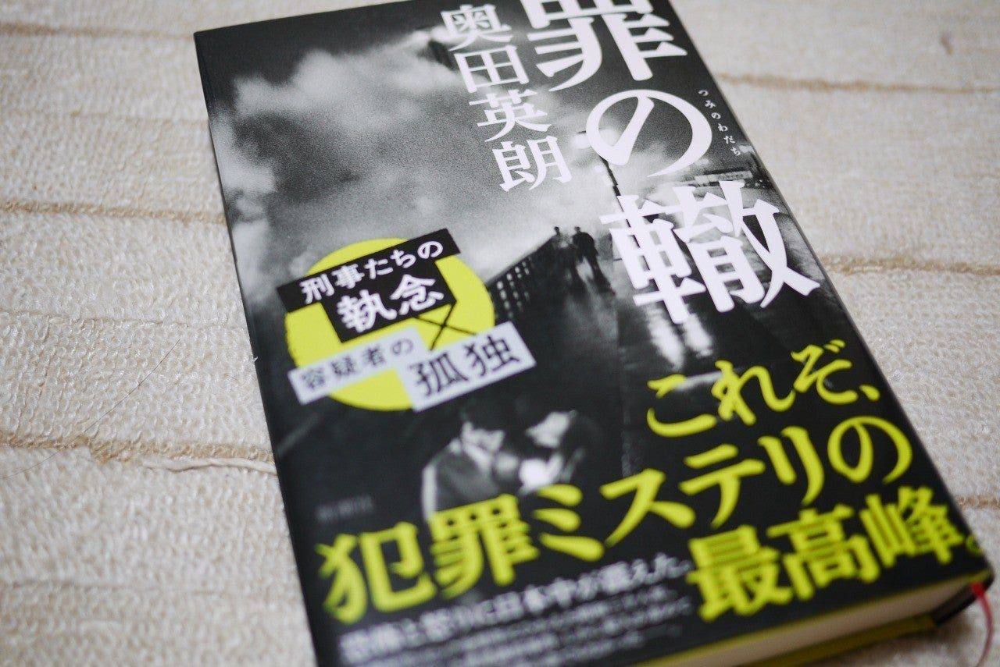

<figure>

</figure>

**※話の展開について若干書かれています。注意！**

　読み応えがあった。ページ数も多いが、単に物量的な問題だけではない。そこに描かれた人物の群像劇、時代背景など、至るところにじっくりと読ませる要素があり、それがこの小説に重厚さを与えている。

　1963年、東京で実際に起きた『吉展ちゃん誘拐殺人事件』。本作では、その誘拐事件をモデルにした形で誘拐事件が登場する。誘拐がまだ多くなかった時代の捜査本部の戸惑い。当時普及し始めた電話を利用した最先端の犯罪。この時代だからこその、警察の苦しさが浮き彫りにされる。事件の難しさと同時に、典型的な警察内の縄張り争いから、結果的に警察は後塵を拝する。細かな描写を積み重ねたからこその、その不甲斐なさ、無念さが印象的だ。

　一方で、登場する人物それぞれの生活の様子が緻密に描写される。決して犯人探しをするタイプのミステリ小説ではないが、読みすすめるにつれ、浮かび上がってくる容疑者。犯罪に至るまでの彼らの考えを想像しながら読むことで、実に不気味な犯罪者心理に触れることになる。派手なアクションもトリックも無いが、全編に渡って醸し出された、息の詰まるような緊張感が見事。

　「刑事は足で稼げ」とは、刑事ドラマなどでよく耳にするセリフであるが、まさにそれを地で行くような犯罪小説。警察による執念の捜査が楽しめる一作。この手の昭和を感じさせる刑事ドラマが好きならぜひお勧めしたい。

　余談ではあるが、作者の奥田英朗は、ちょっとユニークな精神科医の話を書いた『イン・ザ・プール』、寂れた炭鉱町の理髪店の物語である『向田理髪店』など、実に多岐にわたった作品が楽しめる作家である。この『罪の轍』で興味を持ったら、他の作品にも手を伸ばし、その奥深い世界を知ってもらいたい。

[https://amazon.co.jp/dp/4103003537](https://amazon.co.jp/dp/4103003537)
